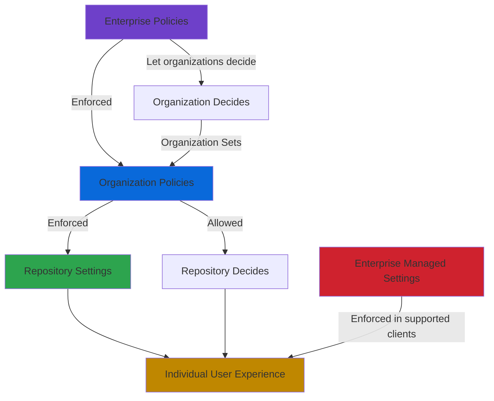

# GitHub Copilot Governance

This document provides comprehensive guidance for configuring GitHub Copilot policies, settings, and best practices for enterprise deployments. Following these recommendations will help establish secure and effective AI-assisted development practices following the principle of "security by default."

> **Last Updated:** October 2, 2026

---

## Table of Contents

1. [Overview](#overview)
2. [GitHub Copilot Plans for Business](#github-copilot-plans-for-business)
3. [Policy Architecture](#policy-architecture)
4. [Configuring Enterprise Policies](#configuring-enterprise-policies)
5. [Configuring Organization Policies](#configuring-organization-policies)
6. [Content Exclusions](#content-exclusions)
7. [Network Configuration](#network-configuration)
8. [License Management](#license-management)
9. [Driving Enterprise Adoption](#driving-enterprise-adoption)
10. [Best Practices for Using Copilot](#best-practices-for-using-copilot)
11. [Copilot Cloud Agent Governance](#copilot-cloud-agent-governance)
12. [Audit and Compliance](#audit-and-compliance)
13. [Troubleshooting](#troubleshooting)
14. [References](#references)

---

## Overview

GitHub Copilot is an AI-powered coding assistant that helps developers write code faster and with less effort. For enterprises adopting GitHub Copilot, establishing proper governance through policies, settings, and best practices ensures consistent usage, maintains security compliance, and maximizes return on investment across the organization.

This document provides comprehensive guidance for enterprise administrators, organization owners, and security teams on configuring GitHub Copilot policies, implementing content exclusions, managing licenses, driving adoption, and following best practices for AI-assisted development at scale.

GitHub Copilot governance operates through a hierarchical policy model that flows from enterprise to organization to individual developer settings. Enterprise owners can enforce policies across all organizations, delegate policy decisions to organization owners, or allow individual developers to configure their own preferences within defined boundaries. Understanding this hierarchy and the available controls is essential for effective Copilot governance.

Modern enterprise deployments require balancing developer productivity with security, compliance, and cost management concerns. This involves careful consideration of which Copilot features to enable, what content to exclude from AI suggestions, how to manage licenses efficiently, and how to measure and optimize Copilot adoption over time.

## GitHub Copilot Plans for Business

### Plan Comparison

GitHub offers multiple Copilot subscription plans tailored for different organizational needs:

| Feature | Copilot Business | Copilot Enterprise |
|---------|------------------|-------------------|
| **Target Audience** | Organizations and enterprises that need centralized management and policy control | Enterprises on GitHub Enterprise Cloud that want a larger pool of GitHub AI Credits and Enterprise-only features |
| **Price** | $19 per granted seat per month | $39 per granted seat per month |
| **Included AI Credits** | 1,900 per user per month, pooled | 3,900 per user per month, pooled |
| **Code Completions** | Unlimited (not billed in AI Credits) | Unlimited (not billed in AI Credits) |
| **Chat Capabilities** | IDE, CLI, GitHub.com and GitHub Mobile | IDE, CLI, GitHub.com and GitHub Mobile |
| **Model Selection** | Premium models, subject to model policies; bring your own key (BYOK) | Priority access to premium models, subject to model policies; BYOK |
| **Copilot Code Review** | ✓ | ✓ |
| **Copilot Cloud Agent** | ✓ | ✓ |
| **Agent Mode (IDE)** | ✓ | ✓ |
| **Copilot CLI and GitHub Copilot app** | ✓ | ✓ |
| **Copilot Spaces** | ✓ | ✓ |
| **Custom Instructions** | Repository, personal and organization | Repository, personal and organization |
| **MCP Server Policy** | ✓ | ✓ |
| **Admin Controls** | Organization and enterprise policies, audit logs | Same as Business |
| **Content Exclusions** | ✓ | ✓ |
| **IP Indemnification** | ✓ | ✓ |
| **Data Privacy** | Limited, documented retention (see [Compliance Considerations](#compliance-considerations)) | Same as Business |

> **Note:** Copilot also offers individual plans: Copilot Free, Copilot Student, Copilot Pro, Copilot Pro+ and Copilot Max (launched 2026-06-01 as an upgrade for existing Student, Pro and Pro+ subscribers). Business and Enterprise are the managed, policy-governed tiers covered in this governance guide. Since 2026-06-01, every Copilot plan bills in AI Credits (1 AI Credit = $0.01); see [Licenses and Billing](19-licenses-billing.md#github-ai-credits) for pooling, paid usage and budgets. Copilot IDE features (code completions, chat, agent mode) are available for GHES users who are licensed through a github.com enterprise account. Cloud-native features such as Copilot code review, cloud agent, and web chat require GitHub Enterprise Cloud. Since GHES 3.22 (generally available 2026-09-08), administrators of disconnected or air-gapped GHES instances can also set up a model provider in GHES so users run Copilot CLI with their GHES credentials (technical preview).

> **Bring your own key (BYOK):** Since 2026-04-22, Copilot Business and Enterprise users can add their own model provider keys to chat in VS Code (local BYOK; it doesn't apply to code completions). It is on by default, and an enterprise or organization policy can turn it off. The provider bills that usage, not GitHub. Separately, enterprise owners can add provider keys centrally as custom models (public preview) under **AI controls** → **Copilot** → **Configure custom models**; the **Enable custom models** policy lets organization owners add their own. Custom models appear in Copilot Chat, Copilot CLI and IDEs.
>
> Copilot CLI (since 2026-04-07) and the GitHub Copilot app (since 2026-06-23) also accept a user's own model provider, and since 2026-07-07 the app runs with a user's own key and no Copilot plan at all. With its own provider, Copilot CLI doesn't need a GitHub sign-in, and `COPILOT_OFFLINE=true` stops it contacting GitHub and turns off its telemetry. Use like that isn't tied to a license on your Copilot plan, so your Copilot policies, budgets and usage metrics don't cover it.

### Licensing Model

Copilot Business and Enterprise licenses are assigned per seat. Billing starts when a seat is granted, whether or not the user is active, and seats granted mid-cycle are prorated. Since 2026-06-01, each license also adds its included AI Credits to a pool shared across the billing entity, and usage beyond the pool is billed at $0.01 per AI Credit unless an administrator disables the **AI credits paid usage** policy. Before 2026-06-01, Copilot was billed in premium requests. Key licensing considerations include:

**Seat Assignment Methods**:
- Direct assignment to individual users
- Assignment through team membership: organization teams, or enterprise teams for Copilot Business licenses that the enterprise assigns (see [Enterprise Teams](28-enterprise-teams.md))
- Self-service license claiming (with proper configuration)
- Automatic assignment based on organization membership

**Cost Management**:
- Licenses can be reclaimed from inactive users
- Usage metrics help identify underutilized licenses
- Enterprise billing provides consolidated cost visibility
- Seat caps can limit maximum license consumption
- Budgets cap AI Credits spend: user-level budgets (generally available since 2026-06-01), cost-center budgets and enterprise spending limits. See [Licenses and Billing](19-licenses-billing.md#budget-alerts-and-cost-centers)
- Since 2026-06-01, Copilot code review also consumes GitHub Actions minutes on private repositories
- Since 2026-09-03, new seats for customers who pay by credit card or PayPal must be paid for before the user gets access. From 2026-10-01, existing card and PayPal customers are also charged upfront for assigned seats at the start of each billing cycle

**License Inheritance**:
- Users receive Copilot through a license that an organization assigns, or that the enterprise assigns directly (Copilot Business only)
- Enterprise policies can override organization-level license controls
- A user licensed by several organizations in one enterprise usually gets the **least restrictive** setting of each policy. A few sensitive policies use the **most restrictive** setting instead, including Copilot Metrics API access, suggestions matching public code, Copilot code review for members without a license, and Copilot Memory. A user licensed by several enterprises usually gets the most restrictive setting. See [Feature availability when GitHub Copilot policies conflict](https://docs.github.com/en/enterprise-cloud@latest/copilot/reference/enterprise-administrators/policy-conflicts)

## Policy Architecture

### Policy Hierarchy



GitHub Copilot policies follow the standard GitHub Enterprise Cloud policy inheritance model:

**Enterprise Level**: Enterprise owners define policies that apply across all organizations within the enterprise. Enterprise policies can:
- **Enforce** a setting everywhere (**Enabled everywhere** or **Disabled everywhere**), preventing organizations from changing it
- **Let organizations decide**, delegating the decision to organization owners (some GitHub docs pages still call this "No policy")
- Limit a feature to **selected organizations**, where a policy offers it: Copilot cloud agent (**Enabled for selected organizations**, since 2026-04-15) and Copilot code review approvals (**Enable for selected organizations**, public preview since 2026-09-01)
- **Configure defaults** for enterprise-assigned users, and for features and models nobody has configured (**Default policy for new features**, **Default availability for released models**)

**Organization Level**: Organization owners configure policies for their organization, subject to enterprise-level constraints:
- Can only configure policies not enforced at enterprise level
- Set defaults for repositories within the organization
- Control feature availability for organization members

**Repository Level**: Repository administrators can configure content exclusions for specific repositories, subject to organization policies.

**Individual Level**: Developers can configure personal preferences in their IDE, subject to organizational policy constraints. For supported keys, enterprise managed settings take precedence over the user's own client settings.

### Client-Side Controls: Enterprise Managed Settings

Policies decide which Copilot features, clients, agents and models users can access. Since 2026-07-01, enterprise managed settings decide how the clients behave. The enterprise keeps a `copilot/managed-settings.json` file in the `.github-private` repository of an organization it selects under **AI controls** → **Agents**, and the settings apply to everyone who receives a Copilot Business or Copilot Enterprise license from the enterprise or its organizations. Copilot CLI, VS Code, JetBrains IDEs, the GitHub Copilot app and Copilot cloud agent enforce them, though not every client supports every key. The settings cover:

- **Agent behavior:** bypass ("yolo") mode, and deny, ask and allow rules for shell commands, file access and network domains (since 2026-09-09)
- **Extensions:** plugins and marketplaces, including Agent Plugins 1.0 packages (since 2026-08-12), and MCP server allow and deny lists (since 2026-08-06)
- **Default model** for new conversations: Auto (since 2026-07-01) or any model (since 2026-09-02); users can still pick another model per conversation
- **Monitoring:** OpenTelemetry export of agent activity to your own collector (since 2026-07-08); prompts, responses and tool arguments are left out unless you turn content capture on
- **Local execution:** remote control of sessions (since 2026-07-30), local sandbox restrictions (public preview since 2026-06-02), and computer use (public preview since 2026-10-01)

Settings can also reach devices through MDM or a file (since 2026-07-08). Enterprise teams can receive their own values for keys you mark overridable (since 2026-08-03): a team value replaces the enterprise default for keys such as `extraKnownMarketplaces`, `strictKnownMarketplaces` and `sandbox`, while a team's `enabledPlugins` adds to the enterprise baseline. Since 2026-09-25, a validator in the "Copilot settings validation" section of the **Agents** page reports errors in these files. See [Enterprise Managed Settings](29-enterprise-managed-settings.md) and [Lab 17](../labs/lab17.md).

### Policy Types

GitHub Copilot policies are organized into three categories:

**Feature Policies**: Control the availability of Copilot features, clients and agents (enterprise: **AI controls** → **Copilot** → **Features & clients**, plus the **Agents** and **MCP** pages)
- Copilot in the IDE (code completions)
- Copilot Chat in the IDE
- Copilot in GitHub.com
- Copilot Chat in GitHub Mobile
- Copilot CLI, with **Allow use of Copilot CLI billed to the organization**. It is on by default wherever Copilot CLI is enabled and lets agentic workflows (since 2026-06-11) and Copilot CLI (since 2026-07-02) in GitHub Actions bill AI Credits to the organization with `GITHUB_TOKEN`; user-level budgets don't apply to that usage
- GitHub Copilot app (its own policy since 2026-07-27, separate from Copilot CLI; **Enabled everywhere** by default)
- Copilot code review, including whether Copilot approvals count toward required approvals (public preview since 2026-09-01), and **Allow members without a Copilot license to use Copilot code review in GitHub.com** (off by default)
- Copilot cloud agent. Cloud sandboxes, which host Copilot CLI and Copilot app sessions in GitHub-hosted environments and run cloud agent sessions started from Microsoft Teams, need the **Cloud Sandbox access** policy (off by default), which shares Copilot cloud agent's policy configuration
- Third-party agents (public preview): **Anthropic Claude** and **OpenAI Codex**, which work in the same repositories as Copilot cloud agent
- Copilot Agent Mode in IDE Chat
- MCP servers in Copilot
- Copilot Memory (public preview, off by default)
- **Store local sessions in the Cloud**: whether local Copilot sessions sync to users' GitHub accounts (**View from cloud**) and can also be remotely controlled from GitHub.com and GitHub Mobile (**View and control**). Unconfigured allows neither, and the Default policy for new features doesn't change this policy

From 2026-10-22, eligible generally available features left **Unconfigured**, including **Copilot code review** and **MCP servers in Copilot**, follow the **Default policy for new features** (Enabled by default). See [Feature and Model Configuration](#feature-and-model-configuration).

> **Announced, not launched by 2026-10-01:** On 2026-08-28, GitHub announced that Copilot Chat on GitHub.com, Copilot Chat in GitHub Mobile and Copilot cloud agent will become one Copilot experience with a single policy, enabled by default, no earlier than 2026-09-28. Opting out of it removes Copilot from GitHub.com and GitHub Mobile.

**Privacy Policies**: Control data handling and sensitive operations
- Suggestions matching public code
- Prompt and suggestion collection
- User feedback collection
- Preview feature opt-in (the **Editor preview features** policy gates preview features in IDEs)

**Models Policies**: Control access to AI models (enterprise: **AI controls** → **Copilot** → **Configure models**; organization: **Settings** → **Copilot** → **Models**)
- Per-model availability: **Enabled**, **Disabled**, or delegated to organizations (in Enterprise teams mode, to enterprise teams and apps). Each model has its own policy, named after the model (for example **Claude Opus 4.7**)
- **Default availability for released models**: what happens to models nobody has configured (shown as **Delegate to Default Policy**; enforced 2026-08-26 to 2026-09-01)
- Targeted model rules: allow specific models for selected organizations (public preview since 2026-05-26)
- Enterprise teams mode: grant models to enterprise teams instead of organizations (opt-in public preview since 2026-07-31)
- Custom models (enterprise BYOK, public preview) and the **Enable custom models** policy
- The base model (GPT-5.3-Codex since 2026-05-17), used when no other model is enabled
- Open-weight models (**Kimi K2.7 Code** since 2026-07-07, **Kimi K3** since 2026-08-06): off by default for Business and Enterprise, and outside default availability
- Deprecations: GitHub announces each one on the changelog with a suggested alternative. Under default availability, the alternative is enabled automatically unless the default policy is off or the model is explicitly disabled (stated in the 2026-09-18 notice of six deprecations on 2026-10-19)

### Policy Enforcement Options

For feature policies at the enterprise level:

| Setting | Behavior |
|---------|----------|
| **Enabled everywhere** | Feature is available to all users; organizations cannot disable |
| **Disabled everywhere** | Feature is blocked for all users; organizations cannot enable |
| **Let organizations decide** | Organization owners decide whether to enable or disable |
| **Enabled for selected organizations** (Copilot cloud agent) or **Enable for selected organizations** (Copilot code review approvals) | Only where a policy offers it: the feature is available only in the organizations you select |
| **Unconfigured** | Nobody has chosen a setting. From 2026-10-22, eligible generally available features follow the **Default policy for new features** |

For organization-level policies:

| Setting | Behavior |
|---------|----------|
| **Enabled** | Feature is available to all organization members |
| **Disabled** | Feature is blocked for all organization members |
| **Unconfigured** | Not yet set by the organization owner. From 2026-10-22, eligible generally available features follow the organization's **Default policy for new features**; unconfigured models follow **Default availability for released models** |

For privacy policies, options are typically "Allowed" or "Blocked" to clearly indicate the impact on data handling.

## Configuring Enterprise Policies

### Accessing AI Controls

Enterprise owners, and users with the **Manage enterprise AI controls** custom role permission, manage Copilot policies through the AI Controls section:

1. Navigate to your enterprise (for example, from the **Enterprises** page on GitHub.com)
2. Click **AI controls** at the top of the page
3. Use the sidebar to navigate between:
   - **Agents**: Policies for the agents under "Available agents", including Copilot cloud agent and Copilot code review, and third-party agents. This page also holds the source and validator for enterprise managed settings (see [Enterprise Managed Settings](29-enterprise-managed-settings.md))
   - **Copilot**: Administration, privacy, model, billing and usage policies, including **Default policy for new features**, **Configure models** and **Configure custom models**. Under "Features & clients", click **Configure features & clients** for feature and client policies such as Copilot CLI and the GitHub Copilot app
   - **MCP**: The **MCP servers in Copilot** policy and the MCP registry policies
4. The top of the AI controls page lists recent agent sessions, and the bottom links to the audit log

### Security-by-Default Enterprise Policy Configuration

For enterprise deployments following security-by-default principles, the following configuration prioritizes security and compliance while enabling developer productivity:

> **Security Principle**: Start with restrictive settings and enable features based on demonstrated need and security review.

**Core Feature Policies**:

| Policy | Security-by-Default Setting | Rationale | Reference |
|--------|----------------------------|-----------|----------|
| Default policy for new features | **Disabled** or **Let organizations decide** if every new feature needs review (the policy ships **Enabled**) | From 2026-10-22, eligible generally available features left **Unconfigured**, including Copilot code review and MCP servers in Copilot, follow this policy. Explicit choices are kept and previews stay opt-in | [Default availability of features and models](https://docs.github.com/en/enterprise-cloud@latest/copilot/concepts/enterprise/default-availability) |
| Copilot in IDE | **Enabled** | Core productivity feature. Code around the cursor and from open editor tabs is sent as a prompt to a GitHub-hosted model, so pair it with content exclusions | [Responsible use: inline suggestions](https://docs.github.com/en/enterprise-cloud@latest/copilot/responsible-use/inline-suggestions) |
| Copilot Chat in the IDE | **Enabled** | Essential for context-aware assistance | [GitHub Copilot policies](https://docs.github.com/en/enterprise-cloud@latest/copilot/concepts/enterprise/policies) |
| Copilot in GitHub.com | **Enabled** | Enables web-based chat for GitHub workflows. Announced to merge with Copilot Chat in GitHub Mobile and Copilot cloud agent into one policy, not launched by 2026-10-01 | [Managing Copilot policies](https://docs.github.com/en/enterprise-cloud@latest/copilot/how-tos/administer-copilot/manage-for-enterprise/manage-enterprise-policies) |
| Copilot CLI | **Enabled** | Useful for command-line workflows. Since 2026-07-14, disabling this policy no longer blocks the Copilot CLI agent provider inside JetBrains IDEs | [GitHub Copilot policies](https://docs.github.com/en/enterprise-cloud@latest/copilot/concepts/enterprise/policies) |
| Allow use of Copilot CLI billed to the organization (organization policy, under Copilot CLI) | **Disabled** until organization or cost-center budgets cover it (on by default wherever Copilot CLI is enabled) | Lets agentic workflows (since 2026-06-11) and Copilot CLI (since 2026-07-02) in GitHub Actions bill AI Credits to the organization with `GITHUB_TOKEN`; user-level budgets don't apply | [Using Copilot CLI in GitHub Actions](https://docs.github.com/en/enterprise-cloud@latest/copilot/how-tos/copilot-cli/use-copilot-cli-in-actions) |
| GitHub Copilot app | **Disabled everywhere** until enterprise managed settings are in place (the policy ships **Enabled everywhere**) | Its own policy since 2026-07-27, separate from Copilot CLI. The app runs agent sessions on developer machines and enforces enterprise managed settings | [About the GitHub Copilot app](https://docs.github.com/en/enterprise-cloud@latest/copilot/concepts/agents/github-copilot-app) |
| Copilot code review | **Enabled** | Improves code quality and security. Since 2026-06-01, each review uses AI Credits and, on private repositories, GitHub Actions minutes | [Configuring Copilot code review](https://docs.github.com/en/enterprise-cloud@latest/copilot/how-tos/copilot-on-github/set-up-copilot/configure-code-review) |
| Allow Copilot to approve pull requests | **Disabled everywhere** (the default) | When enabled, Copilot approvals can count toward required approvals (public preview since 2026-09-01). Keep merges gated on human review | [Configuring Copilot code review](https://docs.github.com/en/enterprise-cloud@latest/copilot/how-tos/copilot-on-github/set-up-copilot/configure-code-review) |
| Allow members without a Copilot license to use Copilot code review in GitHub.com | **Disabled** (the default) unless the organization budgets for it | Bills reviews for members without a license to the organization as paid usage, and since 2026-08-27 also covers automatically requested reviews of bot-authored pull requests. It needs **AI credits paid usage**, and the most restrictive setting applies across organizations | [About Copilot code review](https://docs.github.com/en/enterprise-cloud@latest/copilot/concepts/agents/code-review) |
| Copilot cloud agent | **Disabled**, or **Enabled for selected organizations** for a pilot | Requires careful evaluation; allows autonomous code changes. Since 2026-04-15 you can enable it for selected organizations: by name in the UI, or by organization custom property through the REST API (evaluated once, when you save) | [Enabling Copilot cloud agent](https://docs.github.com/en/enterprise-cloud@latest/copilot/how-tos/administer-copilot/manage-for-enterprise/manage-agents/enable-copilot-cloud-agent) |
| Third-party agents (**Anthropic Claude**, **OpenAI Codex**) | **Disabled** until reviewed like Copilot cloud agent | Public preview. They work in the repositories where Copilot cloud agent is enabled, consume Actions minutes and AI Credits, and install a GitHub App for each agent that an organization allows (**Copilot** → **Cloud agent** → "Partner agents") | [About third-party agents](https://docs.github.com/en/enterprise-cloud@latest/copilot/concepts/agents/about-third-party-coding-agents) |
| Cloud Sandbox access | **Disabled** (the default) until cloud sandbox use is approved | Runs Copilot CLI and Copilot app sessions, and cloud agent sessions started from Microsoft Teams (public preview since 2026-08-21), in GitHub-hosted sandboxes. Sandbox usage is billed separately from AI Credits, so give it a budget | [About cloud and local sandboxes](https://docs.github.com/en/enterprise-cloud@latest/copilot/concepts/security-governance-and-network-settings/about-cloud-and-local-sandboxes) |
| Copilot Agent Mode in IDE Chat | **Let organizations decide** | Let organizations decide based on security posture | [GitHub Copilot policies](https://docs.github.com/en/enterprise-cloud@latest/copilot/concepts/enterprise/policies) |
| MCP servers in Copilot | **Disabled**, set explicitly before 2026-10-22, until an MCP allowlist is in place | External integrations require security review. Left **Unconfigured**, the policy follows the Default policy for new features from 2026-10-22. GitHub's MCP management docs recommend keeping the policy enabled and limiting users to approved servers; the MCP allow and deny lists in enterprise managed settings (generally available since 2026-08-06) are the recommended allowlist | [MCP management](https://docs.github.com/en/enterprise-cloud@latest/copilot/concepts/enterprise/mcp-management) |
| Copilot Memory | **Disabled** (the default) until reviewed | Public preview. Stores repository-level facts that sessions in that repository can use and, since 2026-06-02, user-level preferences that follow a user across repositories. Unused entries are deleted after 28 days; admins can export or bulk-delete preferences, and since 2026-05-26 repository admins can turn Memory off for a repository | [Managing Copilot Memory as an administrator](https://docs.github.com/en/enterprise-cloud@latest/copilot/how-tos/use-copilot-agents/copilot-memory/manage-as-administrator) |
| Store local sessions in the Cloud | **Disabled** or **View from cloud**; choose **View and control** only together with the `remoteControl` managed setting | **View from cloud** syncs local Copilot sessions to each user's GitHub account; **View and control** also allows remote control from GitHub.com and GitHub Mobile (generally available since 2026-05-18). Admins can't read synced sessions, and the Default policy for new features doesn't apply to this policy | [About remote control](https://docs.github.com/en/enterprise-cloud@latest/copilot/concepts/agents/copilot-cli/about-remote-control) |
| Bring your own key (local BYOK in IDEs) | **Disabled** unless approved providers are documented (on by default since 2026-04-22) | Users' own keys send prompts straight from the client to that provider, not through GitHub's Copilot API, and the provider bills the usage | [Bring your own key](https://docs.github.com/en/enterprise-cloud@latest/copilot/concepts/models/bring-your-own-key) |

**Privacy Policies (Critical for Security)**:

| Policy | Security-by-Default Setting | Rationale | Reference |
|--------|----------------------------|-----------|----------|
| Suggestions matching public code | **Blocked** | Prevents suggestions identical to public code; reduces IP and licensing risks | [Managing Copilot policies](https://docs.github.com/en/enterprise-cloud@latest/copilot/how-tos/administer-copilot/manage-for-enterprise/manage-enterprise-policies) |
| Prompt and suggestion collection | **Blocked** | Maintains data privacy (retention caveats in [Compliance Considerations](#compliance-considerations)) | [GitHub Copilot Trust Center](https://copilot.github.trust.page/) |
| User feedback collection | **Allowed** (Optional) | Helps improve Copilot; enable only if participating in product improvement | [Managing Copilot policies](https://docs.github.com/en/enterprise-cloud@latest/copilot/how-tos/administer-copilot/manage-for-enterprise/manage-enterprise-policies) |
| Preview features | **Disabled** | Avoid preview features in production; enable only for evaluation. For Business and Enterprise, the **Editor preview features** policy gates IDE previews, for example the Claude and Codex agent providers in JetBrains IDEs and HydraFusion (a research preview, in VS Code since 2026-09-30). Copilot vision (images and PDFs in chat) no longer depends on this policy: it became generally available on 2026-07-01 and is on for every plan, and GitHub keeps Business and Enterprise attachments for about 24 hours | [Managing Copilot policies](https://docs.github.com/en/enterprise-cloud@latest/copilot/how-tos/administer-copilot/manage-for-enterprise/manage-enterprise-policies) |

**Models Policies**:

| Policy | Security-by-Default Setting | Rationale | Reference |
|--------|----------------------------|-----------|----------|
| Base model | **GPT-5.3-Codex** (GitHub's base model for Business and Enterprise since 2026-05-17; designated the base and long-term support (LTS) model on 2026-03-18) | Used when the organization hasn't approved other models. LTS lasts one year from the 2026-03-18 designation, per the docs; the 2026-05-17 changelog says it stays available through 2027-02-04 (12 months from its launch). A long-term support model gives internal model reviews a stable target | [Base and LTS models](https://docs.github.com/en/enterprise-cloud@latest/copilot/concepts/models/fallback-and-lts-models) |
| Default availability for released models | **Disabled** if every model must pass review (the policy ships **Enabled**) | Enforced 2026-08-26 to 2026-09-01: models you haven't configured show **Delegate to Default Policy** and follow this policy. Open-weight models and models outside GitHub's data retention agreement stay off either way | [Default availability of features and models](https://docs.github.com/en/enterprise-cloud@latest/copilot/concepts/enterprise/default-availability) |
| Model availability (per model) | **Enabled** for reviewed models, **Disabled** for models that fail review; delegate only where organizations or enterprise teams own the decision | Each model shows **Enabled**, **Disabled**, a delegate state, or **Delegate to Default Policy**. Targeted model rules (public preview since 2026-05-26) allow specific models for selected organizations | [Managing availability of models in your enterprise](https://docs.github.com/en/enterprise-cloud@latest/copilot/how-tos/administer-copilot/manage-for-enterprise/manage-availability-of-default-models) |
| Enterprise teams mode | **Off** until enterprise teams exist for every audience (opt-in public preview since 2026-07-31) | When on, organization model settings stop applying and delegated models are granted per enterprise team; a user gets a model if any of their teams has it. See [Enterprise Teams](28-enterprise-teams.md) | [Managing availability of models in your enterprise](https://docs.github.com/en/enterprise-cloud@latest/copilot/how-tos/administer-copilot/manage-for-enterprise/manage-availability-of-default-models) |
| Models that require provider data retention (Claude Fable 5, Claude Fable 5.1) | **Disabled** unless the retention has been accepted, or the enterprise has a zero data retention exemption | Off by default and outside default availability. Enabling the policy acknowledges that Anthropic retains prompts and outputs; eligible enterprises can use zero data retention through the end of 2026 | [Plans for GitHub Copilot](https://docs.github.com/en/enterprise-cloud@latest/copilot/get-started/plans) |
| Custom models (enterprise BYOK) | Add vetted provider keys centrally; leave **Enable custom models** off unless organizations need their own keys | Public preview. Keys are added under **AI controls** → **Copilot** → **Configure custom models** | [Enabling custom models](https://docs.github.com/en/enterprise-cloud@latest/copilot/how-tos/administer-copilot/manage-for-enterprise/enable-custom-models) |
| Open-weight models (**Kimi K2.7 Code**, **Kimi K3**) | **Disabled** (the default) until reviewed | Off by default for Business and Enterprise and outside default availability. GitHub hosts Kimi K2.7 Code on Azure AI Foundry and Kimi K3 on Fireworks AI under zero data retention agreements, and recommends reviewing open-weight models against your security, compliance and data-governance requirements before enabling them | [Hosting of models for GitHub Copilot](https://docs.github.com/en/enterprise-cloud@latest/copilot/reference/ai-models/model-hosting) |
| Default model for new conversations (`model` in enterprise managed settings) | Auto, or a model that passed review | Since 2026-07-01 the default can be Auto model selection, and since 2026-09-02 any model, with per-team defaults through overridable settings. Users can still pick another model for a conversation | [Enterprise Managed Settings](29-enterprise-managed-settings.md#default-model) |

### Configuring Policies Step-by-Step

To configure enterprise Copilot policies:

1. In the top-right corner of GitHub, click your profile picture
2. Click **Enterprises** and select your enterprise
3. Click the **AI controls** tab at the top of the page
4. In the sidebar, click **Agents**, **Copilot** or **MCP**. On the **Copilot** page, click **Configure features & clients** for feature and client policies, or **Configure models** for model availability
5. For each policy:
   - Policies with dropdown menus: Select the enforcement option
   - Policies with toggles: Click to enable or disable
   - Policies requiring additional configuration: Click the policy name

### Policies for Enterprise-Assigned Users

When users receive Copilot access directly from the enterprise (rather than through an organization), the **Policies for enterprise-assigned users** setting determines how **Let organizations decide** policies behave for them:

- **Enable by default**: Features default to enabled for enterprise-assigned users
- **Disable by default**: Features default to disabled unless explicitly enabled

This setting is particularly important for enterprises using the dedicated Copilot Business model without full GitHub Enterprise licenses.

## Configuring Organization Policies

### Organization Policy Management

Organization owners configure Copilot policies through organization settings:

1. Click your profile picture, then **Organizations**
2. Click **Settings** next to your organization
3. In the sidebar, under "Code, planning, and automation," click **Copilot**
4. Select **Policies** to configure feature availability
5. Select **Models** to configure model access
6. Use the other pages under **Copilot** for agent settings: **Cloud agent** (runner and partner agents), **Code review** (review effort and approvals), **Internet access** (the firewall for Copilot cloud agent and Copilot code review) and **Runner type**
7. Use **Custom instructions** for organization custom instructions (generally available since 2026-04-02), which apply to Copilot Chat on GitHub.com, Copilot code review and Copilot cloud agent in every repository in the organization

Organization policies are subject to enterprise-level constraints—settings enforced at the enterprise level cannot be changed at the organization level. If the enterprise turns on **Enterprise teams mode** (opt-in public preview since 2026-07-31), organization model settings no longer apply: model access is managed at the enterprise and granted through enterprise teams (see [Enterprise Teams](28-enterprise-teams.md)).

### Feature and Model Configuration

For each policy, organization owners can select:
- **Enabled**: Available to all organization members with Copilot licenses
- **Disabled**: Blocked for all organization members
- **Unconfigured**: Not yet set. From 2026-10-22, eligible generally available features left **Unconfigured** follow the **Default policy for new features**, which ships **Enabled**, so they turn on unless someone acts. Unconfigured models already follow **Default availability for released models** (enforced 2026-08-26 to 2026-09-01, shown as **Delegate to Default Policy**). Preview features are not covered and stay opt-in. See [Default availability of features and models](https://docs.github.com/en/enterprise-cloud@latest/copilot/concepts/enterprise/default-availability).

**Best Practice**: Review and explicitly configure all policies rather than leaving them unconfigured. From 2026-10-22, leaving a policy unconfigured is a decision to accept the default.

### Preview Features and Feedback

Organizations can opt into Copilot preview features and feedback collection:

**Preview Features**: When enabled, users can test new Copilot features before general availability. Considerations:
- Preview features may have bugs or limitations
- Features may change or be discontinued
- Early access helps teams prepare for new capabilities

**Feedback Collection**: When enabled, users can provide feedback on Copilot features:
- Improves Copilot quality over time
- Helps GitHub prioritize improvements
- Feedback is anonymized and aggregated

## Content Exclusions

### Understanding Content Exclusions

Content exclusions prevent GitHub Copilot from accessing specified files or repositories when generating suggestions. This is essential for:

- **Security**: Protecting sensitive configuration files, secrets, and credentials
- **Compliance**: Excluding regulated data from AI processing
- **Intellectual Property**: Protecting proprietary algorithms and business logic
- **Data Residency**: Meeting data sovereignty requirements

When content is excluded:
- Copilot will not use that content as context for suggestions
- Inline suggestions are disabled for excluded files
- Copilot Chat cannot reference excluded content

**Where exclusions apply**: Since 2026-09-02, content exclusions are generally available in Copilot CLI and the GitHub Copilot app (Business and Enterprise). Since 2026-06-12, Copilot code review on GitHub.com also honors repository, organization and enterprise exclusions: excluded files are not reviewed.

**Important Limitations**: Content exclusions are not supported in the **Edit** and **Agent** modes of Copilot Chat in VS Code and other editors, and third-party agents are not covered. The docs disagree on Copilot cloud agent: the content exclusion availability table doesn't list it, while the supported-surfaces reference lists content exclusion as applying to it, so test before you rely on it. See [Content exclusion for GitHub Copilot](https://docs.github.com/en/enterprise-cloud@latest/copilot/concepts/security-governance-and-network-settings/content-exclusion) and [Supported surfaces for GitHub Copilot policies](https://docs.github.com/en/enterprise-cloud@latest/copilot/reference/supported-surfaces-for-policies).

> **⚠️ Security Warning**: Because content exclusions don't cover agent mode or third-party agents, and the docs disagree on Copilot cloud agent, organizations with sensitive codebases should evaluate those features carefully. Consider disabling them at the enterprise level if content exclusion is critical for compliance.

### Repository-Level Exclusions

Repository administrators can exclude content within their repository:

1. Navigate to the repository on GitHub
2. Click **Settings**
3. Under "Code & automation," click **Copilot** → **Content exclusion**
4. Enter paths to exclude using the format: `- "/PATH/TO/DIRECTORY/OR/FILE"`

**Example Configuration**:
```yaml
# Exclude specific sensitive files
- "/src/some-dir/kernel.rs"
- "secrets.json"

# Exclude by pattern
- "secret*"
- "*.cfg"

# Exclude directories
- "/scripts/**"
- "/config/**"
```

### Organization-Level Exclusions

Organization owners can exclude content across multiple repositories:

1. Navigate to organization **Settings**
2. Click **Copilot** → **Content exclusion**
3. Enter repository references and paths

**Example Configuration**:
```yaml
# Exclude from all repositories
"*":
  - "**/.env"
  - "**/secrets/**"

# Exclude from specific repository
octo-repo:
  - "/src/some-dir/kernel.rs"
  - "secrets.json"

# Exclude from external repository
https://github.com/primer/react.git:
  - "secrets.json"
  - "/src/**/temp.rb"

# Exclude from any repository named 'copilot' across organizations
git@github.com:*/copilot:
  - "/__tests__/**"
  - "/scripts/*"
```

### Enterprise-Level Exclusions

Enterprise owners can configure content exclusions that apply to all users across the enterprise:

1. Navigate to enterprise settings
2. Click **AI controls**
3. In the sidebar, click **Copilot**
4. Click **Content exclusion**
5. Configure exclusions using the same syntax as organization-level

**Key Difference**: Enterprise-level exclusions apply to all Copilot users in the enterprise, regardless of which organization assigned their license. Organization-level exclusions only apply to users licensed through that specific organization.

### Content Exclusion Best Practices

**Security-Focused Exclusions**:
```yaml
# Exclude all environment and secret files
"*":
  - "**/.env"
  - "**/.env.*"
  - "**/secrets/**"
  - "**/*secret*"
  - "**/*credential*"
  - "**/config/production.*"
```

**Compliance-Focused Exclusions**:
```yaml
# Exclude regulated data directories
"*":
  - "**/pii/**"
  - "**/hipaa/**"
  - "**/gdpr/**"
  - "**/financial/**"
```

**Testing Exclusions**: After configuring exclusions:
1. Wait up to 30 minutes for settings to propagate, or reload your IDE
2. Open an excluded file
3. Verify no inline suggestions appear
4. In Copilot Chat, ask to explain the file—it should not be able to use the file content

### Recommended Content Exclusion Patterns

The following patterns represent security-by-default exclusions for enterprise environments:

**Enterprise-Level Mandatory Exclusions**:
```yaml
# Secrets and credentials (CRITICAL)
"*":
  - "**/.env"
  - "**/.env.*"
  - "**/secrets/**"
  - "**/*secret*"
  - "**/*credential*"
  - "**/*password*"
  - "**/config/production.*"
  - "**/*.pem"
  - "**/*.key"
  - "**/*.p12"
  - "**/*.pfx"
  - "**/id_rsa*"
  - "**/id_ed25519*"

# Infrastructure and deployment secrets
"*":
  - "**/terraform.tfvars"
  - "**/*.tfstate"
  - "**/ansible/vault*"
  - "**/kubeconfig*"
```

**Compliance-Focused Exclusions**:
```yaml
# PII and regulated data
"*":
  - "**/pii/**"
  - "**/hipaa/**"
  - "**/gdpr/**"
  - "**/financial/**"
  - "**/customer-data/**"
  - "**/pci/**"

# Legal and proprietary
"*":
  - "**/legal/**"
  - "**/patents/**"
  - "**/proprietary/**"
```

**Security-Critical Path Exclusions**:
```yaml
# Authentication and authorization
"*":
  - "**/auth/**"
  - "**/authentication/**"
  - "**/authorization/**"
  - "**/crypto/**"
  - "**/security/**"
```

## Network Configuration

### Firewall and Proxy Configuration

Enterprise users connecting through firewalls or proxy servers must ensure Copilot endpoints are accessible. The following domains should be added to your allowlist:

**Essential Endpoints** (from the Copilot allowlist reference for GitHub.com):
| Domain | Purpose |
|--------|---------|
| `github.com` | Authentication (`/login/*`) and Copilot on GitHub (`/copilot/*`) |
| `api.github.com` | User management (`/user`, `/copilot_internal/*`) |
| `github.githubassets.com`, `avatars.githubusercontent.com` | Authentication |
| `*.githubcopilot.com` | API service for Copilot suggestions, for any Copilot plan |
| `copilot-proxy.githubusercontent.com` | API service for Copilot suggestions |
| `origin-tracker.githubusercontent.com` | API service for Copilot suggestions |
| `copilot-telemetry.githubusercontent.com` | Copilot client telemetry |
| `collector.github.com` | Analytics telemetry |
| `default.exp-tas.com` | Copilot client experimentation |

To allow only your company's Copilot plan on the corporate network, use subscription-based network routing: allow `*.business.githubcopilot.com` or `*.enterprise.githubcopilot.com` and leave out `*.githubcopilot.com` and `*.individual.githubcopilot.com`. GitHub's `/meta` API endpoint returns most of the wildcard domains (`gh api meta -q '.domains | .website, .copilot'`). On GHE.com, `*.SUBDOMAIN.ghe.com` and `SUBDOMAIN.ghe.com` cover most services.

**Additional Endpoints for Full Functionality**:
| Domain | Purpose |
|--------|---------|
| `*.github.dev` | GitHub Codespaces |
| `vscode-cdn.net` | VS Code extensions |
| `marketplace.visualstudio.com` | Extension marketplace |

**Usage Metrics Report Downloads** (since 2026-05-20, the Copilot usage metrics API returns download links on a GitHub-owned domain):
| Domain | Purpose |
|--------|---------|
| `copilot-reports.github.com` | Report downloads. On GHE.com the host is `copilot-reports.SUBDOMAIN.ghe.com`, covered by `*.SUBDOMAIN.ghe.com` |
| `copilot-reports-*.b01.azurefd.net` | Fallback download host (Azure Front Door); the download host before 2026-05-20 |
| `usagereports*.blob.core.windows.net` | Fallback download host (Azure Blob Storage) when Azure Front Door is unavailable |

The [Copilot allowlist reference](https://docs.github.com/en/enterprise-cloud@latest/copilot/reference/copilot-allowlist-reference) is the maintained list of required domains.

### SSL Certificate Configuration

For environments using custom SSL certificates (SSL inspection, corporate proxies):

1. Obtain your organization's root CA certificate
2. Configure your IDE to trust the certificate:
   - **VS Code**: Add to system certificate store or configure `http.proxyStrictSSL`
   - **JetBrains**: Add to IDE's trusted certificates
   - **Visual Studio**: Uses system certificate store

3. Set environment variables if needed:
   ```bash
   export NODE_EXTRA_CA_CERTS=/path/to/ca-bundle.crt
   ```

### Troubleshooting Network Issues

Common network-related issues and solutions:

| Issue | Possible Cause | Solution |
|-------|---------------|----------|
| "Unable to connect" | Firewall blocking | Add Copilot domains to allowlist |
| Certificate errors | SSL inspection | Install corporate CA certificate |
| Slow responses | Proxy latency | Optimize proxy routing for Copilot domains |
| Intermittent failures | Network instability | Check proxy logs, enable retry logic |

## License Management

### Granting Access

Enterprises can grant Copilot access through multiple methods:

**Method 1: Enable for Organizations**
1. In the enterprise, click **Billing and licensing** → **Licensing**, then next to "Copilot" click **Manage**
2. Next to "Organization access", enable Copilot for all organizations or for specific organizations (with a Copilot Enterprise plan, choose Copilot Business or Copilot Enterprise per organization)
3. Organization owners assign licenses to members

**Method 2: Direct Enterprise Assignment**
1. On the same Copilot licensing page, open the **All members** or **Enterprise Teams** tab and click **Assign licenses**
2. Useful for users who don't have GitHub Enterprise licenses
3. Available for Copilot Business licenses only; set **Policies for enterprise-assigned users** first

**Method 3: Team-Based Assignment**
1. Create teams representing Copilot-eligible groups: enterprise teams (generally available since 2026-06-04) for licenses the enterprise assigns, or organization teams
2. Grant Copilot access to teams: the **Enterprise Teams** tab above, or the organization's **Settings** → **Copilot** → **Access**
3. Team membership changes automatically adjust access. With Enterprise Managed Users, an enterprise team can sync with an IdP group. See [Enterprise Teams](28-enterprise-teams.md)

### Self-Service License Model

Many successful enterprise rollouts implement self-service license claiming:

**Benefits**:
- Reduces administrative overhead
- Accelerates adoption
- Empowers developers to access tools when needed

**Implementation Options**:
1. **GitHub App**: Use a GitHub App to automate license assignment based on criteria
2. **Issue-Based Requests**: Create an issue template for license requests
3. **Team Membership**: Allow users to join a Copilot-enabled team
4. **Automatic Assignment**: Enable Copilot for all organization members

### Monitoring License Usage

Track license utilization to optimize costs:

**Usage Metrics Dashboard**:
- Access through enterprise **Insights** tab
- View total active users, daily/weekly active users
- Monitor feature adoption across languages and IDEs
- The dashboard charts don't include Copilot CLI usage; the API reports do

**API-Based Monitoring**:
```
GET /enterprises/{enterprise}/copilot/metrics/reports/enterprise-28-day/latest
GET /enterprises/{enterprise}/copilot/metrics/reports/users-28-day/latest
GET /enterprises/{enterprise}/copilot/metrics/reports/user-teams-1-day?day=YYYY-MM-DD
GET /enterprises/{enterprise}/copilot/metrics/reports/repos-1-day?day=YYYY-MM-DD
```

Since 2026-04-10, the reports' top-level totals (`code_generation_activity_count`, `code_acceptance_activity_count`, `user_initiated_interaction_count`, `loc_added_sum`, `loc_deleted_sum`) count IDE and Copilot CLI activity together. CLI also appears as `feature=copilot_cli` in the feature breakdowns, but not in `totals_by_ide`. Rebase any dashboard or threshold that assumed IDE-only totals. Since 2026-05-20, report download links point to `copilot-reports.github.com` (see [Firewall and Proxy Configuration](#firewall-and-proxy-configuration)). Organizations have matching reports under `/orgs/{org}/copilot/metrics/reports/`.

What the reports added between 2026-04-02 and 2026-09-25:

| Report | What admins can see |
|--------|---------------------|
| Enterprise and organization (1-day and 28-day) | Copilot cloud agent active users (2026-04-10); active and passive Copilot code review users (2026-04-22); merges and time to merge for Copilot-reviewed pull requests (2026-04-08); code review suggestions by comment type (2026-05-08); AI adoption phases (2026-05-29), with pull requests merged per phase (2026-06-26); activity per third-party agent app (2026-08-07); VS Code Agents window use (2026-09-11); 28-day feature engagement (2026-09-17) |
| Per user (`users-1-day`, `users-28-day`) | Copilot CLI use, sessions and versions (2026-04-02); active or passive code review (2026-04-06); AI adoption phase (2026-05-29); AI Credits consumed, `ai_credits_used` (2026-06-19); Copilot app use (2026-07-28) |
| Teams (`user-teams-1-day`, 2026-05-14) | The teams each licensed user belongs to, for joining with the per-user report to build team-level metrics. Teams with fewer than five seated users are left out |
| Repositories (`repos-1-day`, 2026-07-17) | Copilot cloud agent pull requests created and merged, and Copilot code review activity with suggestions by comment type; since 2026-09-25, median and 90th-percentile time in each human review stage |

**Reading the numbers**: Since 2026-06-15, active-user counts include users that only server-side telemetry confirms; their feature and IDE breakdowns start empty, so more activity looks unattributed. Since 2026-07-02, `ai_credits_used` includes usage that was missed before and Copilot CLI reports suggested lines of code. Since 2026-07-28, `daily_active_users` also counts users active only in the GitHub Copilot app. Compare periods across these dates with care, and treat `ai_credits_used` as a metrics signal, not a billed total.

**Copilot Impact Dashboard** (since 2026-07-22; enterprise **Insights** → **Copilot impact**, also available to organization owners):
- Groups users into adoption cohorts: Passive, Phase 1 Code first, Phase 2 Agent first, and Phase 3 Multi-agent or Copilot app, based on the surfaces each user used on at least two days in the trailing 28 days. Each cohort shows pull request throughput and merge speed, and an adoption multiplier compares engaged users with passive ones
- Since 2026-08-07, a "Potential return on investment" section compares cost per developer, based on actual AI Credits consumption, and pull requests per month between passive and code-first users and agent-first users. Treat it as directional
- Since 2026-09-17, it shows how many active users used each key feature, such as Copilot CLI, Copilot cloud agent, Copilot code review and the GitHub Copilot app, on at least two days in the 28-day period
- The dashboards and reports need the **Copilot usage metrics** policy. Enterprise owners and billing managers, organization owners, and custom roles with a Copilot metrics permission (for organization roles, **View organization Copilot metrics**) can see them

**Inactive User Management**:
- Identify users who haven't used Copilot recently
- Send reminders or reclaim unused licenses
- Set policies for automatic license reclamation

### Cost Optimization Strategies

| Strategy | Implementation | Impact |
|----------|----------------|--------|
| Usage-based assignment | Only assign to active developers | Reduces unused licenses |
| Inactive user reclamation | Revoke after 30/60/90 days inactivity | Recovers wasted spend |
| Team-based allocation | Assign to development teams only | Targets licenses effectively |
| Pilot programs | Start with limited rollout | Validates value before full deployment |
| Budgets | Set user-level, cost-center and enterprise budgets for AI Credits, and decide whether to allow paid usage beyond the pool | Caps spend beyond the included AI Credits |

## Driving Enterprise Adoption

### Rollout Strategy

An effective Copilot enablement process follows these stages:

**Phase 1: Planning (4-6 weeks before launch)**
- Define success metrics and goals
- Identify pilot teams and champions
- Establish governance policies
- Configure enterprise settings

**Phase 2: Pilot (2-4 weeks)**
- Deploy to early adopter teams
- Gather feedback and iterate
- Develop training materials
- Document best practices

**Phase 3: Controlled Rollout**
- Expand to additional teams
- Provide training and support
- Monitor adoption metrics
- Address issues promptly

**Phase 4: General Availability**
- Enable organization-wide or enterprise-wide
- Establish ongoing support channels
- Continue monitoring and optimization

### Example Rollout Timeline

| Timeline | Activity |
|----------|----------|
| Day -45 | Define success metrics, train champions |
| Day -14 | Share announcements and async resources |
| Day -7 | Host introductory workshop |
| Day 0 | Launch with Slack channel, wiki, resources |
| Day +7 | First feedback collection |
| Day +30 | Evaluate pilot results |
| Day +45 | Expand rollout based on learnings |

### Training and Enablement

**Onboarding Resources to Provide**:
- Organization's Copilot usage policies and guidelines
- Best practices for using Copilot documentation
- Prompt engineering guides
- IDE-specific setup instructions
- FAQ and troubleshooting guide

**Training Formats**:
- **Workshops**: Hands-on sessions for teams
- **Office Hours**: Drop-in support for questions
- **Documentation**: Self-service learning materials
- **Champions Network**: Peer-to-peer knowledge sharing

**Copilot Workshops Repository**: GitHub provides a dedicated repository with workshop materials: [github.com/copilot-workshops](https://github.com/copilot-workshops)

### Building a Champions Network

Identify and empower Copilot champions within your organization:

**Champion Responsibilities**:
- Advocate for Copilot adoption
- Provide peer support and guidance
- Share success stories and best practices
- Gather feedback from their teams
- Contribute to training materials

**Supporting Champions**:
- Provide early access to new features
- Create a dedicated communication channel
- Recognize contributions and successes
- Offer advanced training opportunities

### Measuring Success

Define clear metrics to evaluate Copilot adoption:

| Metric Category | Metrics | Target |
|-----------------|---------|--------|
| **Adoption** | Total active users, license activation rate, users per AI adoption phase (impact dashboard) | 70-90% within first month |
| **Engagement** | Daily/weekly active users, feature usage, feature engagement on 2+ days in 28 | Stable or increasing over time |
| **Productivity** | Acceptance rate, code velocity, pull requests merged per adoption phase, time to merge and time in each review stage | Positive feedback from developers |
| **Cost** | AI Credits per user (`ai_credits_used`), cost per developer in the impact dashboard | Within budget, rising only with deeper adoption |
| **Satisfaction** | Survey results, NPS scores | Developers report efficiency gains |

**Trial Success Indicators**:
- Most licensed developers activate and use Copilot regularly
- Developers explore multiple features beyond basic completions
- Teams report efficiency gains and workflow improvements
- Support requests indicate engagement rather than frustration

## Best Practices for Using Copilot

### Understanding Copilot's Strengths

GitHub Copilot excels at:
- **Writing tests**: Generating unit tests, integration tests, and test data
- **Repetitive code**: Boilerplate, CRUD operations, similar patterns
- **Debugging**: Identifying syntax errors and logical issues
- **Explaining code**: Understanding unfamiliar codebases
- **Regular expressions**: Complex pattern matching
- **Documentation**: Comments, docstrings, and README content

Copilot is not designed for:
- Responding to prompts unrelated to coding and technology
- Replacing developer expertise and decision-making
- Generating code without human review

### Choosing the Right Tool

**Use Inline Suggestions for**:
- Completing code snippets as you write
- Generating repetitive patterns
- Implementing from inline comments
- Test-driven development workflows

**Use Copilot Chat for**:
- Answering questions about code
- Generating larger code sections
- Explaining complex algorithms
- Accomplishing specific tasks with keywords
- Code review and refactoring suggestions

### Prompt Engineering Best Practices

Effective prompts lead to better Copilot responses:

**Structure Your Prompts**:
1. **Context**: Provide relevant background
2. **Intent**: Clearly state what you want
3. **Constraints**: Specify requirements and limitations
4. **Examples**: Show expected inputs and outputs

**Tips for Better Results**:
- Break complex tasks into smaller steps
- Be specific about requirements
- Provide examples when helpful
- Follow good coding practices in your prompt
- Use clear, descriptive variable and function names

**Example Prompt Structure**:
```
Context: I'm building a REST API for user management
Intent: Create a function to validate email addresses
Constraints: Must handle international domains, return boolean
Example: validate_email("user@example.com") should return True
```

### Code Review and Validation

Always validate Copilot suggestions before accepting:

**Review Checklist**:
- [ ] Understand what the code does
- [ ] Verify correctness and edge case handling
- [ ] Check for security vulnerabilities
- [ ] Assess readability and maintainability
- [ ] Ensure alignment with coding standards
- [ ] Run tests to validate functionality

**Automated Validation**:
- Use linting to catch style issues
- Run code scanning for security vulnerabilities
- Enable IP scanning to check for public code matches
- Implement comprehensive test coverage

### Providing Context Effectively

Help Copilot generate better suggestions:

**In Your IDE**:
- Keep relevant files open
- Close irrelevant files
- Use descriptive file and function names
- Include type annotations and documentation

**In Copilot Chat**:
- Reference specific files, symbols, or repositories
- Use keywords and skills (e.g., `/explain`, `/tests`, `/fix`)
- Delete unhelpful context from conversation history
- Start new conversations for unrelated topics

### Security Considerations

Maintain security when using Copilot:

**Sensitive Data Protection**:
- Configure content exclusions for sensitive files
- Never include secrets in prompts
- Review suggestions for hardcoded credentials
- Use environment variables for configuration

**Code Quality**:
- Treat Copilot suggestions as drafts
- Review all generated code thoroughly
- Run security scanning on Copilot-generated code
- Follow secure coding practices

**IP Protection**:
- Enable "Block suggestions matching public code" policy
- Review suggestions for license compatibility
- Document Copilot-assisted code appropriately

## Copilot Cloud Agent Governance

### Understanding Copilot Cloud Agent

Copilot cloud agent (formerly "Copilot coding agent") is an autonomous AI capability that runs in GitHub Actions-powered ephemeral environments. It can research a repository, create implementation plans, make code changes on a branch, run tests and linters, and create pull requests — all with minimal human intervention. Due to its autonomous nature, it requires careful governance.

Cloud agent can be triggered via GitHub Issues (assign to `@copilot`), the agents panel on GitHub.com, Copilot Chat, GitHub CLI, the Agent tasks REST API (public preview since 2026-05-13, Copilot Business and Enterprise), or integrated tools (Slack, Teams, Jira, Linear, Azure Boards). Organizations can also create **custom agents** — specialized Copilot instances tailored for specific task types (e.g., frontend, documentation, testing).

Two ways of starting the agent need extra governance attention:
- **Automations** (since 2026-06-02) run the agent unattended on a schedule (hourly, daily or weekly) or when an issue is created or a pull request is created or updated. Each one is scoped to a single private or internal repository, uses the tools its creator selects, and bills its token usage to the user who created it
- **Shared sessions in Microsoft Teams and Slack** (public preview since 2026-08-21): mentioning `@GitHub` starts a session that anyone in the conversation can steer, but only users with write access to the repository can trigger changes. Pull requests created from a shared conversation are attributed to the Copilot app identity, not a person

Third-party agents (Anthropic Claude and OpenAI Codex, public preview) can take the same kinds of tasks once an administrator allows them.

> **⚠️ Security Consideration**: Copilot cloud agent operates with repository permissions and can create commits, branches, and pull requests. It consumes GitHub Actions minutes and AI Credits (see [Licenses and Billing](19-licenses-billing.md#copilot-billing-behavior)). Organizations should carefully evaluate the security implications before enabling.

### Cloud Agent Security Controls

| Control | Recommendation | Rationale |
|---------|----------------|----------|
| **Enterprise Policy** | **Disabled**, or **Enabled for selected organizations** for a pilot | Lets chosen organizations evaluate readiness first (since 2026-04-15: select organizations by name, or by organization custom property through the REST API) |
| **Firewall (Internet access)** | **Enabled** for all repositories with the recommended allowlist; add internal registries to the organization custom allowlist and turn off repository custom rules | Limits data exfiltration. Since 2026-04-03, organization owners set this for every repository under **Settings** → **Copilot** → **Internet access**. It covers only processes the agent starts through its Bash tool, not MCP servers or setup steps |
| **Runner** | Set an organization default runner and turn off **Allow repositories to customize the runner type** | Since 2026-04-03, keeps agent sessions on runners you choose, such as self-hosted runners with internal network access. Sessions consume Actions minutes |
| **Secrets and Variables** | Use **Agents** secrets and variables, scoped to selected repositories | Since 2026-05-08, organization-level Agents secrets can be shared with chosen repositories. The agent gets no Actions, Codespaces or Dependabot secrets, and values prefixed `COPILOT_MCP_` go only to MCP servers |
| **Enterprise Managed Settings** | Restrict plugins and marketplaces in `copilot/managed-settings.json` | Since 2026-07-27, the cloud agent applies the plugin and marketplace keys; bypass-prompt controls apply only to interactive clients. See [Enterprise Managed Settings](29-enterprise-managed-settings.md) |
| **Rulesets** | **Required** | Ensure all agent-created PRs go through review via repository rulesets |
| **Signed Commits** | Keep **Require signed commits** where you use it | Since 2026-04-03, the agent signs its commits (shown as **Verified**), so this rule no longer blocks it. Rules that only allow specific commit authors still do; add Copilot as a ruleset bypass actor where the agent needs access |
| **Unattributed Pull Requests** | Keep **Require an additional approval for unattributed Copilot pull requests** (on by default in rulesets) | Pull requests that Copilot opens under its app identity, for example from a shared Teams or Slack conversation, need one more approval than the ruleset otherwise requires |
| **Configuration Audit** | Review each repository with `GET /repos/{owner}/{repo}/copilot/cloud-agent/configuration` | Public preview since 2026-05-18: returns the repository's MCP server configuration, enabled tools, Actions workflow approval settings and firewall configuration, so you can audit agent setup across many repositories |
| **Required Reviews** | **Minimum 2 reviewers** | Human oversight for autonomous changes. Since 2026-09-01 (public preview), Copilot approvals can count toward required approvals once an admin allows it; keep **Allow Copilot to approve pull requests** at **Disabled everywhere** (the default) so agent changes still need human approval |
| **Status Checks** | **Required** | Ensure CI/CD validation of agent changes |
| **CODEOWNERS** | **Configured** | Domain experts must review changes |
| **Repository Opt-out** | **Available** | Repository owners can disable cloud agent per-repo |

### Copilot Code Review Controls

Copilot code review also runs on GitHub Actions and has its own controls:

- **Billing**: Since 2026-06-01, each review uses AI Credits and, on private repositories, GitHub Actions minutes from the plan's included minutes. Public repositories don't use minutes
- **Runner**: Since 2026-06-01, organization owners can set a default runner under **Settings** → **Copilot** → **Runner type**; since 2026-06-12 they can also stop repositories overriding it. Repositories can set their own runner and setup steps in `.github/workflows/copilot-code-review.yml` (since 2026-07-17)
- **Firewall**: Since 2026-07-17, reviews run behind a firewall that is on by default and configured separately from cloud agent under **Copilot** → **Internet access**. Self-hosted runners don't use it, so restrict their network yourself
- **Content exclusions**: Honored since 2026-06-12
- **Members without a license and bots**: With **AI credits paid usage** and **Allow members without a Copilot license to use Copilot code review in GitHub.com** both on, the organization pays for reviews of unlicensed members' pull requests and, since 2026-08-27, for automatically requested reviews of bot-authored pull requests. Since 2026-08-27, pull requests from Copilot cloud agent get a full agentic review, and the 300-file / 20,000-line size limit no longer applies
- **Skills and MCP** (generally available since 2026-07-29): reviews use agent skills from `.github/skills` and the repository's MCP servers, with read-only tool calls. MCP configurations set up for cloud agent apply to code review, and the GitHub and Playwright MCP servers are on by default. The **MCP servers in Copilot** policy also applies to code review
- **Approvals** (public preview since 2026-09-01): enterprise options are **Let organizations decide**, **Enable for selected organizations** and **Disabled everywhere** (the default)
- **Review effort**: Since 2026-09-28, **Default** means **Balanced**, which uses more AI Credits than **Lite**. Select **Lite** explicitly where cost matters. Organization owners set the organization default under **Settings** → **Copilot** → **Code review** (Lite and Balanced generally available since 2026-08-07); since 2026-09-23, enterprise administrators can also set an enterprise default that organization-owned repositories inherit, and every user has a personal code review settings page

### When to Enable Cloud Agent

Consider enabling Copilot cloud agent when:
- Strong rulesets and review processes are in place
- Teams have experience with Copilot and understand its limitations
- Repositories have comprehensive test coverage
- Clear guidelines exist for acceptable agent use cases

### When to Keep Cloud Agent Disabled

Keep cloud agent disabled when:
- Repositories contain highly sensitive or regulated code
- Content exclusions are critical for compliance
- Teams lack experience with Copilot
- Review and testing processes are not mature

### MCP (Model Context Protocol) Governance

The **Model Context Protocol (MCP)** is the primary extensibility mechanism for Copilot, replacing the earlier "Copilot Extensions" concept. MCP defines how applications share context with LLMs and works across all Copilot surfaces (IDEs, CLI, GitHub.com, cloud agent).

**Key MCP governance controls:**
- **Enterprise policy:** "MCP servers in Copilot" (AI Controls → MCP). From 2026-10-22, if it is left Unconfigured it follows the **Default policy for new features**, which ships **Enabled**. Set it explicitly if MCP servers need a security review first
- **Visual Studio admin:** MCP server allowlist — only approved servers can connect
- **Enterprise managed settings:** `allowedMcpServers` and `deniedMcpServers` in `copilot/managed-settings.json` (generally available since 2026-08-06) approve or block servers by URL, command or name. They fail closed and are enforced in the GitHub Copilot app, Copilot CLI and VS Code. See [Enterprise Managed Settings](29-enterprise-managed-settings.md#mcp-servers)
- **MCP registry policies** (public preview): **MCP Registry URL** and **Restrict MCP access to registry servers** limit IDEs, Copilot CLI (since 2026-04-16) and the Copilot app to servers listed in your own registry. GitHub's docs rate this weaker than the managed-settings allowlist, because it matches only by name or ID, and it doesn't apply to Copilot cloud agent
- **Plugins:** Agent Plugins 1.0 packages (generally available since 2026-08-12) can bundle MCP servers with skills. Govern them with the plugin and marketplace keys and the MCP allow and deny lists in enterprise managed settings
- **GitHub MCP Server:** Official server that automates code-related tasks and connects third-party tools
- **GitHub MCP Registry** (public preview): Curated list of partner and community MCP servers at github.com/mcp

> **Note:** The MCP policy does NOT control access to the GitHub MCP server from third-party hosts (Cursor, Windsurf, Claude Desktop). Separate governance documentation exists in the `github/github-mcp-server` repository.

## Audit and Compliance

### Audit Logging

GitHub Enterprise Cloud provides comprehensive audit logging for Copilot activities:

**Logged Events Include**:
- Policy changes at enterprise and organization levels
- License assignments and revocations
- Content exclusion configuration changes
- Feature enablement/disablement
- Copilot cloud agent and other agent activity on GitHub (search `actor:Copilot`)

The audit log doesn't include client session data, such as prompts sent from local clients. Enterprises with Enterprise Managed Users, including GHE.com enterprises, can export agent session data (prompts, responses and tool calls) from cloud agents, Copilot CLI and IDEs (public preview since 2026-07-02). Turn on the Copilot usage records streaming and API policies on the AI Controls **Copilot** page, then use audit log streaming or `GET /enterprises/{enterprise}/copilot/usage-records`.

**Accessing Audit Logs**:
1. In the enterprise, click **Settings**
2. Click **Audit log**
3. Search `action:copilot` for Copilot plan, policy and license events, and `actor:Copilot` for agent activity. The AI controls page also links to the audit log

**OpenTelemetry Export**: For agent activity on developer machines, the `telemetry` key in enterprise managed settings sends OpenTelemetry traces from supported Copilot clients to a collector you choose (since 2026-07-08 for VS Code and Copilot CLI). Managed values override users' own settings. Prompts, responses and tool arguments are left out unless you turn on content capture, so review that choice with your privacy team. See [Enterprise Managed Settings](29-enterprise-managed-settings.md#telemetry).

### Compliance Considerations

**Data Privacy**: retention is limited, not zero. Confirm the current schedule in the [GitHub Copilot Trust Center](https://copilot.github.trust.page/). Retention changes to know:
- Since 2026-07-01, image and PDF attachments (Copilot vision) are retained for about 24 hours
- Since 2026-07-02 (public preview, Enterprise Managed Users only), enterprise owners can export agent session data (prompts, responses and tool calls) through audit log streaming or the Copilot usage records API
- Claude Fable 5 and Claude Fable 5.1 require Anthropic data retention by default; eligible enterprises can use zero data retention under a time-bound exemption through the end of 2026
- When the unified Copilot experience on GitHub.com launches (announced for no earlier than 2026-09-28), chat data is retained for the life of the account instead of 28 days
- Since 2026-06-02, local Copilot sessions can sync to each user's GitHub account where the **Store local sessions in the Cloud** policy allows it. Administrators control the policy but can't read synced sessions
- Copilot Memory (public preview, off by default) stores repository-level facts and user-level preferences, and deletes entries that go unused for 28 days
- Telemetry can be disabled through privacy policies

**IP Indemnification**:
- Available for Copilot Business and Enterprise customers
- Protects against IP claims related to Copilot suggestions
- Requires compliance with usage terms

**Regulatory Compliance**:
- Configure content exclusions for regulated data
- Maintain audit trails for compliance evidence
- Document Copilot governance policies
- Regular review and updates to configurations

### Responsible AI Usage

GitHub provides guidance on responsible use of Copilot features:

**Key Principles**:
- Human oversight: Developers remain responsible for code quality
- Transparency: Understand Copilot's capabilities and limitations
- Validation: Always review and test generated code
- Continuous learning: Stay updated on Copilot features and best practices

## Troubleshooting

### Common Issues and Solutions

| Issue | Solution |
|-------|----------|
| Copilot not providing suggestions | Check license assignment, network connectivity, IDE extension status |
| Suggestions seem irrelevant | Improve context by opening relevant files, provide clearer prompts |
| Feature not available | Verify policy settings at enterprise/organization level |
| Slow response times | Check network latency, proxy configuration |
| Authentication errors | Re-authenticate GitHub account in IDE |

### Getting Support

**Self-Service Resources**:
- GitHub Copilot documentation: [docs.github.com/copilot](https://docs.github.com/en/enterprise-cloud@latest/copilot)
- GitHub Community discussions
- IDE-specific troubleshooting guides

**Enterprise Support**:
- GitHub Premium Support for enterprise customers
- Dedicated support channels based on support tier
- GitHub Professional Services for implementation assistance

---

## Quick Reference: Copilot Security Priority Matrix

| Priority | Setting Category | Key Actions |
|----------|-----------------|-------------|
| **Critical** | Privacy Policies | Block suggestions matching public code, block prompt/suggestion collection |
| **Critical** | Content Exclusions | Configure enterprise-wide exclusions for secrets, credentials, PII, and regulated data |
| **Critical** | Default Policies | Decide the **Default policy for new features** before it takes effect on 2026-10-22, and the **Default availability for released models** |
| **Critical** | Copilot Cloud Agent | Disable, or enable for selected organizations; enable the agent firewall, lock runners, and require rulesets and human approval for agent PRs |
| **High** | Feature Policies | Enable core features (IDE, Chat, Code Review); carefully evaluate autonomous features |
| **High** | Enterprise Managed Settings | Block bypass mode and restrict plugins, MCP servers and agent operations in `copilot/managed-settings.json` |
| **High** | Network Security | Configure firewall allowlist (including `copilot-reports.github.com`), SSL certificates for corporate proxies |
| **High** | License Governance | Implement approval workflows, monitor usage, reclaim inactive licenses, set AI Credits budgets |
| **Medium** | Preview Features | Disable in production; enable only for controlled evaluation |
| **Medium** | MCP Servers | Set **MCP servers in Copilot** explicitly before 2026-10-22; require security review before enabling and allow only listed servers |
| **Medium** | Sessions and Memory | Keep **Store local sessions in the Cloud**, Copilot Memory, third-party agents and cloud sandboxes off until each is reviewed |
| **Medium** | Audit Logging | Enable audit log streaming to SIEM for Copilot events; export agent activity with OpenTelemetry through managed settings |
| **Low** | User Feedback | Allow if participating in product improvement |

---

## Summary

Effective GitHub Copilot governance requires a comprehensive approach spanning policies, content exclusions, license management, and user enablement. Key takeaways:

1. **Establish Clear Policies**: Configure enterprise and organization policies to balance productivity with security and compliance requirements

2. **Protect Sensitive Content**: Implement content exclusions at appropriate levels to prevent sensitive data from being used in AI suggestions

3. **Manage Licenses Effectively**: Use self-service models, monitor usage, and optimize costs through active license management

4. **Drive Adoption Thoughtfully**: Plan phased rollouts with training, support, and feedback mechanisms

5. **Follow Best Practices**: Educate developers on effective Copilot usage, prompt engineering, and code review processes

6. **Maintain Compliance**: Leverage audit logging, configure privacy policies appropriately, and document governance decisions

By following this guidance, enterprises can maximize the benefits of GitHub Copilot while maintaining appropriate controls and governance.

## Related Documentation

This document is part of the GitHub Enterprise Cloud Administration series:

- [Enterprise Hierarchy](01-enterprise-hierarchy.md) - GHEC structure and multi-org management
- [Policy Inheritance](06-policy-inheritance.md) - Enterprise → Org → Repo policy enforcement
- [Security & Compliance](08-security-compliance.md) - GitHub Secret Protection and Code Security (GHAS), code scanning, audit logs
- [Security-by-Default Policies](11-security-by-default-policies.md) - Comprehensive security settings recommendations
- [Licenses and Billing](19-licenses-billing.md) - Copilot billing in GitHub AI Credits, budgets and cost centers
- [Enterprise Teams](28-enterprise-teams.md) - Enterprise teams for Copilot licenses and model access
- [Enterprise Managed Settings](29-enterprise-managed-settings.md) - Client-side Copilot governance with `managed-settings.json` (hands-on: [Lab 17](../labs/lab17.md))

## References

### Official GitHub Documentation

- [GitHub Copilot Documentation](https://docs.github.com/en/enterprise-cloud@latest/copilot)
- [About Default Availability of Copilot Features and Models](https://docs.github.com/en/enterprise-cloud@latest/copilot/concepts/enterprise/default-availability)
- [Managing Availability of Models in Your Enterprise](https://docs.github.com/en/enterprise-cloud@latest/copilot/how-tos/administer-copilot/manage-for-enterprise/manage-availability-of-default-models)
- [Getting Started with Enterprise Managed Settings](https://docs.github.com/en/enterprise-cloud@latest/copilot/how-tos/administer-copilot/manage-for-enterprise/use-managed-settings/get-started)
- [Customizing the Firewall for Copilot Cloud Agent and Code Review](https://docs.github.com/en/enterprise-cloud@latest/copilot/how-tos/copilot-on-github/customize-copilot/customize-the-firewall)
- [Usage-Based Billing for Organizations and Enterprises](https://docs.github.com/en/enterprise-cloud@latest/copilot/concepts/billing-and-usage/organizations-and-enterprises/billing)
- [Enforcing Policies for GitHub Copilot in Your Enterprise](https://docs.github.com/en/enterprise-cloud@latest/admin/enforcing-policies/enforcing-policies-for-your-enterprise/enforcing-policies-for-github-copilot-in-your-enterprise)
- [Managing Policies and Features for GitHub Copilot in Your Enterprise](https://docs.github.com/en/enterprise-cloud@latest/copilot/how-tos/administer-copilot/manage-for-enterprise/manage-enterprise-policies)
- [Managing Policies and Features for GitHub Copilot in Your Organization](https://docs.github.com/en/enterprise-cloud@latest/copilot/how-tos/administer-copilot/manage-for-organization/manage-policies)
- [GitHub Copilot Policies for Enterprises and Organizations](https://docs.github.com/en/enterprise-cloud@latest/copilot/concepts/enterprise/policies)
- [Feature Availability When GitHub Copilot Policies Conflict](https://docs.github.com/en/enterprise-cloud@latest/copilot/reference/enterprise-administrators/policy-conflicts)
- [Best Practices for Using GitHub Copilot](https://docs.github.com/en/enterprise-cloud@latest/copilot/get-started/best-practices)
- [Excluding Content from GitHub Copilot](https://docs.github.com/en/enterprise-cloud@latest/copilot/how-tos/configure-content-exclusion/exclude-content-from-copilot)
- [Setting up GitHub Copilot for Your Enterprise](https://docs.github.com/en/enterprise-cloud@latest/copilot/how-tos/copilot-on-github/set-up-copilot/enable-copilot/set-up-for-enterprise)
- [MCP Management](https://docs.github.com/en/enterprise-cloud@latest/copilot/concepts/enterprise/mcp-management)
- [About Remote Control of Copilot CLI Sessions](https://docs.github.com/en/enterprise-cloud@latest/copilot/concepts/agents/copilot-cli/about-remote-control)
- [Managing Copilot Memory as an Administrator](https://docs.github.com/en/enterprise-cloud@latest/copilot/how-tos/use-copilot-agents/copilot-memory/manage-as-administrator)
- [GitHub Copilot Usage Metrics](https://docs.github.com/en/enterprise-cloud@latest/copilot/concepts/billing-and-usage/copilot-usage-metrics/copilot-metrics)
- [Viewing the Copilot Impact Dashboard](https://docs.github.com/en/enterprise-cloud@latest/copilot/how-tos/administer-copilot/view-impact-dashboard)

### Rollout and Adoption

- [Rolling Out GitHub Copilot at Scale](https://docs.github.com/en/enterprise-cloud@latest/copilot/tutorials/roll-out-at-scale)
- [Driving GitHub Copilot Adoption in Your Company](https://docs.github.com/en/enterprise-cloud@latest/copilot/tutorials/roll-out-at-scale/enable-developers/drive-adoption)
- [Setting Up a Self-Serve Process for GitHub Copilot Licenses](https://docs.github.com/en/enterprise-cloud@latest/copilot/tutorials/roll-out-at-scale/assign-licenses/set-up-self-serve-licenses)
- [Measuring the Success of a GitHub Copilot Trial](https://docs.github.com/en/enterprise-cloud@latest/copilot/tutorials/roll-out-at-scale/measure-success)
- [Assigning GitHub Copilot Licenses in Your Enterprise](https://docs.github.com/en/enterprise-cloud@latest/copilot/tutorials/roll-out-at-scale/assign-licenses)

### Developer Resources

- [Prompt Engineering for GitHub Copilot](https://docs.github.com/en/enterprise-cloud@latest/copilot/concepts/prompting/prompt-engineering)
- [GitHub Copilot Cookbook](https://docs.github.com/en/enterprise-cloud@latest/copilot/tutorials/copilot-cookbook)
- [Copilot Workshops Repository](https://github.com/copilot-workshops)
- [Responsible Use of GitHub Copilot Features](https://docs.github.com/en/enterprise-cloud@latest/copilot/responsible-use)

### Trust and Compliance

- [GitHub Copilot Trust Center](https://copilot.github.trust.page/)
- [GitHub Copilot Plans](https://github.com/features/copilot/plans)
- [Finding Public Code That Matches GitHub Copilot Suggestions](https://docs.github.com/en/enterprise-cloud@latest/copilot/how-tos/copilot-in-your-ide/copilot-for-common-tasks/find-matching-code)

### Network and Troubleshooting

- [Copilot Allowlist Reference](https://docs.github.com/en/enterprise-cloud@latest/copilot/reference/copilot-allowlist-reference)
- [Configuring Network Settings for GitHub Copilot](https://docs.github.com/en/enterprise-cloud@latest/copilot/how-tos/copilot-in-your-ide/set-up-copilot/configure-network-settings)
- [Troubleshooting GitHub Copilot](https://docs.github.com/en/enterprise-cloud@latest/copilot/how-tos/troubleshoot-copilot)

### Additional Resources

- [GitHub Blog - Copilot Changelog](https://github.blog/changelog/label/copilot/)
- [Training and Onboarding Developers on GitHub Copilot Whitepaper](https://github.com/resources/whitepapers/training-and-onboarding-developers-on-github-copilot)
- [Copilot Survey Engine](https://github.com/github/copilot-survey-engine)

---

## Version History

| Version | Date | Changes |
|---------|------|--------|
| 1.0 | January 2026 | Initial document creation |
| 1.1 | October 2026 | Updated for GitHub Changelog posts from 2026-04-01 to 2026-10-01: billing in GitHub AI Credits, the AI Controls page layout, default policies for new features and released models, enterprise managed settings, cloud agent firewall, runner and secrets controls, Copilot code review controls, usage metrics and report download domains. Added session syncing and remote control, Copilot Memory, third-party agents, cloud sandboxes, open-weight models and model deprecations, the impact dashboard and newer metrics reports, cloud agent automations and shared sessions, the MCP registry and plugins, OpenTelemetry export, and current docs.github.com links |

---

> **Note:** This document should be reviewed and updated regularly as GitHub releases new Copilot features and security capabilities. Always refer to the official GitHub documentation for the most current information.
