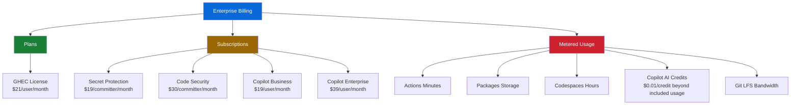
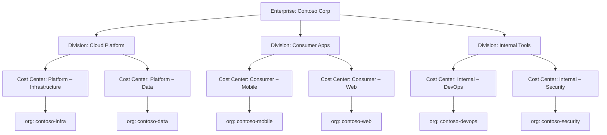
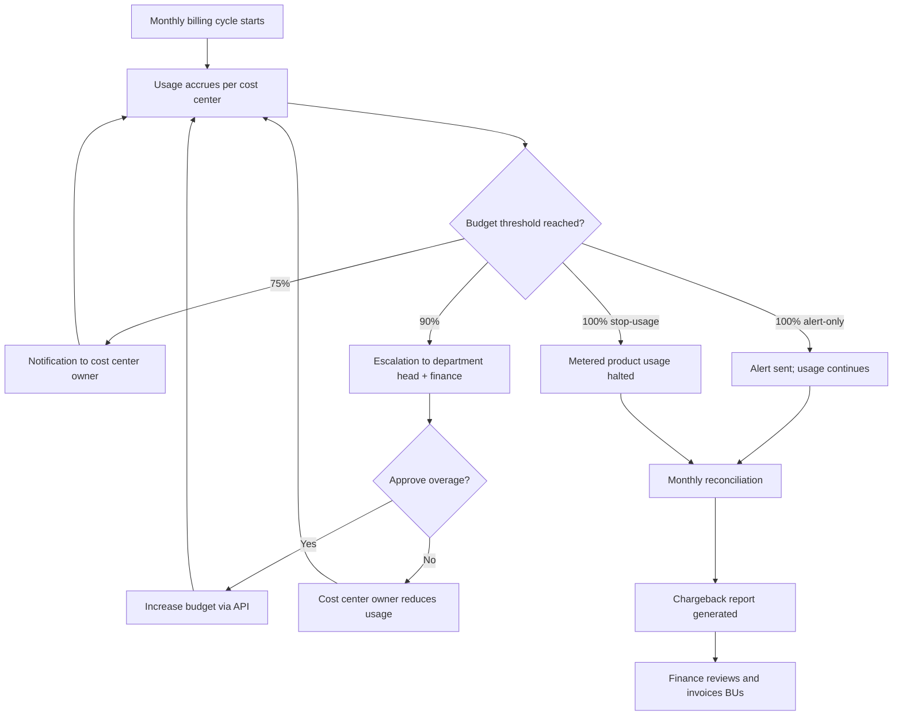

# Licenses and Billing

**Level:** L300 (Advanced)  
**Objective:** Understand GitHub Enterprise Cloud licensing models, billing mechanics, cost optimization strategies, and reporting capabilities for enterprise administrators

## Overview

GitHub Enterprise Cloud (GHEC) billing has undergone a major transformation since 2024. The legacy model of fixed-seat volume licensing has been superseded by **usage-based (metered) billing** as the default for all new GHEC accounts created after August 1, 2024. Existing volume/subscription customers transition to metered billing at renewal.

Under usage-based billing, enterprises pay monthly for the actual number of licenses consumed, plus metered charges for products like GitHub Actions, Packages, Codespaces, and Copilot usage beyond the included **GitHub AI Credits**, Copilot's billing unit since 2026-06-01. All metered products follow a fixed billing period from the 1st to the last day of each calendar month.

The billing platform supports **budgets and alerts** (including per-user budgets for Copilot), **cost centers** for departmental chargeback, and deep integration with **Azure subscriptions** for unified cloud billing. GitHub Copilot is a multi-tier product line with seven plans, and Advanced Security has been split into two separately licensable SKUs: **Secret Protection** and **Code Security**.

This guide covers the licensing and billing landscape that enterprise administrators must understand to manage costs effectively across their GitHub estate.

## License Types

### GitHub Enterprise Cloud Plans

GitHub Enterprise Cloud is the primary plan for enterprise organizations. Each member of an enterprise consumes one license (previously called a "seat"). The enterprise account is the central billing point for all organizations it owns.

Two billing models exist for GHEC licenses:

| Model | Description | Availability |
|-------|-------------|--------------|
| **Usage-based (metered)** | Pay monthly for the number of licenses actually consumed. No upfront commitment. | Default for all trials started after Aug 1, 2024. Available at renewal for existing customers. |
| **Volume (subscription)** | Purchase a fixed number of licenses for a defined period (typically annual). | Legacy model for existing invoiced customers until renewal. |

> **Note:** Usage-based billing is now the recommended model for all new GHEC deployments. It eliminates the need for license forecasting and enables true pay-as-you-go economics.

### Who Consumes a License

Understanding license consumption is critical for cost management. The following roles and statuses determine whether a user counts against your enterprise license total:

#### Users Who Consume a License

- Enterprise owners who are members or owners of at least one organization
- Organization members (including owners)
- Outside collaborators on private or internal repositories (excluding forks)
- Dormant users who are members of at least one organization
- Users with pending organization invitations (non-EMU enterprises only)

#### Users Who Do NOT Consume a License

- Suspended Enterprise Managed User accounts
- Enterprise owners who are not members of any organization
- Enterprise billing managers and organization billing managers
- Guest collaborators who are not organization members or repository collaborators
- Unaffiliated users (added to enterprise but not members of any organization)
- Users with failed invitations

> **Important:** In non-EMU enterprises, pending invitations consume a license immediately. Plan your invitation workflows accordingly to avoid unnecessary license charges.

### Unique-User Licensing

With GitHub Enterprise, users are entitled to both GitHub Enterprise Cloud and GitHub Enterprise Server (GHES). A single user consumes only **one license** regardless of how many GHES instances or GHEC organizations they belong to.

License synchronization between GHES and GHEC environments prevents double-counting. This is particularly important for hybrid deployments where developers may access both cloud and on-premises instances.

| Scenario | Licenses Consumed |
|----------|-------------------|
| User in 1 GHEC org | 1 |
| User in 3 GHEC orgs (same enterprise) | 1 |
| User in GHEC + 2 GHES instances | 1 |
| User in 2 separate enterprises | 2 (one per enterprise) |

### Enterprise Managed Users and Licensing

Enterprise Managed Users (EMU) have distinct licensing behavior compared to standard GHEC enterprises:

| Scenario | EMU | Non-EMU |
|----------|-----|---------|
| Pending org invitations | Do NOT consume license | DO consume license |
| Suspended accounts | Do NOT consume license | N/A (suspension is EMU-only via SCIM) |
| Identity provisioning | Via SCIM/IdP | Manual or SAML SSO |
| Outside collaborator invites | N/A (restricted in EMU) | Pending invites consume license for 7 days |

> **Note:** With EMU, identity lifecycle is managed through your IdP via SCIM provisioning. This means suspended or deprovisioned users stop consuming licenses immediately, providing tighter cost control.

### Managing Enterprise Licenses

License management varies based on your billing model:

| Customer Type | How to Manage Licenses |
|--------------|------------------------|
| **Usage-based billing** | No manual seat management required — billed automatically for consumed licenses |
| **Volume billing (invoiced)** | Contact GitHub Sales team to adjust license count |
| **Volume billing (self-serve)** | Manage via GitHub UI: Enterprise → Billing & licensing → Licensing → Manage licenses |

### License Reports

Enterprise admins can download CSV license reports from the Billing & Licensing → Licensing page. Report fields include:

- `GitHub com login` and `GitHub com name`
- `GitHub com enterprise roles`
- `License type` (`Visual Studio subscription` or `Enterprise`)
- `GitHub com code security license user`
- `GitHub com secret protection license user`
- `GitHub com cost center`
- `Total user accounts`

> **Note:** License reports are essential for periodic audits. Schedule monthly downloads or automate retrieval via the REST API for continuous compliance monitoring.

## Billing Models

### Usage-Based (Metered) Billing

Usage-based billing is the default model for all GHEC accounts created after August 1, 2024. Key characteristics:

- **No upfront commitment** — pay only for what you consume each month
- **Automatic scaling** — licenses expand and contract with your workforce
- **Unified billing** — all metered products bill on the same monthly cycle
- **Azure integration** — metered charges can route through Azure invoicing

This model eliminates the challenges of license forecasting and unused seat waste that were common with volume licensing.

### Volume (Subscription) Billing

Volume billing is the legacy model for existing invoiced customers:

- **Fixed license count** — purchase a predetermined number of seats
- **Annual commitment** — typically billed on an anniversary date
- **Overage restrictions** — exceeding purchased seats may require contacting Sales
- **Transition path** — existing customers move to metered billing at renewal

### Three Billing Categories

GitHub charges for three distinct categories of products:

| Category | Type | Examples |
|----------|------|----------|
| **Plans** | Fixed monthly per-user | GitHub Pro, GitHub Team, GitHub Enterprise Cloud ($21/user/month) |
| **Subscriptions** | Fixed monthly per-user | GitHub Secret Protection, GitHub Code Security |
| **Metered usage** | Variable / consumption-based | GitHub Actions, Packages, Codespaces, Copilot AI Credits beyond included usage, Git LFS |


```mermaid
flowchart TD
    A[Enterprise Billing] --> B[Plans]
    A --> C[Subscriptions]
    A --> D[Metered Usage]

    B --> B1[GHEC License<br/>$21/user/month]

    C --> C1[Secret Protection<br/>$19/committer/month]
    C --> C2[Code Security<br/>$30/committer/month]
    C --> C3[Copilot Business<br/>$19/user/month]
    C --> C4[Copilot Enterprise<br/>$39/user/month]

    D --> D1[Actions Minutes]
    D --> D2[Packages Storage]
    D --> D3[Codespaces Hours]
    D --> D4[Copilot AI Credits<br/>$0.01/credit beyond included usage]
    D --> D5[Git LFS Bandwidth]

    style A fill:#0969da,color:#fff
    style B fill:#1a7f37,color:#fff
    style C fill:#9a6700,color:#fff
    style D fill:#cf222e,color:#fff
```

### Free Usage Included with GHEC

GitHub Enterprise Cloud includes generous free-tier allowances for metered products:

| Product | Usage Type | GHEC Included Amount |
|---------|-----------|----------------------|
| GitHub Actions | Minutes/month | 50,000 |
| GitHub Actions | Storage | 50 GB (shared with Packages) |
| GitHub Packages | Storage | 50 GB (shared with Actions) |
| GitHub Packages | Data transfer/month | 100 GB |
| Git LFS | Storage/month | 250 GB |
| Git LFS | Bandwidth/month | 250 GB |

> **Important:** Codespaces does not have a free organizational or enterprise allowance. Only personal accounts on Free or Pro plans receive free Codespaces hours.

#### GitHub Actions Pricing Highlights

- **Free for**: Public repos (standard runners), self-hosted runners, GitHub Pages, Dependabot
- **Larger runners**: Always billed, even for public repos
- **Storage**: Hourly accrual model (GB-Hours); artifacts, caches, and Packages share the same pooled storage allowance

Baseline runner rates:

| Runner Type | Rate |
|-------------|------|
| Linux 2-core | $0.006/min |
| Windows 2-core | $0.010/min |
| macOS 3/4-core | $0.062/min |

### Billing Cycles

Understanding billing cycles is important for financial planning:

| Billing Type | Cycle |
|-------------|-------|
| **Metered products** | Fixed period: 1st to last day of each month (UTC) |
| **Volume-based licenses** | Anniversary date of subscription |
| **Self-serve CC metered accounts** | Standardized to 1st of month (since Dec 1, 2025) |

#### Mid-Cycle Change Behavior

- **Adding users/licenses**: Prorated charges for the remaining billing period
- **Removing users**: Charges continue through the end of the current cycle
- **Removing organizations/repos**: Charges stop immediately

## GitHub Copilot Licensing

### Copilot Plan Comparison

GitHub Copilot offers seven plans across individual and organizational tiers (Copilot Max was added on 2026-06-01), each with a monthly allowance of AI Credits:

| Plan | Target | Price | Included AI Credits/Month | Key Features |
|------|--------|-------|---------------------------|--------------|
| **Copilot Free** | Individual | $0 | An allowance | Auto model selection only; 2,000 code completions/month; limited agents |
| **Copilot Student** | Verified students | $0 | An allowance | Auto model selection only; unlimited code completions |
| **Copilot Pro** | Individual | $10/month | 1,500 (1,000 base + 500 flex) | Unlimited completions, cloud agent, a selection of models |
| **Copilot Pro+** | Individual (power user) | $39/month | 7,000 (3,900 base + 3,100 flex) | Access to premium models, higher allowance |
| **Copilot Max** | Individual (sustained high volume) | $100/month | 20,000 (10,000 base + 10,000 flex) | Priority access to premium models, highest individual allowance |
| **Copilot Business** | Org/Enterprise | $19/user/month | 1,900 per user, pooled | Centralized management, policy control, cloud agent |
| **Copilot Enterprise** | Enterprise (GHEC) | $39/user/month | 3,900 per user, pooled | All Business features + enterprise-grade capabilities |

> **Note:** Only Copilot Business and Copilot Enterprise pool their included AI Credits. Each individual plan has its own allowance: fixed base credits plus a variable flex allotment. Verified students get Copilot Student through [GitHub Education](https://education.github.com/); verified teachers and maintainers of popular open source projects may be eligible for free Copilot Pro. Enterprise owners can assign Copilot Enterprise or Copilot Business to individual organizations, or mix both across the enterprise. Only the higher-tier seat is billed when a user has both.

### GitHub AI Credits

Since 2026-06-01, Copilot plans are billed on the AI Credits they consume. Before 2026-06-01, Copilot was billed in premium requests with per-model multipliers; only Copilot Pro and Pro+ subscribers on an existing annual plan stayed on that request-based (legacy) billing after that date.

#### How AI Credits Are Consumed

- **Unit:** 1 AI Credit = $0.01 USD. Each interaction consumes input, output and cached tokens, priced per model, and the total is converted into AI Credits. A quick chat question on a lightweight model costs a fraction of a credit; a long Copilot cloud agent session on a frontier model costs far more.
- **What is billed:** Copilot features that call AI models, such as Copilot Chat, Copilot CLI, Copilot cloud agent, Copilot code review, Copilot Spaces and third-party agents. Code completions and next edit suggestions are not billed in AI Credits and stay unlimited on paid plans.
- **Model pricing:** Copilot Business and Enterprise have no request multipliers. Each model has per-token prices (input, cached input, cache write and output, per 1 million tokens) listed in [Models and pricing for GitHub Copilot](https://docs.github.com/en/enterprise-cloud@latest/copilot/reference/copilot-billing/models-and-pricing).
- **Compliance uplift:** On GitHub Enterprise Cloud with data residency, enabling **Restrict Copilot to data residency compliant models** or (US only) **Restrict Copilot to FedRAMP models** adds 10% to AI Credit consumption: an interaction that would use 100 AI Credits uses 110. Both policies are disabled by default.

#### Included Usage and Pooling

Each Copilot Business license includes 1,900 AI Credits and each Copilot Enterprise license 3,900 AI Credits per month. These credits are **pooled** at the billing entity level: an enterprise with 100 Copilot Business users shares one pool of 190,000 AI Credits, so heavy users can draw on what lighter users leave unused.

- The pool resets at 00:00:00 UTC on the 1st of each month. Unused credits don't carry over.
- Adding licenses mid-cycle grows the pool immediately; removing licenses shrinks it from the next billing cycle.

#### Additional Usage

When the pool is exhausted, usage continues as additional (metered) usage at $0.01 per AI Credit, charged to the organization or enterprise, if the AI credit paid-usage policy allows it. That policy is enabled by default; to block all spending beyond included usage, an enterprise or organization admin must disable it in **AI controls**. With it disabled, AI Credit usage is blocked until the pool resets. There is no automatic fallback to a cheaper model when a budget is exhausted.

> **Important:** Model choice drives cost. Per-token prices vary widely between lightweight and frontier models, and agentic sessions make many model calls per task. Set budgets before rollout (see [Budgets and Alerts](#budgets-and-alerts)) and review the **AI usage** page in billing settings regularly.

### Copilot Enterprise Controls

Enterprise administrators have several policy levers for managing Copilot costs:

- The AI credit paid-usage policy (enterprise **AI controls** → **Copilot**) controls whether usage can continue as paid additional usage once the pooled AI Credits are exhausted
- User-level budgets cap each user's total AI Credit consumption, from the pool and from additional usage
- Enterprise, organization and cost center budgets can either **monitor** OR **block** additional usage
- A **Bundled AI credits budget** covers every AI Credit SKU; a SKU-level budget covers one, such as Copilot AI credits or Copilot cloud agent

### Copilot Billing Behavior

Key billing rules for Copilot in enterprise environments:

| Scenario | Billing Behavior |
|----------|-----------------|
| User has personal Copilot Pro, Pro+ or Max + org seat | Personal plan auto-canceled with prorated refund |
| User in multiple orgs (same enterprise) | Enterprise billed once per billing cycle |
| User has both Business and Enterprise seats | Only Enterprise seat is billed |
| Cloud agent usage | Consumes both Actions minutes AND AI Credits |
| Copilot code review (since 2026-06-01) | Consumes AI Credits AND, on private repositories, Actions minutes from the plan's included minutes (overage at standard Actions rates; public repositories stay free). Runs on a standard GitHub-hosted runner unless an organization admin sets a default runner |

### Copilot Seat Management

Copilot seats can be managed at the organization level with three assignment modes:

| Setting | Behavior |
|---------|----------|
| `assign_all` | All organization members automatically receive Copilot |
| `assign_selected` | Only specified teams or users receive Copilot |
| `disabled` | Copilot is disabled for the organization |

The seat breakdown response from the API includes: `total`, `added_this_cycle`, `pending_cancellation`, `pending_invitation`, `active_this_cycle`, and `inactive_this_cycle`.

## Advanced Security Licensing

GitHub Advanced Security (GHAS) — now GitHub Secret Protection and GitHub Code Security — has been split into two independently purchasable SKUs since April 1, 2025. This unbundling allows organizations to adopt only the security capabilities they need.

### Secret Protection

**Price:** $19 per unique active committer per month

Secret Protection includes:

- **Secret scanning** — detects exposed secrets in repositories
- **Push protection** — prevents secrets from being committed in the first place
- **Custom secret patterns** — define organization-specific patterns
- **Secret validity checks** — verifies whether detected secrets are still active

> **Note:** All Secret Protection features are free for public repositories on GitHub.com.

### Code Security

**Price:** $30 per unique active committer per month

Code Security includes:

- **Code scanning** — identifies vulnerabilities using CodeQL and third-party tools
- **Premium Dependabot features** — advanced dependency vulnerability management
- **Dependency review** — analyze dependency changes in pull requests
- **Security overview dashboards** — enterprise-wide security posture visibility

> **Note:** All Code Security features are free for public repositories on GitHub.com.

### Active Committer Billing Basis

Both GHAS SKUs are billed based on **unique active committers** — users who have committed to at least one repository with the feature enabled in the last 90 days.

| Billing Model | Behavior |
|--------------|----------|
| **Metered** | Pay monthly per active committer, no pre-defined limit |
| **Volume** | Purchase a fixed number of committer licenses; overage blocks enabling GHAS on new repos |

#### Calculating Active Committers

Active committers are counted uniquely across the enterprise:

- A developer who commits to 5 repos with GHAS enabled counts as **1 committer**
- Only commits within the 90-day rolling window are considered
- GitHub App bot accounts are **excluded** from active committer counts; however, user-type accounts used for automation **do** count

### GHAS Availability by Plan

| GitHub Plan | Secret Protection | Code Security |
|-------------|-------------------|---------------|
| GitHub Free (public repos) | ✅ Free | ✅ Free |
| GitHub Team | ✅ Available ($19/committer/mo) | ✅ Available ($30/committer/mo) |
| GitHub Enterprise Cloud | ✅ Available ($19/committer/mo) | ✅ Available ($30/committer/mo) |

> **Important:** Since April 2025, GHAS features are available on GitHub Team plans — previously they were restricted to Enterprise plans only.

### GHAS Cost Optimization Strategies

To manage Advanced Security costs effectively:

1. **Audit repository coverage** — disable GHAS on archived or inactive repositories
2. **Target high-risk repos** — enable Code Security on repos with production deployments first
3. **Leverage free tiers** — use Secret Protection on public repos at no cost
4. **Monitor the 90-day window** — committers who stop contributing drop off billing automatically
5. **Use Secret Protection independently** — if code scanning is not needed, purchase only Secret Protection at the lower price point

## Billing Management and Cost Optimization

### Azure Subscription Integration

GHEC accounts can connect an Azure subscription for billing, routing all metered usage through Azure invoicing:

- **Required** for GitHub Enterprise Cloud through a Microsoft Enterprise Agreement to use GHAS, Codespaces, Copilot, and to exceed the plan's included Actions, Packages, and LFS amounts
- Once linked, metered costs bill through Azure on the 1st of each month
- Pre-existing GitHub plan charges continue on the legacy billing date
- Azure SPV app requires **tenant-wide admin consent** to list available subscriptions

#### Linking an Azure Subscription

1. Navigate to **Enterprise settings** → **Billing & licensing** → **Payment information**
2. Click **Add Azure subscription**
3. Authenticate with an Azure account that has Contributor access to the target subscription
4. Grant admin consent for the Azure SPV application
5. Select the target Azure subscription from the dropdown
6. Confirm the billing linkage

> **Note:** Once linked, metered charges for Actions, Packages, Codespaces, Copilot, and GHAS will appear on your Azure invoice. Plan-based charges (GHEC licenses) may remain on the GitHub invoice depending on your agreement type.

### Billing Managers

GitHub provides dedicated billing manager roles that do not consume licenses:

| Role | Scope | Permissions |
|------|-------|-------------|
| **Enterprise billing manager** | Enterprise-wide | View and manage billing settings, payment info, budgets, and usage reports |
| **Organization billing manager** | Single organization | View organization billing details and payment information |

> **Important:** Billing managers cannot access code, repositories, or organization settings beyond billing. This makes the role ideal for finance team members who need cost visibility without code access.

### Spending Limits and Controls

Enterprise administrators can set spending limits to control metered usage costs:

#### Actions and Packages Spending Limits

| Setting | Behavior |
|---------|----------|
| **$0 (default)** | Only included free minutes/storage used; workflows fail when exhausted |
| **Fixed amount** | Usage stops when spending limit is reached |
| **Unlimited** | No cap on metered charges (requires Azure subscription or credit card) |

#### Copilot Spending Controls

| Control | Scope |
|---------|-------|
| AI credit paid-usage policy | Allows or blocks additional usage once the pooled AI Credits run out (enabled by default) |
| User-level budgets | Universal, cost center or individual per-user caps on total AI Credit consumption |
| Bundled AI credits or SKU-level budgets | Cap additional AI Credit spend for the enterprise, an organization or a cost center |
| AI credit pool (cost centers) | Caps a cost center's share of the pooled included AI Credits at what its own licenses fund |
| Organization-level assignment | Restrict which orgs have Copilot enabled |

### Cost Optimization Strategies

Effective cost management requires ongoing monitoring and adjustment:

#### License Optimization

- **Remove dormant users** — audit users inactive for 30+ days and remove from organizations
- **Review outside collaborators** — each outside collaborator on a private repo consumes a license
- **Leverage EMU** — suspended EMU accounts immediately stop consuming licenses

#### Actions Cost Reduction

- **Use self-hosted runners** — no per-minute charges for self-hosted infrastructure
- **Optimize workflow triggers** — use `paths` filters and `concurrency` groups to reduce unnecessary runs
- **Cache dependencies** — reduce build times with `actions/cache`
- **Right-size runners** — use smaller runners for lightweight jobs

#### Copilot Cost Management

- **Audit seat activity** — use the API to identify users with no Copilot activity in 30+ days
- **Assign by team** — use team-based assignment instead of `assign_all`
- **Monitor AI Credits** — use the **AI usage** page in billing settings and the AI usage report (per user and model) to find the users, models and features driving consumption

## Budget Alerts and Cost Centers

### Budgets and Alerts

GitHub's billing platform supports configurable budgets at multiple levels:

#### Budget Scopes

| Scope | Description |
|-------|-------------|
| **Enterprise** | Aggregate budget across all organizations |
| **Organization** | Budget for a single organization's usage |
| **Cost center** | Budget for a logical grouping of resources |
| **User** (AI Credits only) | Per-user cap on total Copilot AI Credit consumption, from the pool and from additional usage. **Universal** applies to every Copilot-licensed user, **cost center user-level** to every member of one cost center, and **individual** to one user. The most specific budget applies |

User-level budgets are generally available since 2026-06-01; cost center user-level budgets followed on 2026-06-30 (REST API) and 2026-07-07 (billing UI).

> **Important:** For Copilot AI Credits, only user-level budgets act on the pooled included usage. Enterprise, organization and cost center budgets cap additional usage only after the pool is exhausted. The enterprise budget is therefore not a total monthly budget: with stop-usage enabled, the maximum Copilot bill is license fees plus that budget.

#### Budget Types

| Type | Behavior |
|------|----------|
| **Alert-only** | Sends notifications when thresholds are reached; usage continues. This is the default: **Stop usage when budget limit is reached** is off unless you select it |
| **Stop-usage** | Halts metered consumption when the budget is exhausted. GitHub's budget guidance is to enable it on every enterprise and cost center spending limit for AI Credits. On GHAS SKU-level budgets (since 2026-05-28) the option is **Limit usage when budget limit is reached** and blocks enabling GHAS on more repositories; see [Budget Considerations for GHAS](#budget-considerations-for-ghas) |
| **User-level** (AI Credits) | Always a hard stop at the limit; there is no alert-only option |

#### Included Usage Alerts

GitHub automatically monitors included free usage allowances with notifications at:

- **90% threshold** — warning that free allocation is nearly exhausted
- **100% threshold** — alert that free allocation is fully consumed

#### Creating a Budget in the UI

Enterprise owners and billing managers create budgets under the enterprise's **Billing and licensing** → **Budgets and alerts** → **New budget**. Choose a budget type (**Product-level budget**, **SKU-level budget** or **Bundled AI credits budget**), then a scope. For a user-level budget, choose **Bundled AI credits budget** and the **Users** scope: leave the user empty for a universal budget, select a cost center for a cost center user-level budget, or select one user for an individual budget. GitHub's setup guidance is to set the universal budget above the per-license value ($19 for Copilot Business, $39 for Copilot Enterprise) so heavier users can still draw on the shared pool.

#### Creating a Budget via API

```bash
# Create an enterprise budget for all AI Credit SKUs that blocks additional usage at $500
gh api \
  --method POST \
  -H "Accept: application/vnd.github+json" \
  -H "X-GitHub-Api-Version: 2026-03-10" \
  /enterprises/{enterprise}/settings/billing/budgets \
  -f budget_scope='enterprise' \
  -f budget_entity_name='' \
  -f budget_type='BundlePricing' \
  -f budget_product_sku='ai_credits' \
  -F budget_amount=500 \
  -F prevent_further_usage=true \
  -F 'budget_alerting[will_alert]=true' \
  -f 'budget_alerting[alert_recipients][]={billing_manager_login}'
```

The budgets REST API is generally available since 2026-06-04. `budget_amount` is in whole US dollars, or a license count for license-based products such as GHAS. Budgets that existed for premium requests before 2026-06-01 were converted to AI Credit budgets automatically.

### Cost Centers

Cost centers enable departmental chargeback by grouping resources and allocating costs to business units:

#### Cost Center Capabilities

- Group organizations, repositories, users and (since 2026-06-25) enterprise teams into logical cost units
- Allocate metered and license-based charges to specific departments
- Route Azure subscription billing per cost center
- Generate per-cost-center usage reports
- Cap a department's Copilot spend with an AI credit pool and a cost center user-level budget (see [Tracking GitHub Copilot via Cost Centers](#tracking-github-copilot-via-cost-centers))

#### Cost Center Limits

| Constraint | Limit |
|-----------|-------|
| Maximum active cost centers per enterprise | 1,000 (since 2026-06-26; previously 500) |
| Maximum resources per cost center | 25,000 |

### Cost Center Allocation Rules

How charges are allocated depends on the product type:

| Product Type | Allocation Basis | Example |
|-------------|-----------------|---------|
| **Usage-based products** | By repository or organization | Actions minutes are allocated to the cost center of the repository where the workflow runs |
| **License-based products** | By user | Copilot seats are allocated to the cost center of the assigned user |
| **AI Credit usage** | By user, else the organization that granted the user's Copilot license | Copilot cloud agent AI Credits are allocated to the cost center of the user who triggered them |

#### Creating a Cost Center via API

```bash
# Create a cost center for the Engineering department
gh api \
  --method POST \
  -H "Accept: application/vnd.github+json" \
  -H "X-GitHub-Api-Version: 2026-03-10" \
  /enterprises/{enterprise}/settings/billing/cost-centers \
  -f name='Engineering' \
  -f description='Engineering department resources'
```

#### Assigning Resources to a Cost Center

```bash
# Add an organization to a cost center
gh api \
  --method POST \
  -H "Accept: application/vnd.github+json" \
  -H "X-GitHub-Api-Version: 2026-03-10" \
  /enterprises/{enterprise}/settings/billing/cost-centers/{cost_center_id}/resources \
  -f resource_type='organization' \
  -f resource_id='{org_id}'
```

### Design Patterns for Cost Center Hierarchies

Choosing the right cost center structure is foundational. An ill-fitting hierarchy creates ongoing friction with finance teams and makes chargeback reports unreliable. The table below summarizes the three most common patterns:

| Pattern | Structure | Best For | Trade-offs |
|---------|-----------|----------|------------|
| **Single-department** | One cost center per business unit (BU) | Enterprises with clear BU ownership of repos and teams | Simple to manage; limited granularity within a BU |
| **Matrix** | Cost centers by project AND department | Enterprises where cross-functional teams share repos | Accurate project-level costing; more complex resource assignment |
| **Multi-tier** | Enterprise → Division → Department → Team | Large enterprises (5,000+ developers) with deep org charts | Full chargeback precision; requires disciplined onboarding processes |

#### Multi-Tier Hierarchy Example


```mermaid
graph TD
    E[Enterprise: Contoso Corp] --> D1[Division: Cloud Platform]
    E --> D2[Division: Consumer Apps]
    E --> D3[Division: Internal Tools]

    D1 --> CC1[Cost Center: Platform – Infrastructure]
    D1 --> CC2[Cost Center: Platform – Data]
    D2 --> CC3[Cost Center: Consumer – Mobile]
    D2 --> CC4[Cost Center: Consumer – Web]
    D3 --> CC5[Cost Center: Internal – DevOps]
    D3 --> CC6[Cost Center: Internal – Security]

    CC1 --> R1[org: contoso-infra]
    CC2 --> R2[org: contoso-data]
    CC3 --> R3[org: contoso-mobile]
    CC4 --> R4[org: contoso-web]
    CC5 --> R5[org: contoso-devops]
    CC6 --> R6[org: contoso-security]
```

> **Tip:** GitHub cost centers are a flat list (no parent-child relationships in the API). To model a hierarchy, use a naming convention that encodes the tier — e.g., `platform-infra`, `platform-data`, `consumer-mobile`. This allows you to group by prefix when generating reports.

#### Organizations vs. Cost Centers for Cost Tracking

Enterprises often ask whether they should create separate organizations or use cost centers for cost isolation. The answer depends on the separation you need:

| Dimension | Organization-Based Tracking | Cost Center-Based Tracking |
|-----------|----------------------------|---------------------------|
| **Access boundaries** | Full access isolation between orgs | No access boundaries — cost centers are billing-only |
| **Policy isolation** | Separate security policies, rulesets, Copilot settings | Shared policies; cost allocation only |
| **Billing granularity** | Usage-based products auto-allocate by repo's org | Can group repos and users from multiple orgs |
| **Overhead** | Higher — each org needs owners, settings, team structure | Lower — cost centers are metadata on existing resources |
| **Recommended when** | Regulatory, compliance, or vendor isolation required | Chargeback reporting across shared infrastructure |

In practice, most enterprises use a **hybrid approach**: organizations for access and policy boundaries, cost centers layered on top for financial reporting.

### Tracking GitHub Copilot via Cost Centers

Copilot is typically the fastest-growing line item in an enterprise GitHub bill. Cost centers provide the mechanism to ensure each department pays for the Copilot seats and AI Credits it actually uses.

#### How Copilot Costs Allocate to Cost Centers

Copilot seats are a **license-based product** and Copilot AI Credits are billed by usage, but both are allocated based on the **user**, not the repository:

- Each Copilot seat is charged to the cost center the user is assigned to, directly or through an enterprise team (a direct assignment wins)
- AI Credit usage is charged to the cost center of the user who triggered it
- If a user is not in any cost center, both follow the organization that granted the Copilot license: that organization's cost center if it has one, otherwise the enterprise
- Some AI Credit usage is billed directly to the organization or enterprise and never counts against a user-level budget: Copilot CLI runs in GitHub Actions with `GITHUB_TOKEN` (since 2026-07-02, allowed by the **Allow use of Copilot CLI billed to the organization** policy), and Copilot code reviews requested by bots or for users without a Copilot license. Cap this usage with cost center or organization budgets
- When a user moves to another cost center, only future usage follows them; earlier usage stays with the previous cost center

#### Capping a Cost Center's Share of Included AI Credits

Included AI Credits are pooled across the enterprise, so without a cap one cost center can spend credits that another cost center's licenses paid for. An **AI credit pool** (called an included usage control in GitHub Docs) limits a cost center's included usage to the AI Credits funded by its own licenses: 1,900 per Copilot Business and 3,900 per Copilot Enterprise license. GitHub calculates the cap for you; increases apply immediately and decreases from the next billing cycle.

- **Where:** Toggle it when you create or edit a cost center that contains at least one user or enterprise team, under the enterprise's **Billing and licensing** → **Cost centers** (in the billing UI since 2026-07-20; REST API since 2026-07-02). Available for Copilot Business and Copilot Enterprise.
- **At the cap:** Choose whether members are blocked or continue as paid additional usage, if the enterprise allows overages.
- **Not a budget:** The pool governs the included phase; a cost center budget caps metered charges after the shared pool is exhausted. Use both on the same cost center.

#### Per-User AI Credit Budgets for a Cost Center

A **cost center user-level budget** sets one per-user AI Credit cap for every member of a cost center, whether added directly or through an enterprise team, and follows membership changes automatically. It counts pooled and additional usage, so it can stop a user before the pool runs out. It overrides the universal user-level budget, and an individual user-level budget overrides it. For example, a platform engineering cost center can get $250 per user while everyone else stays on a $40 universal budget. Create it under **Budgets and alerts** (**Bundled AI credits budget**, **Users** scope, then select the cost center).

#### Monitoring Copilot AI Credits per Cost Center

AI Credit consumption is the variable part of Copilot cost: Copilot Chat, Copilot CLI and Copilot cloud agent sessions are priced per token by model and can generate significant charges once the pool is exhausted. Filter AI Credit usage by cost center to identify which departments drive consumption:

```bash
# Get Copilot AI Credit usage for a specific cost center
# (Uses the AI credit usage endpoint — see Billing API and Reporting for full parameter reference)
gh api \
  -H "Accept: application/vnd.github+json" \
  -H "X-GitHub-Api-Version: 2026-03-10" \
  "/enterprises/{enterprise}/settings/billing/ai_credit/usage?cost_center_id={cost_center_id}&year=2026&month=9"
```

#### Setting Copilot-Specific Budgets per Department

Create per-cost-center budgets for AI Credits to prevent any single department from generating uncapped additional usage charges:

```bash
# Create a cost center budget for all AI Credit SKUs that blocks additional usage at $2,000
gh api \
  --method POST \
  -H "Accept: application/vnd.github+json" \
  -H "X-GitHub-Api-Version: 2026-03-10" \
  /enterprises/{enterprise}/settings/billing/budgets \
  -f budget_scope='cost_center' \
  -f budget_entity_name='{cost_center_id}' \
  -f budget_type='BundlePricing' \
  -f budget_product_sku='ai_credits' \
  -F budget_amount=2000 \
  -F prevent_further_usage=true \
  -F 'budget_alerting[will_alert]=true' \
  -f 'budget_alerting[alert_recipients][]={cost_center_owner_login}'
```

> **Warning:** Without **Stop usage when budget limit is reached** (`prevent_further_usage`), a cost center budget only sends alerts and charges keep accruing; GitHub's budget guidance is to enable it on every enterprise and cost center spending limit. To avoid blocking developers mid-sprint, size budgets from AI usage data and give power users individual user-level budgets rather than leaving spending limits uncapped.

#### Copilot ROI Reporting per Cost Center

Finance teams frequently ask: *"Is Copilot worth it for Department X?"* Combine cost center billing data with Copilot activity metrics to build ROI reports:

| Metric | Source | Purpose |
|--------|--------|---------|
| Copilot seat cost per cost center | Billing usage API (filtered by `cost_center_id`) | Total investment per department |
| AI Credit spend per cost center | AI credit usage API (`ai_credit/usage`, filtered by `cost_center_id`) | Variable cost per department |
| Active users per cost center | Copilot seat API + cost center membership | Utilization rate |
| Suggestions accepted / lines of code | Copilot metrics API | Productivity signal |
| PR cycle time delta | Repository metrics (before/after Copilot rollout) | Velocity impact |

The ROI calculation becomes: `(Productivity gains × developer hourly cost) / (Seat cost + additional AI Credit charges)` per cost center.

### Tracking GitHub Advanced Security via Cost Centers

GHAS — now split into **Secret Protection** and **Code Security** — charges based on **active unique committers** to repositories where the feature is enabled. Like Copilot, GHAS is a license-based product, so cost center allocation is based on the **user** (active committer), not the repository.

#### How GHAS Costs Allocate to Cost Centers

Like Copilot, GHAS is a **license-based product** allocated by **user**:

- Each active committer license is charged to exactly **one** cost center, regardless of how many GHAS-enabled repos they contribute to
- An active committer is anyone who has pushed at least one commit to a GHAS-enabled repo in the last 90 days
- Allocation follows a precedence order: **direct user assignment → oldest organization membership → enterprise fallback**

> **Important:** Because GHAS license costs follow the user's cost center assignment (not the repository), a committer's GHAS charge may land in a cost center that the developer's manager doesn't expect. Review allocation precedence rules with your finance team before enabling GHAS broadly.

#### Active Committer Tracking per Cost Center

```bash
# Get GHAS active committer counts filtered by cost center
# (Uses the usage reporting endpoint — see Billing API and Reporting for full parameter reference)
gh api \
  -H "Accept: application/vnd.github+json" \
  -H "X-GitHub-Api-Version: 2026-03-10" \
  "/enterprises/{enterprise}/settings/billing/usage?product=ghas&cost_center_id={cost_center_id}&year=2026&month=4"
```

#### Budget Considerations for GHAS

Since 2026-05-28, enterprise owners and billing managers can give GHAS SKU-level budgets (Secret Protection, Code Security) a **hard limit set in license count**. Create the budget under the enterprise's **Billing and licensing** → **Budgets and alerts** as a **SKU-level budget** and select **Limit usage when budget limit is reached**. Setup shows a real-time dollar estimate for the license count, and if GHAS licenses are already active the budget can't be set below the current billable license count. Existing soft GHAS budgets can be migrated to the license-based format in the product.

| Budget Setting | Effect on GHAS | Recommendation |
|----------------|---------------|----------------|
| **Alert-only** (limit option not selected) | Threshold alerts at 75%, 90% and 100%; enablement and billing continue | ✅ Visibility without blocking security rollouts |
| **Limit usage when budget limit is reached** | At the limit, GHAS can't be enabled on additional repositories until the budget is raised or the next billing cycle starts. Repositories that already have GHAS keep it, and their active committers are still counted and billed | ✅ A hard ceiling on GHAS expansion |

A hard GHAS budget caps *expansion*, not every license: usage can still exceed it when another committer becomes active in a repository where GHAS is already enabled, or when you enable GHAS on a repository with more active committers than the remaining budget (the enablement succeeds and the excess is billed). Keep reviewing active committer counts before large enablements, and disable GHAS on repos where costs exceed targets.

#### Avoiding Cost Surprises with GHAS Rollouts

GHAS costs can spike unexpectedly when teams enable the feature on repositories with many contributors. Follow this phased approach:

1. **Inventory first** — before enabling GHAS on a repo, query the committer count for the last 90 days
2. **Pilot phase** — enable on 2-3 representative repos per cost center; measure actual committer-based costs
3. **Forecast** — extrapolate pilot costs to the full repo portfolio for each cost center
4. **Budget** — create GHAS SKU-level budgets in license count from the forecast plus a 20% buffer; select **Limit usage when budget limit is reached** where enablement should stop at the limit
5. **Roll out** — enable GHAS progressively, monitoring cost center spend weekly during the first month

```bash
# Estimate active committers for a repo before enabling GHAS
# NOTE: This is an approximation based on contributor stats. For exact active
# committer counts on GHAS-enabled repos, use the Enhanced Billing Platform's
# usage report API (see "Billing API and Reporting" below).
gh api \
  -H "Accept: application/vnd.github+json" \
  -H "X-GitHub-Api-Version: 2026-03-10" \
  "/repos/{owner}/{repo}/stats/contributors" \
  --jq '[.[] | select(
    (.weeks | last | .w) > (now - 90*86400 | floor)
  )] | length'
```

### Cost Center to Azure Billing Mapping

> For initial setup of Azure subscription billing, see **Azure Subscription Integration** in the *Billing Management and Cost Optimization* section above.

Once an Azure subscription is linked to your enterprise, cost centers enable fine-grained billing routing through Azure Cost Management.

#### Linking Cost Centers to Azure Billing

Each cost center can be associated with a different Azure subscription or resource group, enabling separate invoicing:

| Configuration | How It Works |
|--------------|-------------|
| **Single Azure subscription** | All cost centers bill to one subscription; use Azure cost tags to differentiate |
| **Multiple Azure subscriptions** | Each cost center routes charges to a dedicated Azure subscription |
| **Azure resource groups** | Map cost centers to Azure resource groups for consolidated cloud billing |

#### Azure Billing Tags and Cost Center Correlation

GitHub cost center names and IDs appear in Azure Cost Management as billing metadata. To correlate:

1. Use consistent naming between GitHub cost centers and Azure cost tags (e.g., `platform-infra` in both systems)
2. Export Azure Cost Management data filtered by the GitHub billing publisher
3. Join on cost center name to produce unified cloud spend reports

#### Consolidated Cloud Billing Workflow

For enterprises managing both Azure and GitHub spend, the consolidated billing flow is:

1. GitHub usage accrues against cost centers throughout the billing period
2. At month-end, charges are routed through the linked Azure subscription(s)
3. Azure Cost Management aggregates GitHub charges with other Azure services
4. Finance teams pull unified reports from Azure Cost Management, filtered by cost tags that match GitHub cost center names

### Real-World Chargeback Scenarios

The following scenarios illustrate common cost center configurations in enterprise environments.

#### Scenario 1: Fully Decentralized — Each BU Pays Its Own Way

A financial services company with 5 business units, each with its own P&L, requires full cost transparency:

| Cost Center | Orgs Assigned | Products Charged | Monthly Budget |
|-------------|--------------|-----------------|----------------|
| `wealth-mgmt` | wealth-mgmt-eng | GHEC licenses, Copilot, Actions, GHAS | $45,000 |
| `retail-banking` | retail-eng, retail-qa | GHEC licenses, Copilot, Actions, GHAS | $62,000 |
| `capital-markets` | capmarkets-core | GHEC licenses, Copilot, Actions | $38,000 |
| `insurance` | insurance-platform | GHEC licenses, Copilot, GHAS | $28,000 |
| `corporate-tech` | corp-infra, corp-security | GHEC licenses, Actions, GHAS | $15,000 |

**Key decisions:**
- Each BU controls its own Copilot seat assignments
- GHAS is mandatory for `wealth-mgmt` and `retail-banking` (regulated); optional for others
- Alert-only budgets with CFO notification at 90% threshold

#### Scenario 2: Central IT Funds Copilot, BUs Fund Actions

A technology company treats Copilot as a strategic productivity investment funded centrally, while BUs pay for their own CI/CD consumption:

| Cost Center | Scope | Products Charged | Funded By |
|-------------|-------|-----------------|-----------|
| `central-copilot` | All Copilot users (enterprise-wide) | Copilot Enterprise seats, AI Credits | Central IT budget |
| `platform-eng` | platform-eng org repos | Actions, Packages, Codespaces | Platform BU |
| `product-eng` | product-eng org repos | Actions, Packages | Product BU |
| `data-eng` | data-eng org repos | Actions, Packages, Codespaces | Data BU |

**Key decisions:**
- Users are assigned to `central-copilot` for Copilot billing, but their repos are assigned to BU cost centers for Actions
- A single user may generate charges in two cost centers: Copilot (user-based) in `central-copilot` and Actions (repo-based) in their BU's cost center
- Central IT sets a global Copilot budget; BUs set their own Actions budgets

#### Scenario 3: GHAS Cost Allocation for Regulated vs. Non-Regulated Repositories

A healthcare company must enable GHAS on all repos handling PHI data but wants to make it opt-in for internal tooling:

| Cost Center | Repos | GHAS Policy | Budget Type |
|-------------|-------|-------------|-------------|
| `phi-applications` | patient-portal, claims-api, ehr-sync | GHAS mandatory (Secret Protection + Code Security) | Alert-only (security cannot be halted) |
| `internal-tools` | dev-portal, build-scripts, docs | GHAS optional (teams opt in) | Alert-only with lower threshold |
| `open-source` | community projects, SDKs | Secret Protection only (public repos get code scanning free) | Alert-only |

**Key decisions:**
- `phi-applications` has a higher budget ceiling because compliance requires continuous scanning
- Each active committer's GHAS license is charged to exactly **one** cost center based on their user assignment, regardless of which repos they contribute to
- Committers not directly assigned to a cost center fall back to their oldest org membership, then the enterprise default

### Cost Center Reporting and Governance

#### Generating Cost Center Reports via API

Use the billing usage endpoint with the `cost_center_id` filter to produce per-department reports. This uses the same endpoint documented in *Billing API and Reporting* below, filtered to a specific cost center:

```bash
# Generate a cost center usage report for the current month
gh api \
  -H "Accept: application/vnd.github+json" \
  -H "X-GitHub-Api-Version: 2026-03-10" \
  "/enterprises/{enterprise}/settings/billing/usage/summary?cost_center_id={cost_center_id}&year=2026&month=4" \
  --jq '.usageItems[] | {product, sku, quantity, grossAmount, netAmount}'
```

#### Monthly Chargeback Report Automation

Extend the automated billing workflow (see *Automating Usage Reports* in the Billing API section below) by iterating over all cost centers to produce a per-department CSV:

```bash
# Fetch all cost centers, then generate a per-cost-center chargeback report
COST_CENTERS=$(gh api \
  --paginate \
  -H "Accept: application/vnd.github+json" \
  -H "X-GitHub-Api-Version: 2026-03-10" \
  /enterprises/{enterprise}/settings/billing/cost-centers \
  --jq '.[].id')

YEAR=$(date -d "last month" +%Y)
MONTH=$(date -d "last month" +%-m)

echo "cost_center,product,sku,quantity,net_amount" > chargeback-report.csv

for CC_ID in $COST_CENTERS; do
  CC_NAME=$(gh api \
    -H "Accept: application/vnd.github+json" \
    -H "X-GitHub-Api-Version: 2026-03-10" \
    "/enterprises/{enterprise}/settings/billing/cost-centers/${CC_ID}" \
    --jq '.name')

  gh api \
    -H "Accept: application/vnd.github+json" \
    -H "X-GitHub-Api-Version: 2026-03-10" \
    "/enterprises/{enterprise}/settings/billing/usage/summary?cost_center_id=${CC_ID}&year=${YEAR}&month=${MONTH}" \
    --jq ".usageItems[] | [\"${CC_NAME}\", .product, .sku, .quantity, .netAmount] | @csv" \
    >> chargeback-report.csv
done
```

#### Budget Monitoring Workflow


```mermaid
flowchart TD
    A[Monthly billing cycle starts] --> B[Usage accrues per cost center]
    B --> C{Budget threshold reached?}
    C -->|75%| D[Notification to cost center owner]
    C -->|90%| E[Escalation to department head + finance]
    C -->|100% alert-only| F[Alert sent; usage continues]
    C -->|100% stop-usage| G[Metered product usage halted]
    D --> B
    E --> H{Approve overage?}
    H -->|Yes| I[Increase budget via API]
    H -->|No| J[Cost center owner reduces usage]
    I --> B
    J --> B
    F --> K[Monthly reconciliation]
    G --> K
    K --> L[Chargeback report generated]
    L --> M[Finance reviews and invoices BUs]
```

#### Common Mistakes and Gotchas

| Mistake | Impact | Prevention |
|---------|--------|-----------|
| Not assigning all resources to cost centers | Costs land in **Unassigned** bucket; invisible to chargeback reports | Run a monthly audit of unassigned resources |
| Assuming a GHAS budget stops all GHAS spend | Since 2026-05-28 a GHAS SKU-level budget with **Limit usage when budget limit is reached** blocks enabling GHAS on more repositories, but committers on repos that already have GHAS are still billed; without that option the budget only alerts | Combine license-count budgets with committer reviews before large enablements |
| Unexpected GHAS cost center allocation | GHAS license cost may be allocated to a cost center that the developer's manager doesn't expect due to the allocation precedence rules (user assignment → oldest org → enterprise fallback) | Review and explicitly assign users to cost centers before enabling GHAS |
| Creating cost centers after enabling products | Historical costs cannot be retroactively re-allocated | Create cost centers and assign resources before enabling paid features |
| Hitting the 1,000 active cost center limit (since 2026-06-26) | Cannot model a cost center for every team in very large enterprises | Use naming conventions to encode hierarchy; keep cost centers at department level |
| Not linking Azure subscriptions | Billing goes to default payment method; no Azure Cost Management visibility | Link Azure subscriptions as part of enterprise onboarding |

### Cost Center Best Practices

#### Naming Conventions

Use a consistent, hierarchical naming scheme that encodes organizational structure:

| Pattern | Example | When to Use |
|---------|---------|-------------|
| `{division}-{department}` | `platform-infra`, `consumer-mobile` | Most enterprises (2-level hierarchy) |
| `{division}-{department}-{team}` | `platform-infra-sre`, `consumer-mobile-ios` | Large enterprises needing team-level chargeback |
| `{project}-{env}` | `atlas-prod`, `atlas-staging` | Project-based organizations |
| `{region}-{department}` | `us-engineering`, `eu-engineering` | Geographically distributed enterprises |

> **Tip:** Avoid spaces and special characters in cost center names. Use lowercase with hyphens for consistency with GitHub naming conventions.

#### Resource Assignment Strategy

| Resource Type | Assignment Guidance |
|--------------|-------------------|
| **Organizations** | Assign to cost center based on primary owning department |
| **Repositories** | Assign cross-team repos to the cost center of the primary maintainer |
| **Users** | Assign based on reporting structure (HR department code) |
| **Unassigned resources** | Audit monthly; default to a `shared-services` cost center |

#### Budget Threshold Recommendations

| Threshold | Action | Audience |
|-----------|--------|----------|
| **50%** | Manual governance checkpoint (not a platform alert — configure this as a calendar-based review) | Cost center owner |
| **75%** | Platform alert fires by default; review and forecast remaining month spend | Cost center owner + engineering lead |
| **90%** | Platform alert fires by default; escalation; evaluate whether budget increase or usage reduction is needed | Department head + finance |
| **100%** | Platform alert fires by default. Alert-only: continue with overage tracking. Stop-usage (metered products): halt non-critical metered products; on GHAS SKU budgets, the limit blocks enabling GHAS on more repositories | Finance + enterprise admin |

#### Review Cadence

| Activity | Frequency | Owner |
|----------|-----------|-------|
| Review cost center assignment completeness | Monthly | Enterprise admin |
| Review budget utilization across cost centers | Monthly | Finance + enterprise admin |
| Audit for unassigned resources | Monthly | Enterprise admin |
| Reconcile chargeback reports with finance | Monthly | Finance team |
| Review cost center hierarchy and naming | Quarterly | Enterprise admin + department heads |
| Evaluate Copilot ROI per cost center | Quarterly | Engineering leadership |
| Full cost center structure review | Annually | CTO/CIO + finance leadership |

## Billing API and Reporting

### Usage Reporting Endpoints

The GitHub REST API provides comprehensive billing usage data at user, organization, and enterprise levels:

| Endpoint | Method | Description |
|----------|--------|-------------|
| `/organizations/{org}/settings/billing/usage` | GET | Detailed usage report for all paid products (org level) |
| `/organizations/{org}/settings/billing/usage/summary` | GET | Summary usage report (org level) — **public preview** |
| `/organizations/{org}/settings/billing/ai_credit/usage` | GET | AI Credit usage report (org level) |
| `/users/{username}/settings/billing/usage` | GET | Detailed usage report (user level) |
| `/users/{username}/settings/billing/usage/summary` | GET | Summary usage report (user level) — **public preview** |
| `/users/{username}/settings/billing/ai_credit/usage` | GET | AI Credit usage report (user level; only for a Copilot plan the user bought personally) |
| `/enterprises/{enterprise}/settings/billing/usage/summary` | GET | Summary usage report (enterprise level) |
| `/enterprises/{enterprise}/settings/billing/ai_credit/usage` | GET | AI Credit usage report (enterprise level) |
| `/orgs/{org}/settings/billing/advanced-security` | GET | GHAS active committers per repository |

The `premium_request/usage` endpoints at the same levels are still documented. They report premium-request usage, which for Copilot Business and Enterprise means usage before 2026-06-01.

#### Authentication Requirements

- **Personal access tokens (classic)** with billing permissions are required
- **Fine-grained PATs are NOT supported** for billing usage endpoints
- API version header: `X-GitHub-Api-Version: 2026-03-10`

#### Common Query Parameters

| Parameter | Description |
|-----------|-------------|
| `year`, `month`, `day` | Filter by time period (the `hour` parameter was removed on 2026-06-04; `day` returns daily totals) |
| `cost_center_id` | Filter by cost center (enterprise only) |
| `repository` | Filter by repository |
| `product` | Filter by product name |
| `sku` | Filter by SKU name |
| `user`, `model` | Filter AI Credit usage by user or model (`ai_credit/usage` endpoints) |

### Querying Usage Data

#### Enterprise Usage Summary

```bash
# Get enterprise-level billing usage summary for the current month
gh api \
  -H "Accept: application/vnd.github+json" \
  -H "X-GitHub-Api-Version: 2026-03-10" \
  /enterprises/{enterprise}/settings/billing/usage/summary \
  -f year=2026 \
  -f month=4
```

#### Organization AI Credit Usage

```bash
# Get Copilot AI Credit usage for an organization (add &user=, &model= or &product= to filter)
gh api \
  -H "Accept: application/vnd.github+json" \
  -H "X-GitHub-Api-Version: 2026-03-10" \
  "/organizations/{org}/settings/billing/ai_credit/usage?year=2026&month=9"
```

#### GHAS Active Committer Report

```bash
# Get GHAS active committers per repository
gh api \
  -H "Accept: application/vnd.github+json" \
  -H "X-GitHub-Api-Version: 2026-03-10" \
  /orgs/{org}/settings/billing/advanced-security
```

### Copilot Seat Management API

Key REST API endpoints for managing Copilot seat assignments:

| Endpoint | Method | Description |
|----------|--------|-------------|
| `/orgs/{org}/copilot/billing` | GET | Get Copilot seat info and settings |
| `/orgs/{org}/copilot/billing/seats` | GET | List all seat assignments with last activity data |
| `/orgs/{org}/copilot/billing/selected_teams` | POST | Add teams to Copilot subscription |
| `/orgs/{org}/copilot/billing/selected_teams` | DELETE | Remove teams from Copilot subscription |
| `/orgs/{org}/copilot/billing/selected_users` | POST | Add individual users to Copilot |
| `/orgs/{org}/copilot/billing/selected_users` | DELETE | Remove individual users (pending cancellation) |
| `/orgs/{org}/members/{username}/copilot` | GET | Get seat details for a specific user |

**Required scopes**: `manage_billing:copilot` or `read:org` (for GET), `manage_billing:copilot` or `admin:org` (for POST/DELETE).

#### Identifying Inactive Copilot Users

```bash
# List all Copilot seats and filter for inactive users (no activity in 30+ days)
gh api \
  -H "Accept: application/vnd.github+json" \
  -H "X-GitHub-Api-Version: 2026-03-10" \
  /orgs/{org}/copilot/billing/seats \
  --paginate \
  --jq '.seats[] | select(.last_activity_at != null) |
    select(
      (now - (.last_activity_at | fromdateiso8601)) > (30 * 86400)
    ) | {login: .assignee.login, last_activity: .last_activity_at}'
```

### Product and SKU Identifiers

For programmatic budget creation and usage queries, use these product and SKU identifiers:

#### Product IDs

| Product ID | Product Name |
|-----------|--------------|
| `actions` | GitHub Actions |
| `packages` | GitHub Packages |
| `codespaces` | GitHub Codespaces |
| `copilot` | GitHub Copilot |
| `ghas` | GitHub Advanced Security (now Secret Protection + Code Security) |
| `ghec` | GitHub Enterprise Cloud |

#### Key SKU Identifiers

| SKU | Product |
|-----|---------|
| `ghec_licenses` | GHEC license seats |
| `copilot_enterprise` | Copilot Enterprise seats |
| `copilot_for_business` | Copilot Business seats |
| `copilot_ai_credit` | Copilot AI Credits |
| `coding_agent_ai_credit` | Copilot cloud agent AI Credits |
| `copilot_standalone` | Copilot standalone (individual) |
| `spark_ai_credits` | Spark AI Credits |
| `ghas_licenses` | GHAS bundled licenses (legacy) |
| `ghas_code_security_licenses` | Code Security licenses |
| `ghas_secret_protection_licenses` | Secret Protection licenses |

To budget for every AI Credit SKU at once, use `budget_type: BundlePricing` with `budget_product_sku: ai_credits`. Before 2026-06-01, Copilot usage was recorded under the premium-request SKUs (`copilot_premium_request`, `copilot_agent_premium_request`, `spark_premium_request`), which still appear in historical reports.

### Downloadable CSV Reports

Three report types are available from the GitHub web UI, two on the **Metered usage** page and one on the **AI usage** page:

| Report | Max Period | Key Fields |
|--------|-----------|------------|
| **Summarized usage** | 1 year | date, sku, repository, cost_center_name, quantity, gross_amount, discount_amount, net_amount |
| **Detailed usage** | 31 days | Adds username, workflow_path |
| **AI usage** | 31 days | date, model, username, quantity (AI Credits), gross_amount, discount_amount, net_amount, plus per-model input, output, cache_read and cache_write tokens |

> **Important:** The detailed usage report with `username` and `workflow_path` fields is only available via the GitHub web UI download, NOT via the REST API `/usage` endpoint.

### Automating Usage Reports

Build automated billing pipelines using the REST API and GitHub Actions:

```yaml
# .github/workflows/billing-report.yml
name: Monthly Billing Report
on:
  schedule:
    - cron: '0 6 2 * *'  # Run on the 2nd of each month at 6:00 UTC

jobs:
  generate-report:
    runs-on: ubuntu-latest
    steps:
      - name: Fetch enterprise usage summary
        env:
          GH_TOKEN: ${{ secrets.BILLING_PAT }}
        run: |
          YEAR=$(date -d "last month" +%Y)
          MONTH=$(date -d "last month" +%-m)
          gh api \
            -H "Accept: application/vnd.github+json" \
            -H "X-GitHub-Api-Version: 2026-03-10" \
            "/enterprises/${{ vars.ENTERPRISE }}/settings/billing/usage/summary?year=${YEAR}&month=${MONTH}" \
            > usage-summary.json

      - name: Process and upload report
        run: |
          # Parse JSON and generate summary
          jq -r '.usageItems[] |
            [.product, .sku, .quantity, .grossAmount] |
            @csv' usage-summary.json > report.csv
          echo "Report generated for ${YEAR}-${MONTH}"
```

## License Compliance

### Audit and Reporting Capabilities

Enterprise administrators must maintain visibility into license usage to ensure compliance with contractual obligations and internal policies.

#### Enterprise License Audit Checklist

| Area | Action | Frequency |
|------|--------|-----------|
| **Seat count** | Verify consumed licenses match expectations | Monthly |
| **Dormant users** | Identify and remove users inactive 90+ days | Quarterly |
| **Outside collaborators** | Review external users consuming licenses | Monthly |
| **Copilot seats** | Audit seat assignments against active usage | Monthly |
| **GHAS committers** | Review active committer counts per repo | Monthly |
| **Visual Studio subscribers** | Verify VS subscription license entitlements | Quarterly |

### Compliance Monitoring

#### Proactive Monitoring Strategies

1. **Set up budget alerts** — configure alerts at 75%, 90%, and 100% thresholds for all metered products
2. **Automate seat audits** — schedule monthly GitHub Actions workflows to query the billing API and flag anomalies
3. **Track cost center allocation** — ensure all organizations and repositories are assigned to appropriate cost centers
4. **Monitor GHAS expansion** — track when new repos enable GHAS to anticipate committer count increases

#### Compliance Dashboards

Use the billing API to build custom dashboards that provide:

- **Real-time license utilization** — current consumed vs. available licenses
- **Cost trend analysis** — month-over-month spending by product and SKU
- **Per-department allocation** — cost center breakdowns for chargeback
- **Copilot adoption metrics** — active users, AI Credit consumption, inactive seats

### License Synchronization

For hybrid GHEC + GHES deployments, license synchronization ensures accurate counting:

#### Synchronization Process

1. GHES instances upload license usage to GitHub.com
2. GitHub matches users across GHEC and GHES by verified email or linked identity
3. Deduplicated counts are reflected in the enterprise billing dashboard
4. License reports include both cloud and server usage data

#### Troubleshooting Sync Issues

| Issue | Resolution |
|-------|-----------|
| Duplicate user counts | Ensure users have the same verified email in both GHEC and GHES |
| Missing GHES data | Verify GHES instance has connectivity to GitHub.com for license sync |
| Stale counts | License sync runs periodically; allow 24 hours for updates |

### Regulatory Considerations

Enterprise administrators should be aware of compliance requirements that may affect licensing decisions:

- **Data residency** — understand where billing data is stored and processed
- **Procurement policies** — align GitHub billing models with organizational procurement workflows
- **Contract terms** — review volume vs. metered billing implications for multi-year agreements
- **Audit trails** — maintain records of license changes for internal and external audits

## References

1. [How GitHub billing works](https://docs.github.com/en/enterprise-cloud@latest/billing/get-started/how-billing-works)
2. [Billing for GitHub Enterprise](https://docs.github.com/en/enterprise-cloud@latest/billing/concepts/enterprise-billing/billing-for-enterprises)
3. [Usage-based billing for enterprise licenses](https://docs.github.com/en/enterprise-cloud@latest/billing/concepts/enterprise-billing/usage-based-licenses)
4. [GitHub Actions billing](https://docs.github.com/en/enterprise-cloud@latest/billing/concepts/product-billing/github-actions)
5. [GitHub Advanced Security (now Secret Protection + Code Security) license billing](https://docs.github.com/en/enterprise-cloud@latest/billing/concepts/product-billing/github-advanced-security)
6. [Billing cycles](https://docs.github.com/en/enterprise-cloud@latest/billing/concepts/billing-cycles)
7. [Cost centers](https://docs.github.com/en/enterprise-cloud@latest/billing/concepts/cost-centers)
8. [Azure subscription payments](https://docs.github.com/en/enterprise-cloud@latest/billing/concepts/azure-subscriptions)
9. [People who consume a license](https://docs.github.com/en/enterprise-cloud@latest/billing/reference/github-license-users)
10. [Plans for GitHub Copilot](https://docs.github.com/en/enterprise-cloud@latest/copilot/about-github-copilot/plans-for-github-copilot)
11. [Usage-based billing for organizations and enterprises](https://docs.github.com/en/enterprise-cloud@latest/copilot/concepts/billing-and-usage/organizations-and-enterprises/billing)
12. [Product usage included with each plan](https://docs.github.com/en/enterprise-cloud@latest/billing/reference/product-usage-included)
13. [REST API endpoints for billing usage](https://docs.github.com/en/enterprise-cloud@latest/rest/billing/usage)
14. [REST API endpoints for Copilot user management](https://docs.github.com/en/enterprise-cloud@latest/rest/copilot/copilot-user-management)
15. [Managing user licenses](https://docs.github.com/en/enterprise-cloud@latest/billing/how-tos/manage-plan-and-licenses/manage-user-licenses)
16. [License reports reference](https://docs.github.com/en/enterprise-cloud@latest/billing/reference/license-reports)
17. [GitHub Product and SKU names](https://docs.github.com/en/enterprise-cloud@latest/billing/reference/product-and-sku-names)
18. [Billing reports reference](https://docs.github.com/en/enterprise-cloud@latest/billing/reference/billing-reports)
19. [GitHub Copilot licenses](https://docs.github.com/en/enterprise-cloud@latest/billing/concepts/product-billing/github-copilot-licenses)
20. [Budgets and alerts](https://docs.github.com/en/enterprise-cloud@latest/billing/concepts/budgets-and-alerts)
21. [Automating usage reporting with the REST API](https://docs.github.com/en/enterprise-cloud@latest/billing/tutorials/automate-usage-reporting)
22. [REST API endpoints for billing](https://docs.github.com/en/enterprise-cloud@latest/rest/billing/billing)
23. [Budgets for usage-based billing](https://docs.github.com/en/enterprise-cloud@latest/copilot/concepts/billing-and-usage/organizations-and-enterprises/budgets)
24. [Models and pricing for GitHub Copilot](https://docs.github.com/en/enterprise-cloud@latest/copilot/reference/copilot-billing/models-and-pricing)
25. [Setting up budgets to control spending on metered products](https://docs.github.com/en/enterprise-cloud@latest/billing/how-tos/set-up-budgets)
26. [REST API endpoints for budgets](https://docs.github.com/en/enterprise-cloud@latest/rest/billing/budgets)
27. [Request-based billing (legacy), for annual Copilot Pro and Pro+ plans](https://docs.github.com/en/enterprise-cloud@latest/copilot/reference/copilot-billing/request-based-billing-legacy/github-copilot-premium-requests)
