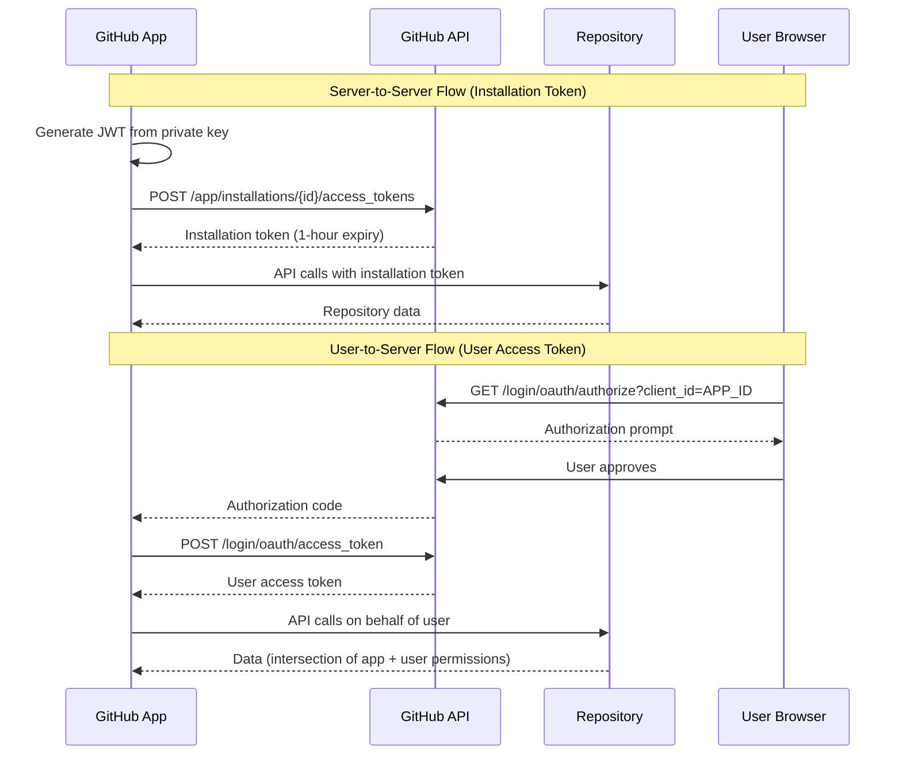
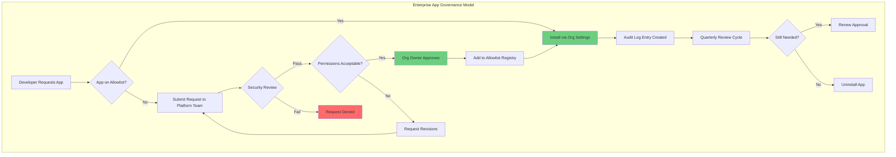

# GitHub Marketplace and Apps

**Level:** L300 (Advanced)  
**Objective:** Understand GitHub's app ecosystem, Marketplace governance, and enterprise policies for controlling third-party integrations across GitHub Enterprise Cloud

## Overview

GitHub Apps and GitHub Marketplace form a critical part of the GitHub Enterprise Cloud (GHEC) ecosystem, enabling organizations to extend GitHub's functionality through vetted integrations. For enterprise administrators, the primary concerns are governance and security: controlling which apps can be installed, who can install them, what permissions they receive, and auditing all app-related activity.

GitHub Apps are the officially recommended integration type, replacing OAuth Apps with a more secure, fine-grained permissions model. They use short-lived installation tokens (1 hour) instead of user-bound OAuth tokens, which stay valid until revoked unless the OAuth app uses expiring tokens (on by default for OAuth apps created since 2026-08-14). GitHub Apps also support built-in centralized webhooks, and their bot accounts do not consume enterprise seats.

AI extensibility runs through MCP (Model Context Protocol) servers, agent plugins that bundle skills with MCP servers (Agent Plugins 1.0, GA 2026-08-12) and partner agent apps, all of which enterprises govern with Copilot policies and enterprise managed settings.

This guide covers the full app lifecycle from an enterprise administrator's perspective: app types, Marketplace mechanics, permission models, internal app development, governance policies, MCP/Copilot extensibility, and webhook-driven architectures.

## GitHub Apps vs OAuth Apps

GitHub Apps are the officially recommended way to integrate with GitHub. The documentation explicitly states: "In general, GitHub Apps are preferred over OAuth apps." OAuth Apps are still supported but GitHub actively encourages migration to GitHub Apps.

### Key Differences

| Feature | GitHub Apps | OAuth Apps |
|---------|------------|------------|
| **Permission Model** | Fine-grained permissions (repository, organization, account levels) | Coarse OAuth scopes (e.g., `repo` grants full access) |
| **Repository Access** | User chooses specific repositories during installation | Access to all repos user can see |
| **Authentication** | Installation access tokens (1-hour expiry) + user access tokens | OAuth tokens stay long-lived unless the app uses expiring tokens (since 2026-08-14: 8-hour access token plus a refresh token valid for 6 months without use; on by default for new OAuth apps) |
| **Acting As** | Can act independently (bot) OR on behalf of user | Always acts on behalf of a user |
| **Webhooks** | Built-in, centralized webhook for all repos in installation | Must configure per-repository or per-organization |
| **Rate Limits** | Scale with number of repos + org users | Fixed 5,000 requests/hour per user |
| **Enterprise Seats** | App bots do NOT consume a GHEC seat | Machine user accounts DO consume a seat |
| **Org Policy Scope** | NOT subject to organization OAuth app access restrictions | Subject to OAuth app access restrictions |
| **Enterprise-Level Access** | Can be installed on the enterprise account with enterprise permissions (third-party apps since 2026-08-07; public preview, partial API coverage) | Can access enterprise-level resources through the authorizing user's token |

### Decision Matrix

Use this matrix to determine which app type fits your integration needs:

| Scenario | Recommended Type | Rationale |
|----------|-----------------|-----------|
| CI/CD pipeline integration | GitHub App | Fine-grained repo access, no seat cost |
| Code quality scanning tool | GitHub App | Needs only specific repo permissions |
| Enterprise-wide reporting dashboard | GitHub App (enterprise installation) | Enterprise permissions without a person's token; check API coverage first |
| Bot for automated PR reviews | GitHub App | Acts independently, centralized webhooks |
| Internal developer tool | GitHub App | Short-lived tokens, scoped access |
| Enterprise billing management | GitHub App (enterprise installation) | Enterprise billing permission (since 2026-08-26) covers usage, budgets and cost centers |
| Issue triaging automation | GitHub App | Repository-scoped, event-driven |
| Cross-org analytics | GitHub App | Can access org resources without seats |

### When OAuth Apps Are Still Required

Since 2026-08-07, enterprise owners can install GitHub Apps, including public third-party apps, on the enterprise account itself. An enterprise installation receives only the enterprise permissions the app requests. It gets no access to the enterprise's organizations or repositories (install the app on those separately) and receives no webhooks. Enterprise-installed apps are in public preview, and not every enterprise API supports them yet. The docs list these supported operations:

- Creating and listing organizations, managing enterprise users, and calling the enterprise SCIM APIs
- Creating and managing GitHub App installations in the enterprise's organizations
- Managing enterprise custom repository properties
- Enterprise billing: usage reports, budgets and cost centers (enterprise billing permission, since 2026-08-26)
- Authorizing personal access tokens (classic) and SSH keys for SSO in selected organizations

An OAuth App (or a personal access token with appropriate scopes) is still required for enterprise APIs that don't support GitHub Apps yet; for example, the docs list doesn't include the enterprise audit log API. Check [Permissions required for GitHub Apps](https://docs.github.com/en/enterprise-cloud@latest/rest/authentication/permissions-required-for-github-apps) and [Installing a GitHub App on your enterprise](https://docs.github.com/en/enterprise-cloud@latest/apps/using-github-apps/installing-a-github-app-on-your-enterprise) before you choose.

### Security Advantages of GitHub Apps

**Short-Lived Tokens:**

GitHub App installation tokens expire after one hour, significantly reducing the blast radius of a token leak compared to OAuth tokens, which persist until explicitly revoked unless the OAuth app uses expiring tokens (an 8-hour access token plus a refresh token valid for 6 months; on by default for OAuth apps created since 2026-08-14).

**Installation Token Format:**

Since 2026-04-27, GitHub has rolled out a stateless format for newly issued installation tokens in stages: Actions `GITHUB_TOKEN` and first-party integrations first, then all GitHub App installation tokens from mid-May to late June 2026. Tokens keep the `ghs_` prefix but carry a JWT (`ghs_APPID_JWT`), are about 520 characters long and vary in length. Treat them as opaque strings: remove fixed-length checks and regexes such as `ghs_[A-Za-z0-9]{36}`, and make sure token storage holds at least 520 characters. For testing, the temporary `X-GitHub-Stateless-S2S-Token` request header (`enabled` or `disabled`) on `POST /app/installations/{installation_id}/access_tokens` forces either format; GitHub will stop honoring it at a date it announces separately. The change applies to GitHub Enterprise Cloud, including data residency; GitHub Enterprise Server isn't affected.

**Principle of Least Privilege:**

GitHub Apps start with no permissions by default and must explicitly request each permission. This contrasts with OAuth scopes where requesting `repo` grants full read/write access to all repositories.

**No Seat Consumption:**

GitHub App bot accounts (identified by the `[bot]` suffix) do not count against your enterprise seat licenses. OAuth App machine users each consume a seat, adding direct cost.

**Centralized Webhooks:**

A single webhook endpoint receives events for all repositories in an installation, simplifying architecture and reducing configuration drift.

### Migration Path from OAuth to GitHub Apps

GitHub provides a structured migration guide:

1. **Review** the existing OAuth app's scopes and functionality
2. **Register** a new GitHub App with equivalent fine-grained permissions
3. **Modify code** to use GitHub App authentication (update auth flow, review rate limits)
4. **Publicize** the new GitHub App to users
5. **Instruct users** to install and authorize the new app
6. **Remove** old per-repository webhooks
7. **Delete** the legacy OAuth app

> **Important:** Each user must install and/or authorize the new GitHub App individually — there is no automated migration path.

### App Authentication Flow


```mermaid
sequenceDiagram
    participant App as GitHub App
    participant GH as GitHub API
    participant Repo as Repository
    participant User as User Browser

    Note over App,User: Server-to-Server Flow (Installation Token)
    App->>App: Generate JWT from private key
    App->>GH: POST /app/installations/{id}/access_tokens
    GH-->>App: Installation token (1-hour expiry)
    App->>Repo: API calls with installation token
    Repo-->>App: Repository data

    Note over App,User: User-to-Server Flow (User Access Token)
    User->>GH: GET /login/oauth/authorize?client_id=APP_ID
    GH-->>User: Authorization prompt
    User->>GH: User approves
    GH-->>App: Authorization code
    App->>GH: POST /login/oauth/access_token
    GH-->>App: User access token
    App->>Repo: API calls on behalf of user
    Repo-->>App: Data (intersection of app + user permissions)
```

To find an installation ID without paging through `GET /app/installations`, an app authenticated with its JWT can call `GET /orgs/{org}/installation`, `GET /repos/{owner}/{repo}/installation`, `GET /users/{username}/installation` or, since 2026-05-13, `GET /enterprises/{enterprise}/installation` for an installation on an enterprise account.

### Rate Limit Comparison

GitHub Apps benefit from dynamic rate limits that scale with installation size:

| Installation Size | GitHub App Rate Limit | OAuth App Rate Limit |
|-------------------|----------------------|---------------------|
| Personal account | 5,000 requests/hour | 5,000 requests/hour |
| Organization (< 20 repos) | 5,000 requests/hour | 5,000 requests/hour |
| Organization (20+ repos) | 5,000 + (50 × repos) | 5,000 requests/hour |
| GitHub Enterprise Cloud org | Up to 12,500 requests/hour | 5,000 requests/hour |

## GitHub Marketplace

GitHub Marketplace ([github.com/marketplace](https://github.com/marketplace)) is the primary discovery and distribution channel for GitHub Apps and GitHub Actions. It connects developers and organizations with tools that extend GitHub workflows.

### Marketplace Listing Types

GitHub Marketplace lists two primary categories of tools:

**GitHub Actions:**

- Reusable workflow components published to Marketplace
- Free to list and use (compute costs are separate)
- Subject to enterprise Actions policies

**Apps (GitHub Apps and OAuth Apps):**

- Full integrations that interact with the GitHub API
- Can be free or paid
- Subject to app installation policies

### Pricing Models

| Model | Description | Use Case |
|-------|-------------|----------|
| **Free** | No charge to install and use | Open source tools, community integrations |
| **Flat-rate** | Fixed monthly or annual price | Simple pricing for teams |
| **Per-unit** | Per-seat or per-resource pricing | Enterprise tools that scale with usage |

**Pricing rules:**

- All paid plans must support both monthly and annual billing
- 14-day free trials are optional but available for paid plans
- Up to 10 pricing plans per listing
- Plans can target personal accounts, organizations, or both

### Publisher Verification

Publisher verification is a trust mechanism for Marketplace listings:

- **Required for paid listings** — publishers must prove organizational identity
- **Criteria for paid apps:** GitHub Apps need minimum 100 installations; OAuth Apps need minimum 200 users
- **Verified badge** displayed on Marketplace listing page
- **Enterprise policy integration:** Enterprise admins can filter allowed Actions to "verified creators only"

### Listing Requirements

All Marketplace listings must meet these requirements:

- Valid contact information for the publisher
- Clear description of the app's functionality
- Privacy policy URL
- Support documentation link
- Webhook events configured for billing plan changes (paid apps)
- Logo and branding assets meeting Marketplace guidelines

### Enterprise Considerations for Marketplace

Organization owners and repository admins can install Marketplace apps on their organizations, subject to enterprise policies. Enterprise administrators should consider:

- **Actions policy filtering:** Allow all, allow verified creators only, or allow specific patterns
- **App installation restrictions:** Limit who can install apps at the organization level
- **Budget controls:** Monitor Marketplace spending through billing management
- **Security review:** Evaluate app permissions before allowing installation

## App Installation and Permissions

### Installation Flow

The app installation process follows a structured workflow:

1. **Discovery:** User finds the app on Marketplace, a third-party site, or via direct URL (`https://github.com/apps/APP_NAME/installations/new`)
2. **Permission Review:** GitHub displays the exact permissions the app requests before installation
3. **Repository Selection:** User selects which repositories the app can access (all repositories or specific repositories)
4. **Installation:** App is installed at the organization or personal account level, or, for apps with enterprise permissions, on the enterprise account (see [When OAuth Apps Are Still Required](#when-oauth-apps-are-still-required))
5. **Authorization (if needed):** If the app acts on behalf of users, each user must separately authorize the app

### Fine-Grained Permissions Model

GitHub Apps have four types of permissions: repository, organization, enterprise and account:

#### Repository Permissions

Access to repository-specific resources:

- **Contents** — read/write access to repository files
- **Issues** — create, read, update issues
- **Pull requests** — interact with PRs and reviews
- **Actions** — manage workflow runs and artifacts
- **Secrets** — manage repository secrets
- **Deployments** — create and manage deployments
- **Environments** — manage deployment environments
- **Checks** — create check runs and check suites

#### Organization Permissions

Access to organization-level resources:

- **Members** — view and manage organization members
- **Teams** — create, read, update teams
- **Projects** — manage organization projects
- **Administration** — manage organization settings
- **Custom repository roles** — manage custom roles
- **Custom organization roles** — manage org-level roles

#### Enterprise Permissions

Access to manage an enterprise, used only when the app is installed on the enterprise account. Since 2026-08-07, any user or organization can create a GitHub App with enterprise permissions; to be installed on an enterprise, the app must be public or internal. Enterprise owners see and grant only the enterprise permissions the app requests. Examples:

- The enterprise billing permission — read, or read and write, the enterprise billing REST API: usage, budgets and cost centers (since 2026-08-26)
- **Enterprise credentials** — with write access, authorize existing personal access tokens (classic) and SSH keys for SSO across organizations (since 2026-09-16)
- **Enterprise organization installations** and **Enterprise organization installation repositories** — manage app installations across the enterprise's organizations; apps that request these can only be installed on the enterprise that owns them

#### Account Permissions

Access to user-specific resources (requires user authorization):

- **Email addresses** — view user email addresses
- **Followers** — view user followers
- **Profile** — view user profile information
- **Starring** — manage starred repositories

### Permission Intersection Model

When a GitHub App uses a user access token (acting on behalf of a user), the effective permissions are the **intersection** of:

1. The permissions granted to the app installation
2. The permissions the authenticated user has on the resource

```text
Effective Access = App Installation Permissions ∩ User Permissions

Example:
  App has: Contents (write), Issues (read)
  User has: Contents (read), Issues (write), Pull Requests (write)
  Effective: Contents (read), Issues (read)
```

This intersection model ensures that apps can never escalate beyond what the authenticating user can do themselves.

### Permission Update Flow

When an app owner modifies the permissions their app requests:

1. App owner updates permission requirements in app settings
2. GitHub notifies every account owner where the app is installed
3. Account owners receive a prompt to review and approve new permissions
4. **Until approved**, the installation continues with the old permission set
5. Admins can review pending permission changes in organization settings

### Organization-Level Installation Restrictions

Organization owners can control app installation behavior:

| Setting | Repository Admins Can... | Organization Owners Can... |
|---------|-------------------------|---------------------------|
| **Default (unrestricted)** | Install apps that don't request org permissions or "repository administration" | Install any app |
| **Restricted to org owners** | Cannot install apps; must request from org owners | Install any app |
| **Access requests enabled** | Request unapproved apps for org owner review | Approve or deny requests |
| **Access requests disabled** | Cannot request or install apps | Install any app |

### Reviewing Installed Apps

Enterprise administrators should regularly audit installed apps:

```bash
# List all GitHub App installations for an organization
gh api --paginate /orgs/{org}/installations \
  --jq '.installations[] | {id: .id, app: .app_slug, permissions: .permissions}'

# List SAML SSO credential authorizations (PATs, SSH keys) in an organization
gh api --paginate /orgs/{org}/credential-authorizations \
  --jq '.[] | {login: .login, credential_type: .credential_type}'
```

Since 2026-09-16, enterprises that use enterprise-level SSO can let an enterprise-installed GitHub App authorize an existing personal access token (classic) or SSH key for SSO in up to 50 organizations per request (`POST /enterprises/{enterprise}/credential-authorizations`), instead of each developer authorizing it per organization. Turn it on in enterprise **Settings → Authentication security → Allow GitHub Apps to authorize credentials**. The app must be owned by the enterprise or one of its organizations, have write access to the **Enterprise credentials** permission and call the API with an enterprise installation token. It identifies the credential by token ID or SSH key fingerprint, so no secret passes to the app.

## Creating Internal GitHub Apps

### When to Create Internal Apps

Organizations should consider creating internal (private) GitHub Apps when:

- **Automating repetitive workflows** across multiple repositories
- **Building custom integrations** between GitHub and internal systems
- **Replacing personal access tokens** with scoped, auditable app tokens
- **Implementing compliance checks** that run on every pull request
- **Managing repository configuration** at scale (templates, labels, settings)
- **Bridging systems** such as ticketing platforms, deployment tools, or monitoring

### Registration Process

#### Step 1: Navigate to App Settings

For organization-owned apps:

- Go to **Organization Settings → Developer settings → GitHub Apps → New GitHub App**

For personal apps:

- Go to **Settings → Developer settings → GitHub Apps → New GitHub App**

#### Step 2: Configure Basic Information

| Field | Description | Best Practice |
|-------|-------------|---------------|
| **App name** | Unique name across all of GitHub | Use org prefix: `myorg-deploy-bot` |
| **Description** | What the app does | Be specific about capabilities |
| **Homepage URL** | Landing page for the app | Internal wiki or docs page |
| **Callback URL** | OAuth redirect (if using user auth) | Only needed for user-to-server flow. You can register up to 10 (OAuth apps too, since 2026-08-14). Keep wildcard matching off unless you control every subdomain and path under the URL |
| **Webhook URL** | Endpoint for event delivery | Your server's webhook handler endpoint |
| **Webhook secret** | HMAC secret for payload verification | Generate with `openssl rand -hex 32` |

#### Step 3: Select Permissions

Follow the principle of least privilege:

- Request only the permissions your app actually needs
- Start with read-only access; upgrade to write only when necessary
- Document why each permission is required

#### Step 4: Subscribe to Events

Select only the webhook events your app needs to process. Common events:

- `push` — code pushed to a repository
- `pull_request` — PR opened, closed, merged, or updated
- `issues` — issue created, edited, or closed
- `check_run` / `check_suite` — CI/CD check results
- `installation` — app installed or uninstalled

#### Step 5: Generate Private Key

After registration, generate a private key (`.pem` file) for authenticating as the app. Store this securely — it is the app's identity credential.

### App Manifest Flow

For automated or repeatable app registration, use the GitHub App manifest flow:

```json
{
  "name": "my-internal-app",
  "url": "https://internal.example.com",
  "hook_attributes": {
    "url": "https://internal.example.com/webhooks"
  },
  "redirect_url": "https://internal.example.com/callback",
  "public": false,
  "default_permissions": {
    "contents": "read",
    "pull_requests": "write",
    "checks": "write"
  },
  "default_events": [
    "push",
    "pull_request"
  ]
}
```

The manifest flow allows you to register apps programmatically by POSTing the manifest to `https://github.com/settings/apps/new` — useful for infrastructure-as-code workflows.

### Probot Framework

[Probot](https://probot.github.io/) is a popular open-source framework for building GitHub Apps in Node.js:

**Key Features:**

- Handles webhook delivery and verification automatically
- Manages authentication (JWT generation, installation tokens)
- Provides an event-driven programming model
- Includes development tools (simulator, logging)
- Supports deployment to various platforms (Vercel, AWS Lambda, containers)

**Example Probot App:**

```javascript
// app.js — Auto-label PRs based on file paths
module.exports = (app) => {
  app.on('pull_request.opened', async (context) => {
    const files = await context.octokit.pulls.listFiles(
      context.pullRequest({ per_page: 100 })
    );

    const labels = new Set();
    for (const file of files.data) {
      if (file.filename.startsWith('docs/')) labels.add('documentation');
      if (file.filename.startsWith('src/')) labels.add('code-change');
      if (file.filename.endsWith('.test.js')) labels.add('tests');
    }

    if (labels.size > 0) {
      await context.octokit.issues.addLabels(
        context.issue({ labels: [...labels] })
      );
    }
  });
};
```

### Internal App Best Practices

**Security:**

- Store private keys in a secrets manager (Azure Key Vault, AWS Secrets Manager, HashiCorp Vault)
- Rotate private keys on a regular schedule
- Use webhook secrets and verify every payload signature
- Restrict the app to internal visibility (not listed on Marketplace)
- Review callback (redirect) URLs on every GitHub App and OAuth app you own: wildcard matching sends authorization codes to any subdomain or subpath of the URL, and it is on for apps that had a single callback URL before 2026-08-03 — turn it off unless you need it

**Operations:**

- Deploy webhook handlers with high availability (multiple replicas, health checks)
- Implement idempotent webhook processing (GitHub may redeliver events)
- Log all API calls and webhook events for troubleshooting
- Monitor rate limit consumption and implement backoff strategies

**Governance:**

- Register apps under organization ownership (not personal accounts)
- Document the app's purpose, permissions, and owners in a runbook
- Include the app in your organization's change management process
- Review and update permissions when app functionality changes

## Enterprise App Governance

### Enterprise-Level Policies

Enterprise owners can enforce policies that govern app usage across all organizations in the enterprise.

#### GitHub Actions Policies

Navigate to **Enterprise Settings → Policies → Actions** to configure:

| Policy | Description |
|--------|-------------|
| **Allow all actions and reusable workflows** | No restrictions on which Actions can run |
| **Allow enterprise actions and reusable workflows** | Only Actions from internal enterprise repositories |
| **Allow enterprise, and select non-enterprise, actions** | Granular control with sub-options |

**Sub-options for selective policies:**

- **Allow actions created by GitHub** — permits `actions/*` and `github/*` namespaces
- **Allow Marketplace actions by verified creators** — filters for the verified creator badge
- **Allow specified actions and reusable workflows** — pattern-based allowlist (e.g., `octocat/*`, `!blocked-org/action@*`)
- **Require full-length commit SHA pinning** — strongest supply chain security

#### OAuth App Access Restrictions

When enabled at the organization level (default for new organizations):

- Members cannot authorize OAuth app access to organization resources without approval
- Users can request owner approval; org owners receive notifications of pending requests
- Organization-owned apps automatically receive access when restrictions are enabled
- **Does NOT apply to GitHub Apps** — GitHub Apps are governed through installation policies, not OAuth restrictions

#### Personal Access Token Policies

Enterprise owners can enforce PAT policies at the enterprise level:

| Policy | Scope | Description |
|--------|-------|-------------|
| **Restrict fine-grained PATs** | Enterprise | Control whether fine-grained PATs can access org resources |
| **Restrict classic PATs** | Enterprise | Control whether classic PATs can access org resources |
| **Maximum token lifetime** | Enterprise | Set maximum lifetime (default: 366 days for fine-grained) |
| **Require approval** | Organization | Fine-grained PATs require org owner approval before access |
| **Admin exemption** | Enterprise | Exempt enterprise administrators from lifetime policies |

Organization owners can further restrict within enterprise limits but cannot override enterprise restrictions.

### App Allowlisting

Organizations can maintain an allowlist of approved GitHub Apps:

**Setting up an allowlist:**

1. Navigate to **Organization Settings → Third-party access → GitHub Apps**
2. Review currently installed apps and their permissions
3. Enable installation restrictions (org owners only)
4. Document approved apps in an internal registry
5. Establish a review process for new app requests

**Allowlist governance model:**

```text
App Request Flow:
  Developer → Submits app request (with business justification)
    → Security team reviews permissions and data access
    → Platform team validates technical compatibility
    → Org owner approves installation
    → App added to allowlist registry
    → Periodic re-review (quarterly recommended)
```

### Audit Logging for App Events

GitHub Enterprise Cloud captures detailed audit events for all app-related activity. Key events include:

#### Installation Events

| Audit Event | Description |
|-------------|-------------|
| `integration_installation.create` | GitHub App installed on organization |
| `integration_installation.destroy` | GitHub App uninstalled from organization |
| `integration_installation.repositories_added` | Repositories added to app installation |
| `integration_installation.repositories_removed` | Repositories removed from app installation |

#### OAuth App Events

| Audit Event | Description |
|-------------|-------------|
| `oauth_application.create` | OAuth app registered |
| `oauth_application.destroy` | OAuth app deleted |
| `oauth_authorization.create` | User authorized an OAuth app |
| `oauth_authorization.destroy` | User revoked an OAuth app authorization |

#### Token Events

| Audit Event | Description |
|-------------|-------------|
| `personal_access_token.create` | PAT created |
| `personal_access_token.destroy` | PAT revoked |
| `auto_approve_personal_access_token_requests.enable` | PAT auto-approval enabled |
| `auto_approve_personal_access_token_requests.disable` | PAT auto-approval disabled |

#### Querying Audit Logs

```bash
# Search for app installation events in the past 30 days
gh api --paginate /enterprises/{enterprise}/audit-log \
  --jq '.[] | select(.action | startswith("integration_installation"))' \
  -f phrase="action:integration_installation created:>$(date -d '30 days ago' +%Y-%m-%d)"

# Search for OAuth authorization events
gh api --paginate /orgs/{org}/audit-log \
  -f phrase="action:oauth_authorization" \
  --jq '.[] | {actor: .actor, action: .action, created_at: .created_at}'
```

### Governance Workflow


```mermaid
graph TD
    subgraph "Enterprise App Governance Model"
        A[Developer Requests App] --> B{App on Allowlist?}
        B -->|Yes| C[Install via Org Settings]
        B -->|No| D[Submit Request to Platform Team]
        D --> E{Security Review}
        E -->|Pass| F{Permissions Acceptable?}
        E -->|Fail| G[Request Denied]
        F -->|Yes| H[Org Owner Approves]
        F -->|No| I[Request Revisions]
        I --> D
        H --> J[Add to Allowlist Registry]
        J --> C
        C --> K[Audit Log Entry Created]
        K --> L[Quarterly Review Cycle]
        L --> M{Still Needed?}
        M -->|Yes| N[Renew Approval]
        M -->|No| O[Uninstall App]
    end

    style G fill:#ff6b6b
    style C fill:#6bcf7f
    style H fill:#6bcf7f
```

## MCP and Copilot Extensions

### Model Context Protocol (MCP)

MCP is an open standard for connecting AI models to external data sources and tools. GitHub has embraced MCP as the primary extensibility mechanism for Copilot, enabling AI assistants to interact with external systems in a structured, secure way.

**Key characteristics of MCP:**

- Works across all major Copilot surfaces: IDE (VS Code, JetBrains, Xcode), Copilot CLI, and Copilot cloud agent
- Provides a standardized protocol for tool discovery, invocation, and data exchange
- Replaces the earlier "Copilot Extensions" agent/skillset model as the primary extensibility mechanism
- Supports both local (developer machine) and remote (server-hosted) MCP servers

### GitHub MCP Server

The **GitHub MCP Server** is the official GitHub-provided MCP server, maintained by GitHub. It provides Copilot with the ability to:

- Search and read repository contents
- Create and manage issues and pull requests
- Query commit history and branch information
- Interact with GitHub Actions workflows
- Access organization and team data (within permission boundaries)

### GitHub MCP Registry

The **GitHub MCP Registry** ([github.com/mcp](https://github.com/mcp)) is a curated catalog of MCP servers, separate from GitHub Marketplace:

| Aspect | GitHub MCP Registry | GitHub Marketplace |
|--------|--------------------|--------------------|
| **Purpose** | Discover MCP servers for AI tools | Discover GitHub Apps and Actions |
| **Content** | MCP server configurations | Apps, Actions, paid integrations |
| **Status** | Public preview | Generally available |
| **Governance** | MCP server policy | App installation policies |
| **Target** | AI/Copilot users and admins | All GitHub users |

### Enterprise MCP Server Policy

Enterprise administrators control MCP availability through the **"MCP servers in Copilot"** policy:

**Policy location:** Enterprise Settings → AI controls → MCP

**Key policy details:**

- **Default state:** until 2026-10-22 the policy stays off unless an admin enables it. From 2026-10-22, if it is left Unconfigured, it follows the enterprise's **Default policy for new features**, which ships **Enabled**, so set it explicitly
- Available at both enterprise and organization levels
- Only applies to **Copilot Business** and **Copilot Enterprise** subscriptions
- Does NOT govern Copilot Free, Pro, or Pro+ users
- Does NOT control access to GitHub MCP server in third-party host apps (Cursor, Windsurf, Claude)

**Configuration options:**

| Setting | Effect |
|---------|--------|
| **Enabled everywhere** | MCP servers can run in Copilot clients for Copilot Business and Enterprise users; restrict which ones with an allowlist (below). The organization-level setting is **Enabled** |
| **Disabled** | MCP servers cannot be used with Copilot in managed surfaces |
| **Let organizations decide** | Each organization's owners set the policy for their organization |
| **Unconfigured** | Off until 2026-10-22; from then it follows the **Default policy for new features**, which ships **Enabled** |

**MCP allowlists in enterprise managed settings (GA 2026-08-06):** Enterprise owners can approve or block individual MCP servers by adding `allowedMcpServers` and `deniedMcpServers` to `copilot/managed-settings.json` in the enterprise's `.github-private` repository. Entries match a remote server by URL (`serverUrl`, `*` wildcards allowed), a local server by exact command and arguments (`serverCommand`), or a server by its user-assigned name (`serverName`, a convenience rather than a security control because users can rename servers). A deny match always blocks; when an allowlist exists, unlisted servers are blocked; and a malformed file blocks every server except built-in defaults such as the GitHub MCP server. The 2026-08-06 post lists enforcement in the GitHub Copilot app, Copilot CLI and VS Code. The **MCP servers in Copilot** policy must still allow MCP for any server to run. See [Enterprise managed settings](./29-enterprise-managed-settings.md).

**Registry-based restriction (public preview):** Since 2026-04-16, enterprise and organization owners can instead point Copilot at an internal MCP registry (**MCP Registry URL** on the **MCP** page of AI controls) and set **Restrict MCP access to registry servers** to **Registry only**. GitHub's docs say this isn't the recommended method: it matches servers only by name or ID, and users can bypass it by editing configuration files. Prefer the managed-settings allowlist.

**Agent finder** (since 2026-06-17) lets Copilot discover MCP servers, skills and agents on demand from a registry you choose, either GitHub's curated public catalog or a private registry, and installs nothing automatically. The post says enterprises limit what agents can discover through managed settings; the managed settings reference documents no separate key for it.

### Plugins and Plugin Marketplaces

Agent plugins package skills, MCP server configurations, hooks and custom agents into one installable unit; Agent Plugins 1.0 is the open format (GA 2026-08-12). Enterprises govern plugins in `copilot/managed-settings.json`: `enabledPlugins` installs or blocks plugins for everyone, `extraKnownMarketplaces` adds marketplaces, and `strictKnownMarketplaces` (since 2026-06-25) restricts installs to listed marketplaces. The Awesome Copilot marketplace is available by default, so set `strictKnownMarketplaces` if you need to control where plugins come from, and pair it with the MCP allowlist because plugins can carry MCP servers. The May and June 2026 previews used `.github/copilot/settings.json`, which is still read for backward compatibility. See [Enterprise Managed Settings](./29-enterprise-managed-settings.md#plugins-and-marketplaces).

### Copilot Extensions in Marketplace

The Copilot extensibility landscape includes integrations available through Marketplace:

- **Metrics dashboards** — track Copilot adoption and productivity
- **License monitors** — manage Copilot seat allocation
- **Project management integrations** — Linear, Jira integration with Copilot cloud agent
- **Code review tools** — AI-powered review assistants

These are standard GitHub Apps that complement Copilot, not "Copilot Extensions" in the traditional sense. The extensibility model has shifted toward MCP as the primary mechanism.

**Agent apps** (since 2026-06-02; public preview per the docs) are partner agents distributed as GitHub Apps in Marketplace. After an app is installed and its agent features are enabled, users can assign it an issue, @mention it in a pull request comment or start it from the Agents UI. In an organization owned by an enterprise, an administrator must also enable the **Agent apps** Copilot policy. Sessions run on Copilot cloud agent and consume GitHub AI Credits, and each user authorizes the app through OAuth on first use, so review agent apps through the same app approval process.

### Copilot Cloud Agent Integrations

Copilot cloud agent supports MCP servers configured at the repository level:

- **GitHub MCP server** and **Playwright MCP server** are configured by default
- Repository administrators add other servers as JSON in repository **Settings → Copilot → MCP servers**, with any secrets stored as Agents secrets prefixed `COPILOT_MCP_`. Since 2026-06-02, Copilot code review uses the same configuration (public preview), so a server added for the agent can also run during reviews
- Third-party Marketplace apps can assign work to Copilot cloud agent (e.g., "GitHub Copilot for Linear" assigns Linear issues to Copilot cloud agent)
- To audit this at scale, `GET /repos/{owner}/{repo}/copilot/cloud-agent/configuration` (public preview since 2026-05-18) returns a repository's MCP configuration, enabled tools, Actions workflow approval setting and firewall configuration

### MCP Security Considerations

**Secret Scanning in MCP:**

- Push protection secures GitHub MCP server interactions for public repos and repos with Secret Protection enabled, and blocks secrets from appearing in AI-generated responses
- Since 2026-05-05 (GA), the GitHub MCP server's secret scanning tools let Copilot CLI, VS Code and other MCP clients scan local changes before commit, for repositories with Secret Protection. They work only with the remote GitHub MCP server, follow your organization's push protection configuration, and return findings to the chat session only: nothing is stored as an alert

**Access Control:**

- MCP servers operate within the same permission boundaries as the Copilot subscription
- Enterprise admins should review MCP server configurations in repositories
- Monitor audit logs for MCP-related activity

**Best Practices for Enterprise MCP Governance:**

1. Set the **MCP servers in Copilot** policy explicitly before 2026-10-22, when an Unconfigured policy starts following the **Default policy for new features** (Enabled by default)
2. Enable for a pilot organization first
3. Establish an approved MCP server list and enforce it with `allowedMcpServers` and `deniedMcpServers` in enterprise managed settings. GitHub's docs recommend keeping the MCP policy enabled and restricting servers this way, rather than relying on a custom MCP registry, which users can bypass by editing configuration files
4. Document data flow for each MCP server (what data leaves your environment)
5. Review repository MCP configurations in repository **Settings → Copilot → MCP servers** (not files in the repository), or audit them at scale with the cloud agent configuration REST API
6. Limit repository admin access, because repository administrators change this configuration in settings, where pull request review doesn't see it

## Webhook-Driven Apps

### How Apps Use Webhooks

Webhooks are the primary event delivery mechanism for GitHub Apps. When configured events occur (push, PR opened, issue created), GitHub sends an HTTP POST request to the app's registered webhook URL.

### Webhook Architecture

GitHub Apps receive a **single, centralized webhook** for all repositories in an installation. This contrasts with organization or repository webhooks, which must be configured individually.

**Centralized webhook advantages:**

- Single endpoint to manage for all repositories
- Automatic coverage when new repositories are added to the installation
- Consistent event delivery without per-repo configuration
- Simplified monitoring and alerting

### Webhook Event Categories

| Category | Events | Common Use Cases |
|----------|--------|-----------------|
| **Repository** | `push`, `create`, `delete`, `fork` | CI/CD triggers, branch protection |
| **Pull Request** | `pull_request`, `pull_request_review`, `pull_request_review_comment` | Code review automation, merge checks |
| **Issues** | `issues`, `issue_comment`, `label` | Triage bots, SLA tracking |
| **CI/CD** | `check_run`, `check_suite`, `workflow_run`, `deployment` | Status reporting, deployment gates |
| **Security** | `code_scanning_alert`, `dependabot_alert`, `secret_scanning_alert` | Security automation, alerting. Since 2026-07-15, `secret_scanning_alert` payloads include `secret_category` (`default` for provider and custom patterns, `generic` for generic patterns and AI-detected secrets) for routing |
| **Organization** | `membership`, `team`, `organization` | User provisioning, team sync |

### Webhook Payload Verification

Always verify webhook payloads to ensure they originate from GitHub:

```javascript
const crypto = require('crypto');

function verifyWebhookSignature(payload, signature, secret) {
  const hmac = crypto.createHmac('sha256', secret);
  const digest = 'sha256=' + hmac.update(payload).digest('hex');
  return crypto.timingSafeEqual(
    Buffer.from(digest),
    Buffer.from(signature)
  );
}

// In your webhook handler:
app.post('/webhooks', (req, res) => {
  const signature = req.headers['x-hub-signature-256'];
  if (!verifyWebhookSignature(req.rawBody, signature, WEBHOOK_SECRET)) {
    return res.status(401).send('Invalid signature');
  }
  // Process the event...
});
```

### Webhook Delivery and Reliability

GitHub provides several reliability features for webhook delivery:

**Automatic retries:**

- Failed deliveries (non-2xx response) are retried
- GitHub retries up to 3 times with exponential backoff

**Delivery logs:**

- Available in the app's Advanced settings
- Show request/response details for each delivery
- Useful for debugging integration issues

**Redelivery:**

- Individual webhook deliveries can be manually redelivered from the UI
- Useful for recovering from temporary outages

### Development with smee.io

[smee.io](https://smee.io/) is a webhook proxy service that simplifies local development of GitHub Apps:

**How it works:**

1. Create a channel at smee.io to get a unique URL
2. Configure your GitHub App's webhook URL to point to the smee.io channel
3. Run the smee client locally to forward events to your development server
4. Develop and test webhook handlers without exposing your local machine

```bash
# Install the smee client
npm install --global smee-client

# Start forwarding webhooks to your local server
smee --url https://smee.io/YOUR_CHANNEL --target http://localhost:3000/webhooks
```

### Webhook Best Practices

**Respond quickly:**

- Return a `2xx` status code within 10 seconds
- Queue events for asynchronous processing if handling takes longer
- Use a message queue (Redis, RabbitMQ, SQS) for reliable processing

**Idempotent processing:**

- GitHub may redeliver events due to retries or manual redelivery
- Use the `X-GitHub-Delivery` header as a unique event ID
- Track processed events to avoid duplicate handling

**Security:**

- Always verify webhook signatures using the shared secret
- Use HTTPS for webhook endpoints in production
- Rotate webhook secrets periodically
- Never expose webhook secrets in logs or error messages

**Monitoring:**

- Track delivery success rates via the GitHub App settings
- Alert on consecutive delivery failures
- Monitor webhook processing latency
- Log all received events for audit and troubleshooting

## References

### Official Documentation

1. [About Creating GitHub Apps](https://docs.github.com/en/apps/creating-github-apps/about-creating-github-apps/about-creating-github-apps) — GitHub App fundamentals and architecture
2. [Differences Between GitHub Apps and OAuth Apps](https://docs.github.com/en/apps/oauth-apps/building-oauth-apps/differences-between-github-apps-and-oauth-apps) — Comprehensive comparison of app types
3. [About GitHub Marketplace for Apps](https://docs.github.com/en/apps/github-marketplace/github-marketplace-overview/about-github-marketplace-for-apps) — Marketplace overview and listing types
4. [About Model Context Protocol (MCP)](https://docs.github.com/en/enterprise-cloud@latest/copilot/concepts/context/mcp) — MCP and Copilot extensibility (GitHub App-based Copilot Extensions were disabled on 2025-11-10)
5. [Migrating OAuth Apps to GitHub Apps](https://docs.github.com/en/apps/creating-github-apps/about-creating-github-apps/migrating-oauth-apps-to-github-apps) — Step-by-step migration guide
6. [Choosing Permissions for a GitHub App](https://docs.github.com/en/apps/creating-github-apps/registering-a-github-app/choosing-permissions-for-a-github-app) — Fine-grained permissions reference
7. [About OAuth App Access Restrictions](https://docs.github.com/en/enterprise-cloud@latest/organizations/managing-oauth-access-to-your-organizations-data/about-oauth-app-access-restrictions) — Organization-level OAuth controls
8. [Requirements for Listing an App](https://docs.github.com/en/apps/github-marketplace/creating-apps-for-github-marketplace/requirements-for-listing-an-app) — Marketplace listing requirements
9. [Setting Pricing Plans for Your Listing](https://docs.github.com/en/apps/github-marketplace/listing-an-app-on-github-marketplace/setting-pricing-plans-for-your-listing) — Marketplace pricing models
10. [Enforcing Policies for GitHub Actions in Your Enterprise](https://docs.github.com/en/enterprise-cloud@latest/admin/policies/enforcing-policies-for-your-enterprise/enforcing-policies-for-github-actions-in-your-enterprise) — Enterprise Actions governance

### Additional Resources

11. [About Using GitHub Apps](https://docs.github.com/en/apps/using-github-apps/about-using-github-apps) — Installation and usage guide
12. [Limiting OAuth App and GitHub App Access Requests](https://docs.github.com/en/enterprise-cloud@latest/organizations/managing-programmatic-access-to-your-organization/limiting-oauth-app-and-github-app-access-requests) — Org-level access request controls
13. [Setting a Personal Access Token Policy for Your Organization](https://docs.github.com/en/enterprise-cloud@latest/organizations/managing-programmatic-access-to-your-organization/setting-a-personal-access-token-policy-for-your-organization) — Organization PAT policies
14. [Enforcing Policies for Personal Access Tokens in Your Enterprise](https://docs.github.com/en/enterprise-cloud@latest/admin/policies/enforcing-policies-for-your-enterprise/enforcing-policies-for-personal-access-tokens-in-your-enterprise) — Enterprise PAT enforcement
15. [Audit Log Events for Your Enterprise](https://docs.github.com/en/enterprise-cloud@latest/admin/monitoring-activity-in-your-enterprise/reviewing-audit-logs-for-your-enterprise/audit-log-events-for-your-enterprise) — Comprehensive audit event reference
16. [Governing How People Use Repositories](https://docs.github.com/en/enterprise-cloud@latest/admin/managing-accounts-and-repositories/managing-repositories-in-your-enterprise/governing-how-people-use-repositories-in-your-enterprise) — Repository governance policies
17. [Managing Policies and Features for Copilot in Your Enterprise](https://docs.github.com/en/copilot/how-tos/administer/enterprises/managing-policies-and-features-for-copilot-in-your-enterprise) — Enterprise Copilot governance

### Related Workshop Documentation

- [06-policy-inheritance.md](./06-policy-inheritance.md) — Policy enforcement and inheritance across enterprise hierarchy
- [08-security-compliance.md](./08-security-compliance.md) — Security scanning, audit logging, and compliance
- [12-github-copilot-governance.md](./12-github-copilot-governance.md) — Copilot policies and governance controls
- [29-enterprise-managed-settings.md](./29-enterprise-managed-settings.md) — Enterprise managed settings: MCP allowlists, plugins and marketplaces
