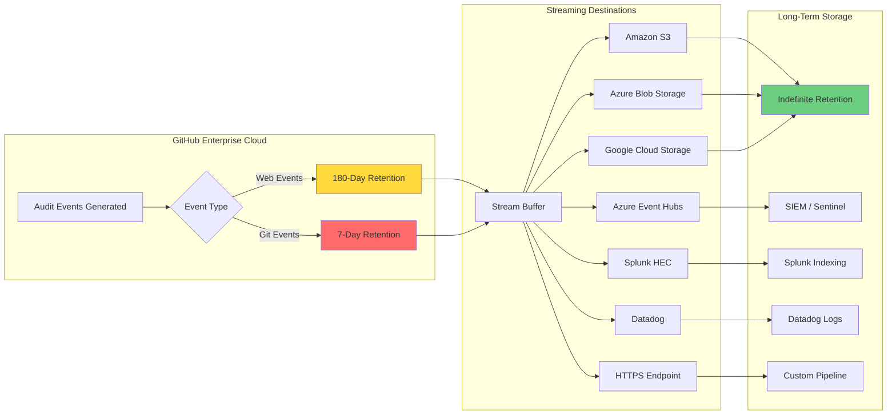
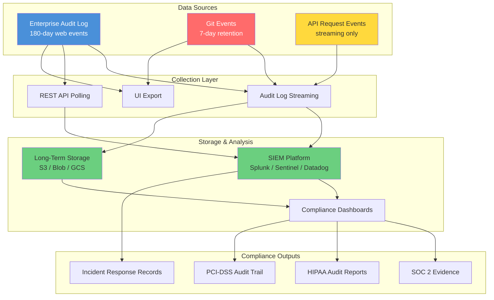

# Audit Log Deep Dive

**Level:** L300 (Advanced)  
**Objective:** Master GitHub Enterprise Cloud audit log querying, streaming, API access, and Security Information and Event Management (SIEM) integration for security monitoring and compliance

## Overview

GitHub Enterprise Cloud provides comprehensive audit logging at both the enterprise and organization levels, capturing events related to settings changes, access control, user membership, app permissions, repository management, and more. The audit log is a foundational compliance and security tool for enterprise administrators, enabling visibility into every administrative action across the enterprise.

This module covers audit log architecture, search and filtering capabilities, REST and GraphQL API access patterns, streaming to external SIEM platforms, event categories, and how to build compliance-ready audit trails for frameworks like SOC 2, HIPAA, and PCI-DSS.

> **Key takeaway:** Always configure audit log streaming for long-term retention. The default 180-day web event window and 7-day Git event window are insufficient for most compliance frameworks.

## Audit Log Scope and Retention

Understanding the scope and retention boundaries of the audit log is essential for designing an effective monitoring and compliance strategy.

### Enterprise vs Organization Audit Logs

GitHub provides audit logs at two distinct levels, each capturing different categories of events:

| Aspect | Enterprise Audit Log | Organization Audit Log |
|---|---|---|
| **Scope** | All organizations owned by the enterprise | Single organization |
| **Access** | Enterprise owners only | Organization owners |
| **Events** | Enterprise settings (`business.*`), org membership, repo management, billing, security events across all orgs | Repository changes, team management, webhooks, member access |
| **Git events** | Yes (7-day retention) | No |
| **API endpoint** | `/enterprises/{enterprise}/audit-log` | `/orgs/{org}/audit-log` |
| **UI location** | Enterprise → Settings → Audit log | Organization → Settings → Archives → Logs → Audit log |

The enterprise audit log aggregates actions across all child organizations, making it the primary tool for enterprise-wide security monitoring. The organization audit log provides a more focused view for org-level administrators who do not have enterprise owner access.

### Retention Periods

Retention periods determine how long events are queryable through the UI and API:

| Event Type | Retention | Access Method | Notes |
|---|---|---|---|
| **Web events** (non-Git) | **180 days** | UI, API, streaming, export | Default UI shows 3 months; use `created` filter for older events |
| **Git events** (push, clone, fetch) | **7 days** | API only (`include=git`), export, streaming | Not included in UI search results |
| **Streamed events** | **Indefinite** | External storage/SIEM | Depends on your retention policy |



> **Critical:** Git events have only a 7-day retention window. Always enable audit log streaming to capture Git events (push, clone, fetch) for long-term storage and incident investigation.

### Enterprise Managed Users (EMU) Differences

Enterprises using Enterprise Managed Users have enhanced audit log capabilities compared to standard GHEC:

| Feature | Standard GHEC | EMU Enterprise |
|---|---|---|
| Enterprise audit log | ✅ | ✅ |
| Organization audit log | ✅ | ✅ |
| User security log events in enterprise log | ❌ | ✅ |
| IP addresses for personal account activity | N/A | ❌ (only enterprise-owned resources) |
| `api.request` events without repo context | No IP shown | No IP shown |

With EMU, the enterprise audit log also includes user-level security log events (such as authentication and session activity) that are not available in non-EMU enterprises. This provides enterprise owners with complete visibility into managed user actions across the platform.

### IP Address Disclosure

By default, source IP addresses are **not displayed** in audit log events. Enterprise owners must explicitly enable IP address disclosure:

**Enabling IP Disclosure:**

1. Navigate to **Enterprise** → **Settings** → **Audit log** → **Source IP disclosure**
2. Toggle **Enable source IP disclosure**
3. IP addresses will appear for both new and existing events across the enterprise and all child organizations

**Important Considerations:**
- When using EMU, IP addresses are only shown for interactions with enterprise-owned resources (private and internal repositories), not personal account activity
- `api.request` events without repository context do not include IP addresses regardless of the disclosure setting
- Enable IP disclosure **before** configuring audit log streaming to ensure IP data is present in all streamed events
- Review privacy regulations in your jurisdiction before enabling IP logging

## Searching and Filtering

The audit log UI and API support a powerful query syntax for finding specific events. Understanding these filters is essential for both routine monitoring and incident investigation.

### UI Search Interface

The audit log search interface is accessible from:

- **Enterprise level:** Enterprise → Settings → Audit log
- **Organization level:** Organization → Settings → Archives → Logs → Audit log

The search bar accepts free-text queries and structured phrase qualifiers. Results are displayed in reverse chronological order with pagination.

### Phrase Qualifiers

Phrase qualifiers allow precise filtering of audit log events:

| Qualifier | Syntax | Example | Description |
|---|---|---|---|
| **Action** | `action:EVENT` | `action:repo.create` | Filter by specific event action |
| **Actor** | `actor:USERNAME` | `actor:octocat` | Filter by who performed the action |
| **User** | `user:USERNAME` | `user:targetuser` | Filter by affected user |
| **Repository** | `repo:OWNER/REPO` | `repo:my-org/my-repo` | Filter by repository |
| **Created** | `created:OPERATOR DATE` | `created:>=2025-01-01` | Filter by date (ISO 8601) |
| **Operation** | `operation:TYPE` | `operation:authentication` | Filter by operation type |
| **IP** | `ip:ADDRESS` | `ip:192.168.1.1` | Filter by IP (if disclosure enabled) |
| **Country** | `country:CODE` | `country:US` | Filter by country code |
| **Hashed token** | `hashed_token:"VALUE"` | `hashed_token:"abc123..."` | Filter by token SHA-256 hash |

### Date Range Queries

The `created` qualifier supports several comparison operators for precise date filtering:

```text
# Events on or after a specific date
created:>=2025-01-01

# Events before a specific date
created:<2025-06-01

# Events within a date range
created:2025-01-01..2025-03-31

# Events on a specific date
created:2025-03-15

# Events within the last 30 days
created:>=2025-05-01
```

> **Note:** By default, the audit log UI shows only the past 3 months of events. Use the `created` qualifier to access events up to 180 days in the past.

### Combining Filters

Multiple qualifiers can be combined to create precise queries. Qualifiers are joined with AND logic when space-separated:

```text
# Repository creation events by a specific user in the last 30 days
action:repo.create actor:octocat created:>=2025-05-01

# Authentication failures from a specific country
operation:authentication country:CN

# All actions on a specific repository by a specific actor
repo:my-org/my-repo actor:admin-user

# Token-based actions within a date range
hashed_token:"abc123def456" created:2025-01-01..2025-03-31

# Branch protection changes
action:protected_branch.update created:>=2025-04-01

# Member removal events across organizations
action:org.remove_member created:>=2025-01-01
```

### Exporting Results

Audit log data can be exported from the UI in multiple formats:

**Web Event Export:**
1. Navigate to Enterprise → Settings → Audit log
2. Apply desired filters
3. Click **Export** dropdown → Choose **JSON** or **CSV**
4. Download the exported file

**Git Event Export:**
1. Navigate to Enterprise → Settings → Audit log
2. Click **Export Git Events** dropdown
3. Select the desired date range
4. Click **Download Results** (compressed JSON)

> **Limitation:** Git event exports cover only the 7-day retention window. For historical Git event data, audit log streaming is required.

## Audit Log API

The audit log API provides programmatic access to audit events, enabling automation, custom dashboards, and integration with external tools.

### REST API

The REST API is the primary method for programmatic audit log access:

| Aspect | Detail |
|---|---|
| **Enterprise endpoint** | `GET /enterprises/{enterprise}/audit-log` |
| **Organization endpoint** | `GET /orgs/{org}/audit-log` |
| **Rate limit** | 1,750 queries per hour per user+IP combination |
| **Authentication** | PAT with `read:audit_log` scope, or fine-grained token with "Enterprise administration" read permission |
| **Pagination** | Cursor-based (`after`/`before` parameters) via `Link` headers |
| **Filtering** | `phrase` query parameter using same syntax as UI search |
| **Include parameter** | `web` (default), `git`, or `all` |
| **Max per_page** | 100 results |
| **Order** | `desc` (default) or `asc` |

**Basic REST API Examples:**

```bash
# Get recent audit events for an enterprise
curl -s -H "Authorization: Bearer TOKEN" \
  -H "Accept: application/json" \
  "https://api.github.com/enterprises/ENTERPRISE/audit-log?per_page=100"

# Get Git events (push, clone, fetch)
curl -s -H "Authorization: Bearer TOKEN" \
  "https://api.github.com/enterprises/ENTERPRISE/audit-log?include=git"

# Get all events (web + Git)
curl -s -H "Authorization: Bearer TOKEN" \
  "https://api.github.com/enterprises/ENTERPRISE/audit-log?include=all&per_page=100"

# Filter by action and date range
curl -s -H "Authorization: Bearer TOKEN" \
  "https://api.github.com/enterprises/ENTERPRISE/audit-log?phrase=action:repo.create+created:>=2025-01-01"

# Filter by actor
curl -s -H "Authorization: Bearer TOKEN" \
  "https://api.github.com/enterprises/ENTERPRISE/audit-log?phrase=actor:octocat"

# Filter by organization-scoped events
curl -s -H "Authorization: Bearer TOKEN" \
  "https://api.github.com/orgs/MY-ORG/audit-log?phrase=action:team.add_member&per_page=50"
```

### Cursor-Based Pagination

The audit log REST API uses cursor-based pagination (not page numbers). Cursors are returned in the `Link` header:

```bash
# Step 1: Make initial request
curl -s -I -H "Authorization: Bearer TOKEN" \
  "https://api.github.com/enterprises/ENTERPRISE/audit-log?per_page=100" \
  | grep -i "^link:"

# Response Link header contains:
# <https://api.github.com/enterprises/ENTERPRISE/audit-log?per_page=100&after=MS42MTYzNTk4OTkxNjIyMStyfDEw>; rel="next"

# Step 2: Follow the cursor to the next page
curl -s -H "Authorization: Bearer TOKEN" \
  "https://api.github.com/enterprises/ENTERPRISE/audit-log?per_page=100&after=MS42MTYzNTk4OTkxNjIyMStyfDEw"
```

**Paginating with `gh api`:**

```bash
# Automatic pagination with gh CLI (handles cursors automatically)
gh api --paginate /enterprises/ENTERPRISE/audit-log?per_page=100 \
  | jq '.[].action' | sort | uniq -c | sort -rn | head -20

# Paginate and filter for specific actions
gh api --paginate "/enterprises/ENTERPRISE/audit-log?phrase=action:repo.create&per_page=100" \
  | jq -r '.[] | [.created_at, .actor, .action, .repo] | @tsv'
```

> **Rate Limit:** The audit log API allows 1,750 queries per hour per user+IP combination. When paginating large result sets, implement backoff logic to stay within limits.

### GraphQL API

The GraphQL API supports querying organization-level audit logs with rich filtering and nested field selection:

```graphql
{
  organization(login: "my-org") {
    auditLog(last: 25, query: "action:repo.create") {
      edges {
        node {
          ... on AuditEntry {
            action
            actorLogin
            createdAt
            actorIp
            operationType
            user {
              name
              email
            }
          }
        }
      }
      pageInfo {
        startCursor
        hasPreviousPage
      }
    }
  }
}
```

**Using GraphQL with `gh api`:**

```bash
# Query org audit log via GraphQL
gh api graphql -f query='
{
  organization(login: "my-org") {
    auditLog(last: 50, query: "actor:octocat") {
      edges {
        node {
          ... on AuditEntry {
            action
            actorLogin
            createdAt
          }
        }
      }
    }
  }
}'

# Query with date filter
gh api graphql -f query='
{
  organization(login: "my-org") {
    auditLog(last: 100, query: "created:>=2025-01-01") {
      edges {
        node {
          ... on AuditEntry {
            action
            actorLogin
            createdAt
            operationType
          }
        }
      }
      pageInfo {
        startCursor
        hasPreviousPage
      }
    }
  }
}'
```

> **Note:** GraphQL audit log queries support data for approximately 90–120 days. For the full 180-day window or Git events, use the REST API.

### Using gh CLI

The `gh` CLI provides a convenient wrapper for audit log API access without managing authentication headers manually:

```bash
# List recent enterprise audit events
gh api /enterprises/ENTERPRISE/audit-log?per_page=100

# Filter for repository creation events
gh api "/enterprises/ENTERPRISE/audit-log?phrase=action:repo.create&per_page=100"

# Get Git events
gh api "/enterprises/ENTERPRISE/audit-log?include=git&per_page=50"

# Search by actor with date range
gh api "/enterprises/ENTERPRISE/audit-log?phrase=actor:octocat+created:>=2025-03-01&per_page=100"

# Pretty-print results with jq
gh api /enterprises/ENTERPRISE/audit-log?per_page=10 | jq '.[] | {action, actor, created_at, repo}'

# Export all events from the last 7 days to a file
gh api --paginate "/enterprises/ENTERPRISE/audit-log?phrase=created:>=2025-06-01&per_page=100" \
  > audit-events.json

# Count events by action type
gh api --paginate /enterprises/ENTERPRISE/audit-log?per_page=100 \
  | jq '.[].action' | sort | uniq -c | sort -rn

# Find events by a specific access token hash
TOKEN_HASH=$(echo -n "ghp_xxxxxxxxxxxxxxxxxxxx" | openssl dgst -sha256 -binary | base64)
gh api "/enterprises/ENTERPRISE/audit-log?phrase=hashed_token:\"$TOKEN_HASH\""
```

### Token Identification and Forensics

Each audit log entry includes fields for identifying the access token used to perform the action:

| Field | Description |
|---|---|
| `hashed_token` | SHA-256 hash of the token used |
| `programmatic_access_type` | Type of token (PAT, OAuth, GitHub App installation token) |
| `token_scopes` | Scopes granted to the token |

**Incident Response Workflow:**

When a token is suspected to be compromised:

1. Compute the SHA-256 hash of the token
2. Search the audit log for all events performed with that token
3. Assess the scope of unauthorized access
4. Revoke the token and rotate credentials

```bash
# Compute the token hash
TOKEN_HASH=$(echo -n "ghp_compromisedTokenValue" | openssl dgst -sha256 -binary | base64)

# Search for all events performed with the compromised token
gh api --paginate \
  "/enterprises/ENTERPRISE/audit-log?phrase=hashed_token:\"$TOKEN_HASH\"&per_page=100" \
  | jq '.[] | {action, actor, created_at, repo, org}'

# Include Git events to see clone/push activity
gh api --paginate \
  "/enterprises/ENTERPRISE/audit-log?include=all&phrase=hashed_token:\"$TOKEN_HASH\"&per_page=100" \
  | jq '.[] | {action, actor, created_at, repo}'
```

### Data Residency API Endpoints

Enterprises using GitHub Enterprise Cloud with data residency (GHE.com) must use dedicated subdomain API endpoints:

| API | Standard GHEC | Data Residency (GHE.com) |
|---|---|---|
| **REST** | `https://api.github.com/enterprises/{enterprise}/audit-log` | `https://api.SUBDOMAIN.ghe.com/enterprises/{enterprise}/audit-log` |
| **GraphQL** | `https://api.github.com/graphql` | `https://api.SUBDOMAIN.ghe.com/graphql` |
| **gh CLI** | `gh api /enterprises/...` | Authenticate to GHE.com account first |

```bash
# REST API with data residency (example: octocorp.ghe.com)
curl -s -H "Authorization: Bearer TOKEN" \
  "https://api.octocorp.ghe.com/enterprises/octocorp/audit-log?per_page=100"

# gh CLI with data residency requires authentication to the GHE.com account
gh auth login --hostname octocorp.ghe.com
gh api /enterprises/octocorp/audit-log?per_page=100
```

> **Data Residency Regions:** EU, Australia, US, and Japan. All audit log features — streaming, API access, UI search — remain fully available on GHE.com.

## Audit Log Streaming

Audit log streaming enables real-time export of audit events to external SIEM and storage platforms for long-term retention, alerting, and compliance.

### Supported Endpoints

GitHub supports streaming to seven endpoint types:

| Provider | Authentication | Regional Support | Notes |
|---|---|---|---|
| **Amazon S3** | Access keys or OIDC | All AWS regions | Supports CloudTrail Lake integration; OIDC avoids long-lived credentials |
| **Azure Blob Storage** | SAS token | Most Azure regions | Not supported in Azure Government |
| **Azure Event Hubs** | Shared access policy / Connection string | Most Azure regions | Not supported in Azure Government; ideal for Microsoft Sentinel |
| **Splunk** | HEC token (HTTP Event Collector) | N/A (self-hosted or cloud) | Validates via `<domain>:port/services/collector` |
| **Google Cloud Storage** | Service account JSON key | All GCS regions | Requires Storage Object Creator role |
| **Datadog** | API key or client token | US, US3, US5, EU1, US1-FED, AP1 | Filter by `github.audit.streaming` in Datadog Logs |
| **HTTPS Event Collector** | HEC token | N/A | Generic HEC-compatible endpoint for custom integrations |

### Stream Data Format

All streamed audit log data follows a consistent format:

- **Format:** Compressed JSON files (`.json.gz`)
- **Filename pattern:** `YYYY/MM/HH/MM/<uuid>.json.gz`
- **Delivery guarantee:** At-least-once (some events may be duplicated)
- **Deduplication:** Use the `_document_id` field to deduplicate events in your pipeline

**Example streamed event payload:**

```json
{
  "_document_id": "abc123def456-7890",
  "action": "repo.create",
  "actor": "octocat",
  "actor_id": 12345,
  "created_at": 1719849600000,
  "org": "my-org",
  "org_id": 67890,
  "repo": "my-org/new-repo",
  "visibility": "private",
  "actor_ip": "203.0.113.42",
  "hashed_token": "sha256:abcdef...",
  "programmatic_access_type": "Personal access token",
  "token_scopes": "repo,admin:org"
}
```

### Stream Buffering and Continuity

Understanding buffering behavior is critical for maintaining continuous audit log coverage:

| Scenario | Behavior |
|---|---|
| **Stream paused < 7 days** | Resumes with no data loss; buffer retained |
| **Stream paused 7–21 days** | Resumes from 1 week prior to current time |
| **Stream paused > 3 weeks** | Stream resets; starts from current timestamp |
| **Datadog exception** | Datadog only accepts logs up to 18 hours old; pausing > 18 hours risks data loss |

> **Best Practice:** If you must pause a stream for maintenance, limit downtime to less than 7 days. For Datadog streams, keep pauses under 18 hours.

### Health Checks

GitHub performs automated health checks on configured streams:

- **Frequency:** Every 24 hours
- **Notification:** Enterprise owners receive email if a stream is misconfigured
- **Grace period:** A misconfigured stream must be fixed within **6 days** before events are dropped
- **Recommendation:** Monitor your enterprise email for stream health alerts and set up redundant notification channels

### Multiple Endpoints

GitHub supports streaming to multiple endpoints simultaneously (public preview):

- Configure up to two endpoints of the same type or two different providers
- Use multiple endpoints for redundancy (e.g., S3 for long-term storage + Splunk for real-time alerting)
- Each endpoint operates independently with its own health checks and buffering

### API Request Event Streaming

Enterprise owners can opt-in to stream `api.request` events for enhanced security visibility:

**Enabling API Request Events:**

1. Navigate to Enterprise → Settings → Audit log → Settings
2. Toggle **Enable API Request Events**
3. Only security-relevant API endpoints are included in the stream

> **Note:** API request event streaming must be explicitly enabled — it is not included by default. These events are available only via streaming, not in the UI or standard API queries.

### Streaming Configuration API

The streaming configuration can be managed programmatically via the REST API:

```bash
# List configured streams
gh api /enterprises/ENTERPRISE/audit-log/streams

# Get the stream encryption key (for encrypting credentials)
gh api /enterprises/ENTERPRISE/audit-log/stream-key

# Create a new stream (example: Amazon S3)
gh api --method POST /enterprises/ENTERPRISE/audit-log/streams \
  -f enabled=true \
  -f stream_type="AmazonS3" \
  -f vendor_specific='{"bucket":"my-audit-bucket","region":"us-east-1","key_id":"AKIA...","secret_key":"encrypted..."}'

# Update an existing stream
gh api --method PUT /enterprises/ENTERPRISE/audit-log/streams/STREAM_ID \
  -f enabled=true

# Delete a stream
gh api --method DELETE /enterprises/ENTERPRISE/audit-log/streams/STREAM_ID

# Check stream health (list streams and inspect status)
gh api /enterprises/ENTERPRISE/audit-log/streams \
  | jq '.[] | {id, stream_type, enabled, status}'
```

**General Setup Process:**

1. Configure the target endpoint (create S3 bucket, Event Hub, Splunk HEC, etc.)
2. Navigate to **Enterprise** → **Settings** → **Audit log** → **Log streaming**
3. Select **Configure stream** → Choose provider
4. Enter provider-specific credentials
5. Click **Check endpoint** to verify connectivity
6. Click **Save**

## SIEM Integration Patterns

Integrating the GitHub audit log with your Security Information and Event Management (SIEM) platform enables real-time alerting, correlation with other security data sources, and long-term compliance reporting.

### Splunk Integration

**Architecture:** GitHub → Splunk HTTP Event Collector (HEC)

**Setup Steps:**

1. In Splunk, create a new HEC token under **Settings** → **Data Inputs** → **HTTP Event Collector**
2. Note the HEC endpoint: `https://http-inputs-<host>:443/services/collector`
3. In GitHub, configure audit log streaming with the Splunk provider
4. Enter the HEC domain, port (443 for Splunk Cloud), and token
5. Enable SSL verification
6. Click **Check endpoint** and **Save**

**Splunk Search Examples:**

```spl
# Find all repository deletion events
index=github_audit action="repo.destroy"
| table _time, actor, repo, org

# Alert on enterprise admin changes
index=github_audit (action="business.add_admin" OR action="business.remove_admin")
| stats count by actor, action, _time

# Detect branch protection removal
index=github_audit action="protected_branch.destroy"
| table _time, actor, repo, org

# Track repository visibility changes
index=github_audit action="repo.access"
| where visibility="public"
| table _time, actor, repo, visibility_was, visibility
```

### Microsoft Sentinel via Azure Event Hubs

**Architecture:** GitHub → Azure Event Hubs → Microsoft Sentinel

This is the recommended pattern for organizations using the Microsoft security stack, enabling correlation of GitHub audit events with Entra ID sign-in logs for end-to-end identity visibility.

**Setup Steps:**

1. Create an Azure Event Hubs namespace and event hub
2. Create a shared access policy with **Send** permission
3. Copy the connection string
4. In GitHub, configure audit log streaming with the Azure Event Hubs provider
5. Enter the Event Hub instance name and connection string
6. Click **Check endpoint** and **Save**
7. In Microsoft Sentinel, add an **Event Hubs** data connector pointing to the same event hub
8. Create analytics rules to generate alerts

**Sentinel KQL Query Examples:**

```kql
// Repository deletion events
GitHubAuditLogPolling_CL
| where action_s == "repo.destroy"
| project TimeGenerated, actor_s, repo_s, org_s

// SAML SSO configuration changes
GitHubAuditLogPolling_CL
| where action_s startswith "business.enable_saml" or action_s startswith "business.disable_saml"
| project TimeGenerated, actor_s, action_s

// Failed authentication patterns
GitHubAuditLogPolling_CL
| where operation_s == "authentication"
| summarize FailedAttempts=count() by actor_s, bin(TimeGenerated, 1h)
| where FailedAttempts > 10
```

### Datadog Integration

**Architecture:** GitHub → Datadog Logs (direct streaming)

**Setup Steps:**

1. In Datadog, obtain your API key from **Organization Settings** → **API Keys**
2. In GitHub, configure audit log streaming with the Datadog provider
3. Enter the API key and select the appropriate Datadog site (US, US3, US5, EU1, US1-FED, AP1)
4. Click **Check endpoint** and **Save**

**Important Datadog Considerations:**
- Filter logs in Datadog using the `github.audit.streaming` source
- Datadog only accepts logs up to **18 hours old** — do not pause the stream for extended periods
- Use Datadog Log Pipelines to parse and enrich GitHub audit events
- Create monitors for high-severity events

### Amazon S3 and CloudTrail Lake

**Architecture:** GitHub → Amazon S3 → CloudTrail Lake (optional)

**Setup Steps:**

1. Create an S3 bucket with appropriate IAM policies
2. Optionally configure OIDC for keyless authentication (no long-lived AWS credentials)
3. In GitHub, configure audit log streaming with the Amazon S3 provider
4. Enter bucket name, region, and authentication credentials (or OIDC configuration)
5. Click **Check endpoint** and **Save**

**CloudTrail Lake Integration:**
- Use the `aws-samples/aws-cloudtrail-lake-github-audit-log` reference architecture
- Enables unified audit visibility across AWS and GitHub events
- Supports SQL-based querying of audit events in CloudTrail Lake

### Best Practices for All Integrations

Follow these best practices regardless of your SIEM platform:

1. **Enable IP disclosure** before setting up streaming to ensure IP data is present in events
2. **Enable API request events** for security-relevant API endpoint logging
3. **Stream to multiple endpoints** for redundancy (public preview)
4. **Monitor stream health** — fix misconfigured streams within 6 days to avoid dropped events
5. **Implement deduplication** using the `_document_id` field (at-least-once delivery may produce duplicates)
6. **Create alerts for high-severity events:**

| Event | Severity | Description |
|---|---|---|
| `business.disable_two_factor_requirement` | 🔴 Critical | 2FA requirement disabled at enterprise level |
| `business.disable_saml` | 🔴 Critical | SAML SSO disabled |
| `repo.destroy` | 🟠 High | Repository permanently deleted |
| `protected_branch.destroy` | 🟠 High | Branch protection rule removed |
| `org.remove_member` | 🟡 Medium | User removed from organization |
| `business.add_admin` | 🟡 Medium | New enterprise administrator added |
| `business.remove_admin` | 🟡 Medium | Enterprise administrator removed |
| `ip_allow_list.disable` | 🟠 High | IP allow list disabled |

## Event Categories

The GitHub audit log organizes events into categories based on the resource type and action performed.

### Enterprise-Level Event Categories

| Category | Description | Example Events |
|---|---|---|
| `business` | Enterprise settings and administration | `business.add_admin`, `business.add_organization`, `business.enable_saml`, `business.enable_two_factor_requirement` |
| `org` | Organization membership and settings | `org.add_member`, `org.remove_member`, `org.update_member`, `org.invite_member` |
| `repo` | Repository lifecycle and settings | `repo.create`, `repo.destroy`, `repo.access`, `repo.rename`, `repo.transfer` |
| `team` | Team management | `team.create`, `team.destroy`, `team.add_member`, `team.add_repository` |
| `hook` | Webhook management | `hook.create`, `hook.destroy`, `hook.events_changed` |
| `protected_branch` | Branch protection rules | `protected_branch.create`, `protected_branch.update`, `protected_branch.destroy` |
| `billing` | Billing and payment | `billing.change_billing_type`, `billing.budget_create` |
| `copilot` | Copilot license and settings | `copilot.cfb_seat_assignment_created`, `copilot.cfb_seat_cancelled` |
| `actions_cache` | GitHub Actions cache | `actions_cache.delete` |
| `audit_log_streaming` | Stream configuration | `audit_log_streaming.create`, `audit_log_streaming.update` |
| `code_scanning` | Code scanning alerts | `code_scanning.alert_created`, `code_scanning.alert_closed_by_user` |
| `secret_scanning` | Secret scanning | Enterprise and org-level secret scanning settings |
| `ip_allow_list` | IP allow list | `ip_allow_list_entry.create`, `ip_allow_list.enable` |
| `oauth_application` | OAuth app management | `oauth_application.create`, `oauth_application.destroy` |
| `personal_access_token` | Fine-grained PAT management | Token approval and denial events |
| `dependabot_alerts` | Dependabot configuration | Organization-level Dependabot alert settings |
| `api` | API request events (streaming only) | `api.request` (must be explicitly enabled) |

### Git Events

Git events track repository data access and modification at the Git protocol level:

| Event | Description | Retention |
|---|---|---|
| `git.clone` | Repository was cloned | 7 days |
| `git.fetch` | Changes were fetched | 7 days |
| `git.push` | Changes were pushed | 7 days |

**Important Git Event Limitations:**

- Available at the **enterprise level only**
- **Not included in UI search results** — use the API with `include=git` or `include=all`
- Git events initiated via the **web browser or API** (e.g., merging a PR in the UI) are **not** included in Git event exports
- When streaming is enabled, Git events are automatically included in the stream
- Git events include `hashed_token` and `programmatic_access_type` fields for token forensics

```bash
# Query Git events via REST API
gh api "/enterprises/ENTERPRISE/audit-log?include=git&phrase=created:>=2025-06-01&per_page=100"

# Query all events (web + Git)
gh api "/enterprises/ENTERPRISE/audit-log?include=all&per_page=100" \
  | jq '.[] | select(.action | startswith("git.")) | {action, actor, repo, created_at}'
```

### Copilot Audit Events

The `copilot` event category tracks administrative and license management actions:

| Event | Description |
|---|---|
| `copilot.cfb_seat_assignment_created` | Copilot license assigned to a user |
| `copilot.cfb_seat_cancelled` | Copilot license removed from a user |
| `copilot.cfb_seat_management_changed` | Seat management settings changed |
| Various policy events | Changes to Copilot-related enterprise policies |

**Agentic Audit Events:**

When Copilot agents perform actions (e.g., Copilot Coding Agent creating pull requests):

- Filter with `actor:Copilot` to see agent activity
- Key fields: `actor_is_agent: true`, `agent_session_id`, `user` (initiating human)
- Example: Copilot creates a PR → logged as `pull_request.create` with `actor:Copilot`

```bash
# Find all Copilot agent activity
gh api "/enterprises/ENTERPRISE/audit-log?phrase=actor:Copilot&per_page=100" \
  | jq '.[] | {action, actor, user, agent_session_id, created_at}'
```

> **What is NOT logged:** Individual prompts, code suggestions, accept/reject events, and local IDE interactions with Copilot are not included in the audit log.

### Operation Types

Every audit log event is categorized by operation type:

| Operation | Description | Example |
|---|---|---|
| `create` | A new resource was created | `repo.create`, `team.create` |
| `access` | A resource was read or accessed | `repo.access` |
| `modify` | An existing resource was changed | `protected_branch.update` |
| `remove` | A resource was deleted | `repo.destroy`, `org.remove_member` |
| `authentication` | An authentication event occurred | Login, SSO, token usage |
| `transfer` | Resource ownership was moved | `repo.transfer` |
| `restore` | A previously deleted resource was restored | `repo.restore` |

```bash
# Filter events by operation type
gh api "/enterprises/ENTERPRISE/audit-log?phrase=operation:remove&per_page=100"

# Count events by operation type
gh api --paginate "/enterprises/ENTERPRISE/audit-log?per_page=100" \
  | jq '.[].operation' | sort | uniq -c | sort -rn
```

## Compliance Use Cases

The audit log is a critical component of meeting compliance requirements. This section maps audit log capabilities to common compliance frameworks.

### SOC 2 Requirements

SOC 2 (Service Organization Control 2) requires evidence of access control, change management, and monitoring:

| SOC 2 Trust Service Criteria | Audit Log Evidence |
|---|---|
| **CC6.1** — Logical access security | `org.add_member`, `org.remove_member`, `team.add_member`, authentication events |
| **CC6.2** — Authorization and authentication | `business.enable_saml`, `business.enable_two_factor_requirement`, SSO events |
| **CC6.3** — Role-based access | `team.add_repository`, `repo.access`, permission change events |
| **CC8.1** — Change management | `repo.create`, `protected_branch.update`, `hook.create`, `repo.rename` |
| **CC7.2** — Security monitoring | Audit log streaming to SIEM, alerting on high-severity events |
| **CC7.3** — Incident response | Token forensics via `hashed_token`, IP address disclosure |

**SOC 2 Retention Requirement:** Typically 1 year of audit trail retention. The default 180-day window is insufficient — streaming is required.

### HIPAA Requirements

HIPAA (Health Insurance Portability and Accountability Act) requires audit controls for systems handling protected health information (PHI):

| HIPAA Requirement | Audit Log Evidence |
|---|---|
| **§164.312(b)** — Audit controls | Comprehensive event logging via enterprise audit log |
| **§164.312(c)** — Integrity controls | `protected_branch.create`, `repo.access`, signed commit events |
| **§164.312(d)** — Authentication | SAML SSO events, 2FA enforcement, token usage tracking |
| **§164.308(a)(1)(ii)(D)** — Activity review | Audit log streaming to SIEM with regular review procedures |
| **§164.308(a)(5)(ii)(C)** — Log-in monitoring | Authentication events, IP address tracking |

**HIPAA Retention Requirement:** 6 years for security-related documentation. Audit log streaming to long-term storage is mandatory.

### PCI-DSS Requirements

PCI-DSS (Payment Card Industry Data Security Standard) mandates comprehensive audit trails for cardholder data environments:

| PCI-DSS Requirement | Audit Log Evidence |
|---|---|
| **10.1** — Audit trail for system components | Enterprise audit log captures all administrative actions |
| **10.2** — Log specific events | User access (`org.add_member`), admin actions (`business.*`), access to audit trails (`audit_log_streaming.*`) |
| **10.3** — Record audit trail entries | Events include actor, action, timestamp, affected resource, source IP (when enabled) |
| **10.5** — Secure audit trails | Stream to tamper-evident storage (S3 with Object Lock, immutable Blob Storage) |
| **10.7** — Retain audit trail history | Minimum 1 year (3 months immediately available). Streaming required for full retention |

### Data Residency Considerations

For enterprises subject to data sovereignty regulations (GDPR, Schrems II, etc.):

| Consideration | Guidance |
|---|---|
| **Audit data location** | GHE.com data residency ensures data is stored in the chosen region (EU, Australia, US, Japan) |
| **Streaming destination** | Choose streaming endpoints in the same region as your data residency (e.g., Azure Event Hubs in EU West for EU data residency) |
| **IP address logging** | Review local privacy regulations before enabling IP disclosure |
| **Cross-border data transfer** | Ensure streaming to non-local endpoints complies with applicable data transfer regulations |
| **API access** | Use `api.SUBDOMAIN.ghe.com` endpoints to ensure API traffic stays within the data residency boundary |

### Building a Compliance Audit Trail

A complete compliance audit trail requires combining multiple audit log capabilities:



**Implementation Checklist:**

1. ☐ Enable IP address disclosure at the enterprise level
2. ☐ Configure audit log streaming to at least one long-term storage endpoint
3. ☐ Configure a second stream to a SIEM platform for real-time alerting
4. ☐ Enable API request event streaming
5. ☐ Create SIEM alerts for high-severity events (see Best Practices table above)
6. ☐ Implement deduplication using `_document_id` in your ingestion pipeline
7. ☐ Set up periodic access reviews using audit log data
8. ☐ Document retention policies and map them to compliance framework requirements
9. ☐ Test stream failover and buffering behavior
10. ☐ Establish a quarterly audit log review cadence

## References

### Official Documentation

1. [Enterprise Audit Log Overview](https://docs.github.com/en/enterprise-cloud@latest/admin/monitoring-activity-in-your-enterprise/reviewing-audit-logs-for-your-enterprise) — Enterprise audit log features and access
2. [Exporting Audit Log Activity](https://docs.github.com/en/enterprise-cloud@latest/admin/monitoring-activity-in-your-enterprise/reviewing-audit-logs-for-your-enterprise/exporting-audit-log-activity-for-your-enterprise) — Exporting audit log and Git event data
3. [Streaming the Audit Log](https://docs.github.com/en/enterprise-cloud@latest/admin/monitoring-activity-in-your-enterprise/reviewing-audit-logs-for-your-enterprise/streaming-the-audit-log-for-your-enterprise) — Audit log streaming setup and providers
4. [REST API: Enterprise Audit Log](https://docs.github.com/en/rest/enterprise-admin/audit-log) — REST API endpoints for enterprise audit logs
5. [Using the Audit Log API](https://docs.github.com/en/enterprise-cloud@latest/admin/monitoring-activity-in-your-enterprise/reviewing-audit-logs-for-your-enterprise/using-the-audit-log-api-for-your-enterprise) — REST and GraphQL API usage guide
6. [Searching the Enterprise Audit Log](https://docs.github.com/en/enterprise-cloud@latest/admin/monitoring-activity-in-your-enterprise/reviewing-audit-logs-for-your-enterprise/searching-the-audit-log-for-your-enterprise) — Search syntax and filtering
7. [Organization Audit Log](https://docs.github.com/en/organizations/keeping-your-organization-secure/managing-security-settings-for-your-organization/reviewing-the-audit-log-for-your-organization) — Organization-level audit log overview
8. [Enterprise Audit Log Events](https://docs.github.com/en/enterprise-cloud@latest/admin/monitoring-activity-in-your-enterprise/reviewing-audit-logs-for-your-enterprise/audit-log-events-for-your-enterprise) — Complete enterprise event reference
9. [Organization Audit Log Events](https://docs.github.com/en/enterprise-cloud@latest/organizations/keeping-your-organization-secure/managing-security-settings-for-your-organization/audit-log-events-for-your-organization) — Complete organization event reference
10. [IP Address Disclosure](https://docs.github.com/en/enterprise-cloud@latest/admin/monitoring-activity-in-your-enterprise/reviewing-audit-logs-for-your-enterprise/displaying-ip-addresses-in-the-audit-log-for-your-enterprise) — Configuring IP address visibility
11. [Token Identification in Audit Logs](https://docs.github.com/en/enterprise-cloud@latest/admin/monitoring-activity-in-your-enterprise/reviewing-audit-logs-for-your-enterprise/identifying-audit-log-events-performed-by-an-access-token) — Finding events by access token
12. [GraphQL API for Enterprise Accounts](https://docs.github.com/en/enterprise-cloud@latest/graphql/guides/managing-enterprise-accounts) — GraphQL audit log queries
13. [Copilot Audit Log Events](https://docs.github.com/en/enterprise-cloud@latest/copilot/managing-copilot/managing-github-copilot-in-your-organization/reviewing-audit-logs-for-copilot-business) — Copilot license and settings audit events
14. [Agentic Audit Log Events](https://docs.github.com/en/enterprise-cloud@latest/copilot/reference/agentic-audit-log-events) — Copilot agent activity audit events
15. [Data Residency for GitHub Enterprise Cloud](https://docs.github.com/en/enterprise-cloud@latest/admin/data-residency/about-github-enterprise-cloud-with-data-residency) — GHE.com data residency features

### Related Workshop Modules

- [03-identity-access-management.md](./03-identity-access-management.md) — SAML SSO, SCIM provisioning, and authentication configuration
- [04-enterprise-managed-users.md](./04-enterprise-managed-users.md) — EMU architecture and enhanced audit log capabilities
- [06-policy-inheritance.md](./06-policy-inheritance.md) — Enterprise and organization policy enforcement
- [08-security-compliance.md](./08-security-compliance.md) — Security settings, secret scanning, and compliance overview
