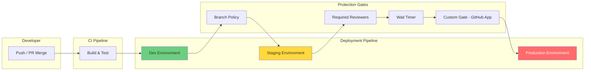
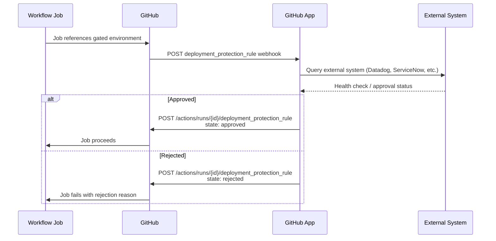
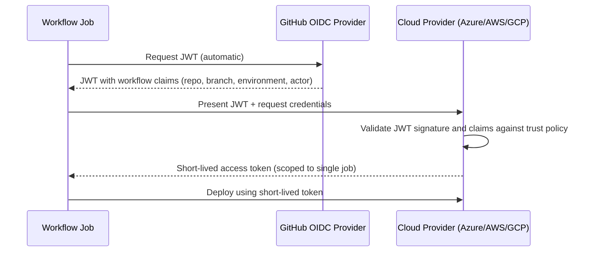

# Deployment Strategies

**Level:** L300 (Advanced)  
**Objective:** Design and govern secure deployment pipelines using GitHub Environments, protection rules, OIDC federation, and enterprise policies

## Overview

GitHub Actions provides a mature, integrated deployment platform built around **environments**, **protection rules**, and **OIDC-based cloud authentication**. Environments serve as named deployment targets (e.g., `production`, `staging`, `qa`) that can be gated with required reviewers, wait timers, branch/tag restrictions, and custom deployment protection rules powered by GitHub Apps. This system enables organizations to enforce separation of duties, auditability, and automated compliance checks before any code reaches production.

For GitHub Enterprise Cloud (GHEC) administrators, the deployment story extends beyond individual repositories. Enterprise-level policies govern which Actions and reusable workflows are permitted, how self-hosted runners are scoped, default `GITHUB_TOKEN` permissions, and artifact/log retention periods. Combined with OIDC federation — which replaces long-lived cloud credentials with short-lived, job-scoped tokens — GHEC administrators can build deployment pipelines that are both secure by default and auditable end-to-end.

This guide covers the full deployment surface: environments, protection rules, OIDC, custom gates, deployment tracking, enterprise policies, and best practices for L300 administrators who must design and govern deployment infrastructure at scale.



## GitHub Environments

Environments are named deployment targets configured at the repository level under **Settings → Environments**. Each environment can hold secrets, variables, and protection rules that are enforced before any workflow job referencing that environment can proceed.

### Environment Configuration

| Setting | Description |
|---------|-------------|
| **Name** | Case-insensitive, up to 255 characters (e.g., `production`, `Production`, and `PRODUCTION` are the same environment) |
| **Secrets** | Encrypted values available only to jobs referencing the environment, and only after all protection rules pass |
| **Variables** | Non-secret configuration values accessible via the `vars` context |
| **Protection rules** | Required reviewers, wait timers, branch/tag restrictions, admin bypass controls, and custom GitHub App gates |
| **Deployment branch/tag policies** | Restrict which refs can deploy to the environment |

Environments are available for all plans on public repositories. Private and internal repositories require GitHub Pro, GitHub Team, or GitHub Enterprise Cloud. Some protection rules (wait timers, required reviewers) require paid plans for private repositories.

### Environment Secrets and Variables

Environment secrets are encrypted at rest and are only exposed to workflow jobs that reference the corresponding environment. They are injected **after** all protection rules for the environment have been satisfied.

```yaml
# Accessing environment secrets and variables
jobs:
  deploy:
    runs-on: ubuntu-latest
    environment: production
    steps:
      - name: Deploy to production
        run: |
          echo "Deploying to ${{ vars.DEPLOY_URL }}"
          ./deploy.sh --api-key "${{ secrets.API_KEY }}"
```

> **Security Note:** On self-hosted runners, environment secrets should be treated with the same security posture as repository or organization secrets, because runners are not isolated containers. Any process on the runner can access secrets during the job.

Environment variables are non-secret configuration values that allow you to parameterize deployments across environments without duplicating workflow logic:

| Context | Example | Description |
|---------|---------|-------------|
| `secrets.API_KEY` | Encrypted credentials | Available after protection rules pass |
| `vars.DEPLOY_URL` | `https://staging.example.com` | Non-secret, environment-specific configuration |
| `vars.REPLICA_COUNT` | `3` | Environment-tuned parameters |

### Branch and Tag Policies

Deployment branch and tag policies restrict which Git refs can trigger deployments to a given environment. Three options are available:

| Policy | Description | Use Case |
|--------|-------------|----------|
| **No restriction** | Any branch or tag can deploy | Development environments |
| **Protected branches only** | Only branches with branch protection rules | Staging environments |
| **Selected branches and tags** | Name patterns using `fnmatch` syntax | Production restricted to `release/*` tags |

```yaml
# Example: Branch-restricted deployment
jobs:
  deploy-staging:
    runs-on: ubuntu-latest
    environment: staging   # Only allows deployments from 'main'
    steps:
      - uses: actions/checkout@v6
      - run: ./deploy.sh staging

  deploy-production:
    runs-on: ubuntu-latest
    environment: production  # Only allows deployments from 'release/*' tags
    needs: deploy-staging
    steps:
      - uses: actions/checkout@v6
      - run: ./deploy.sh production
```

### Environment Auto-Creation and the `deployment: false` Option

Running a workflow that references a non-existent environment **auto-creates** that environment with no protection rules. This convenience can be a governance risk — administrators should pre-create environments with appropriate protections before teams begin deploying.

The `deployment: false` option allows a job to reference an environment for its secrets and variables **without** creating a deployment record:

```yaml
jobs:
  integration-test:
    runs-on: ubuntu-latest
    environment:
      name: testing
      deployment: false   # Access secrets without creating a deployment
    steps:
      - name: Run integration tests
        run: ./test.sh --db-url "${{ secrets.TEST_DB_URL }}"
```

> **Important:** Custom deployment protection rules (GitHub Apps) are **incompatible** with `deployment: false` — the job will fail immediately if both are configured. Use `deployment: false` only for CI/test jobs that need environment-scoped secrets but should not appear in deployment history.

## Deployment Protection Rules

Protection rules are the enforcement layer for environments. They gate workflow jobs and ensure that deployments meet organizational policies before proceeding. Rules can be **built-in** (provided by GitHub) or **custom** (powered by GitHub Apps).

### Built-in Protection Rules

GitHub provides four built-in protection mechanisms for environments:

| Rule | Description | Timeout / Limit |
|------|-------------|-----------------|
| **Required reviewers** | Up to 6 people or teams must be assigned; only 1 approval needed to proceed | Jobs wait up to 30 days, then auto-fail |
| **Wait timer** | Configurable delay between 1 and 43,200 minutes (30 days) | Does not count toward billable Actions minutes |
| **Deployment branches/tags** | Restrict deployments to specific refs via name patterns | N/A |
| **Admin bypass control** | Admins can bypass protection rules by default; can be disabled per environment | N/A |

### Required Reviewers

Up to **6 required reviewers** (individual users or teams) can be assigned to an environment. Only **one** reviewer must approve for the deployment job to proceed. This provides flexibility while ensuring human oversight.

Key behaviors:
- Pending reviews appear in the workflow run UI and trigger notifications to assigned reviewers
- If no reviewer approves within 30 days, the job automatically fails
- The **"Prevent self-review"** option blocks the user who triggered the workflow from approving the deployment, enforcing separation of duties
- Reviewers can approve or reject directly from the Actions workflow run page

```yaml
# Workflow that requires approval before production deployment
name: Deploy to Production
on:
  push:
    tags:
      - 'release/*'

jobs:
  build:
    runs-on: ubuntu-latest
    steps:
      - uses: actions/checkout@v6
      - run: npm ci && npm run build
      - uses: actions/upload-artifact@v4
        with:
          name: build-output
          path: dist/

  deploy:
    needs: build
    runs-on: ubuntu-latest
    environment:
      name: production
      url: https://app.example.com
    steps:
      - uses: actions/download-artifact@v4
        with:
          name: build-output
      - run: ./deploy.sh production
```

### Wait Timers

Wait timers impose a mandatory delay before a deployment job can execute. The timer starts after all other protection rules (including reviewer approvals) are satisfied.

- **Range:** 1 to 43,200 minutes (30 days)
- **Billing:** Wait time does **not** consume GitHub Actions minutes
- **Use cases:** Allow time for monitoring after a canary deployment, enforce change-freeze windows, or provide a rollback window

### Deployment Branch and Tag Restrictions

Branch and tag restrictions are the first line of defense, preventing unauthorized refs from triggering deployments. Patterns use `fnmatch` syntax:

| Pattern | Matches |
|---------|---------|
| `main` | Only the `main` branch |
| `release/*` | Any branch or tag starting with `release/` |
| `v[0-9]*` | Tags like `v1.0.0`, `v2.3.1` |
| `feature/**` | Nested branches like `feature/auth/login` |

### Admin Bypass Controls

By default, repository administrators can bypass all environment protection rules. For production environments where strict governance is required, this behavior should be explicitly disabled:

- Navigate to **Settings → Environments → [environment name]**
- Uncheck **"Allow administrators to bypass configured protection rules"**
- When disabled, administrators must follow the same approval and gating process as all other contributors

> **Recommendation:** Disable admin bypass for all production and production-adjacent environments to maintain audit integrity and regulatory compliance.

### Custom Deployment Protection Rules

Custom deployment protection rules are powered by **GitHub Apps** and enable integration with third-party systems for automated deployment gating. Each environment supports a maximum of **6 deployment protection rules** (combining built-in and custom).

Custom rules follow a webhook-driven architecture:



**Required App permissions:**
- `Actions: Read-only`
- `Deployments: Read and write`

**Capabilities:**
- Apps can post **status reports** (up to 10 per deployment, Markdown-formatted, max 1,024 characters) without approving or rejecting
- Custom rules can be published to the **GitHub Marketplace** for organizational discovery
- Custom deployment protection rules are currently in **public preview**

## OIDC for Cloud Deployments

OpenID Connect (OIDC) is the **recommended approach** for authenticating GitHub Actions workflows with cloud providers. OIDC replaces long-lived stored credentials with short-lived, job-scoped tokens, eliminating credential duplication and enabling automatic rotation.

### How OIDC Works

The OIDC flow establishes a trust relationship between a cloud provider and GitHub's OIDC provider:



1. An OIDC trust relationship is established between the cloud provider and GitHub's OIDC provider (`https://token.actions.githubusercontent.com`)
2. When a workflow job runs, GitHub's OIDC provider auto-generates a JWT containing claims about the workflow identity (repository, branch, environment, actor, etc.)
3. The workflow presents this JWT to the cloud provider, which validates the claims against its trust policy
4. The cloud provider issues a **short-lived access token** scoped to a single job

**Benefits:**
- **No cloud secrets stored in GitHub** — eliminates credential duplication and reduces blast radius
- **Granular control** — cloud provider's IAM policies control exactly which workflows can assume which roles
- **Automatic credential rotation** — tokens expire after each job completes
- **Auditability** — every token exchange is logged on both GitHub and cloud provider sides

### Key JWT Claims

The JWT issued by GitHub's OIDC provider contains claims that identify the workflow context:

| Claim | Description | Example |
|-------|-------------|---------|
| `sub` | Subject — encodes repo, branch/tag/environment | `repo:octo-org/octo-repo:environment:prod` |
| `aud` | Audience — defaults to repo owner URL; customizable | `api://AzureADTokenExchange` |
| `iss` | Issuer — GitHub's OIDC provider | `https://token.actions.githubusercontent.com` |
| `repository` | Full repository name | `octo-org/octo-repo` |
| `repository_owner` | Organization name | `octo-org` |
| `repository_visibility` | Repository visibility | `public`, `private`, or `internal` |
| `environment` | Environment name (when job references one) | `production` |
| `job_workflow_ref` | Ref path to reusable workflow (if applicable) | `octo-org/workflows/.github/workflows/deploy.yml@refs/heads/main` |
| `runner_environment` | Runner type | `github-hosted` or `self-hosted` |
| `ref` | Git ref that triggered the run | `refs/heads/main` |
| `workflow` | Workflow name | `Deploy Application` |
| `repo_property_*` | Custom properties (public preview) | `repo_property_team=platform` |

### Subject Claim Customization

The `sub` claim format varies by trigger context and can be customized at the organization level:

| Context | Default Subject Claim Format |
|---------|------------------------------|
| **Environment** | `repo:ORG/REPO:environment:ENV-NAME` |
| **Branch** | `repo:ORG/REPO:ref:refs/heads/BRANCH` |
| **Tag** | `repo:ORG/REPO:ref:refs/tags/TAG` |
| **Pull request** | `repo:ORG/REPO:pull_request` |

Organizations can customize the `sub` claim via the REST API to include additional claim fields such as `repository_id` or `repository_visibility`. This enables **attribute-based access control (ABAC)** patterns where cloud trust policies gate access based on repository metadata.

**Repository custom properties as OIDC claims (public preview):** Organization and enterprise admins can include repository custom properties as claims in OIDC tokens, prefixed with `repo_property_`. For example, a custom property `team=platform` results in a `repo_property_team` claim, allowing cloud trust policies to authorize access based on team ownership rather than per-repository configuration.

### Configuring OIDC for Azure

Azure uses **Microsoft Entra ID federated credentials** to trust GitHub's OIDC provider:

1. Create a Microsoft Entra ID application and service principal
2. Add federated credentials with subject matching the GitHub OIDC subject claim
3. Set the audience to `api://AzureADTokenExchange`
4. Use the `azure/login` action with `client-id`, `tenant-id`, and `subscription-id`

```yaml
name: Deploy to Azure
on:
  push:
    branches: [main]

permissions:
  id-token: write
  contents: read

jobs:
  deploy:
    runs-on: ubuntu-latest
    environment: production
    steps:
      - uses: actions/checkout@v6

      - name: Azure Login via OIDC
        uses: azure/login@v2
        with:
          client-id: ${{ secrets.AZURE_CLIENT_ID }}
          tenant-id: ${{ secrets.AZURE_TENANT_ID }}
          subscription-id: ${{ secrets.AZURE_SUBSCRIPTION_ID }}

      - name: Deploy to Azure Web App
        uses: azure/webapps-deploy@v3
        with:
          app-name: my-web-app
          package: ./dist
```

> **Note:** The workflow **must** include `permissions: id-token: write` to allow the OIDC token request. Without this permission, the `azure/login` action will fail.

### Configuring OIDC for AWS

AWS uses an **IAM OIDC identity provider** with a role trust policy:

1. Add GitHub as an OIDC identity provider in IAM with provider URL `https://token.actions.githubusercontent.com` and audience `sts.amazonaws.com`
2. Create an IAM role with a trust policy that validates the `sub` claim
3. Use the `aws-actions/configure-aws-credentials` action with `role-to-assume`

```json
{
  "Version": "2012-10-17",
  "Statement": [
    {
      "Effect": "Allow",
      "Principal": {
        "Federated": "arn:aws:iam::ACCOUNT_ID:oidc-provider/token.actions.githubusercontent.com"
      },
      "Action": "sts:AssumeRoleWithWebIdentity",
      "Condition": {
        "StringEquals": {
          "token.actions.githubusercontent.com:aud": "sts.amazonaws.com",
          "token.actions.githubusercontent.com:sub": "repo:octo-org/octo-repo:environment:prod"
        }
      }
    }
  ]
}
```

```yaml
jobs:
  deploy:
    runs-on: ubuntu-latest
    environment: production
    permissions:
      id-token: write
      contents: read
    steps:
      - uses: actions/checkout@v6
      - name: Configure AWS Credentials
        uses: aws-actions/configure-aws-credentials@v4
        with:
          role-to-assume: arn:aws:iam::ACCOUNT_ID:role/GitHubActionsDeployRole
          aws-region: us-east-1
      - run: aws s3 sync ./dist s3://my-app-bucket
```

### Configuring OIDC for GCP

Google Cloud uses **Workload Identity Federation** to trust GitHub's OIDC tokens:

1. Create a Workload Identity Pool and Provider with issuer `https://token.actions.githubusercontent.com`
2. Grant the target service account `roles/iam.workloadIdentityUser` on the pool
3. Use the `google-github-actions/auth` action with `workload_identity_provider` and `service_account`

```yaml
jobs:
  deploy:
    runs-on: ubuntu-latest
    environment: production
    permissions:
      id-token: write
      contents: read
    steps:
      - uses: actions/checkout@v6
      - name: Authenticate to GCP
        uses: google-github-actions/auth@v2
        with:
          workload_identity_provider: projects/PROJECT_NUMBER/locations/global/workloadIdentityPools/POOL/providers/PROVIDER
          service_account: deploy-sa@PROJECT_ID.iam.gserviceaccount.com
      - name: Deploy to Cloud Run
        uses: google-github-actions/deploy-cloudrun@v2
        with:
          service: my-service
          region: us-central1
          source: .
```

### OIDC Security Hardening

Follow these practices to harden OIDC-based deployments:

| Practice | Rationale |
|----------|-----------|
| Use environment-scoped subject claims | Prevents non-production branches from assuming production roles |
| Restrict `repository_visibility` in trust policies | Ensures only private repos can access internal resources |
| Enable `runner_environment` claim validation | Prevents self-hosted runner compromise from escalating to cloud access |
| Customize `aud` claim per cloud provider | Reduces token reuse risk across providers |
| Use `repo_property_*` claims for ABAC | Gates access by team or classification instead of per-repo config |
| Pin cloud login actions to commit SHAs | Prevents supply-chain attacks via compromised action tags |
| Audit OIDC token exchanges in cloud provider logs | Maintains end-to-end deployment audit trail |

## Custom Deployment Gates

Custom deployment gates extend the built-in protection rules by integrating third-party systems through GitHub Apps. They enable automated, policy-driven deployment decisions based on external data sources.

### GitHub App Integration Architecture

A custom deployment gate requires a GitHub App with the following configuration:

| Requirement | Value |
|-------------|-------|
| **Permissions** | `Actions: Read-only`, `Deployments: Read and write` |
| **Webhook event** | `deployment_protection_rule` |
| **Authentication** | JWT → installation access token |
| **Response endpoint** | `POST /repos/{owner}/{repo}/actions/runs/{run_id}/deployment_protection_rule` |

The App must be installed on the target repository and explicitly enabled on each environment where it should enforce gates.

### Webhook and Approval Flow

When a workflow job reaches a gated environment, GitHub sends a `deployment_protection_rule` webhook to the registered App. The flow proceeds as follows:

1. **GitHub sends webhook** — the payload includes the deployment details, environment name, workflow run ID, and callback URL
2. **App authenticates** — the App generates a JWT using its private key, then exchanges it for an installation access token
3. **App evaluates conditions** — the App queries its external system (monitoring platform, ITSM tool, compliance engine)
4. **App responds** — calls the REST API with `state: approved` or `state: rejected`, plus an optional `comment` explaining the decision

```yaml
# Example: Workflow with custom gate on production
name: Deploy with Custom Gate
on:
  push:
    tags:
      - 'v*'

jobs:
  deploy-staging:
    runs-on: ubuntu-latest
    environment: staging
    steps:
      - uses: actions/checkout@v6
      - run: ./deploy.sh staging

  deploy-production:
    needs: deploy-staging
    runs-on: ubuntu-latest
    environment: production  # Custom gate App evaluates before this job runs
    steps:
      - uses: actions/checkout@v6
      - run: ./deploy.sh production
```

### Use Cases for Custom Gates

| Use Case | External System | Gate Logic |
|----------|----------------|------------|
| **Change management** | ServiceNow, Jira Service Management | Verify an approved change request exists for the deployment |
| **Observability health check** | Datadog, Honeycomb, New Relic | Confirm error rates and latency are below thresholds |
| **Security scan gate** | Snyk, Checkmarx, SonarQube | Block deployment if critical vulnerabilities are found |
| **Compliance verification** | Custom compliance engine | Validate SOC 2 / HIPAA controls before production release |
| **Feature flag readiness** | LaunchDarkly, Split | Ensure feature flags are configured before deployment |
| **Infrastructure readiness** | Terraform, Pulumi | Verify infrastructure provisioning completed successfully |

## Deployment Tracking and Visibility

GitHub provides comprehensive deployment tracking through the UI, REST API, GraphQL API, and webhooks. Every deployment creates structured data objects that enable dashboards, notifications, and audit trails.

### Deployment Objects and Status Objects

When a workflow job references an environment, GitHub automatically creates:

- **Deployment object** — represents the intent to deploy a specific ref to an environment, includes the commit SHA, environment name, and optional payload
- **Deployment status objects** — track the progression of the deployment through states

Deployment statuses follow a defined state machine:

| Status | Description | Terminal? |
|--------|-------------|-----------|
| `queued` | Deployment is queued and waiting | No |
| `pending` | Deployment is pending external validation | No |
| `in_progress` | Deployment is actively running | No |
| `success` | Deployment completed successfully | Yes |
| `failure` | Deployment failed | Yes |
| `error` | An error occurred during deployment | Yes |
| `inactive` | Previously successful deployment superseded by a newer one | Yes |

> **Auto-inactivation:** When a deployment status is set to `success`, GitHub automatically marks all prior non-transient, non-production deployments in the same environment as `inactive`.

### Deployment REST API

The Deployments REST API enables programmatic deployment management:

```bash
# List deployments for a repository
gh api /repos/{owner}/{repo}/deployments \
  --jq '.[] | {id, environment, ref, created_at}'

# Create a deployment
gh api --method POST /repos/{owner}/{repo}/deployments \
  -f ref="main" \
  -f environment="staging" \
  -f auto_merge=false \
  -f required_contexts='[]'

# Create a deployment status
gh api --method POST /repos/{owner}/{repo}/deployments/{deployment_id}/statuses \
  -f state="success" \
  -f environment_url="https://staging.example.com" \
  -f description="Deployment successful"
```

**Webhooks** provide real-time notification of deployment events:
- `deployment` — fired when a new deployment is created
- `deployment_status` — fired when a deployment status changes

### Concurrency Controls

Use concurrency groups to prevent parallel deployments to the same environment:

```yaml
jobs:
  deploy:
    runs-on: ubuntu-latest
    environment: production
    concurrency:
      group: production-deploy
      cancel-in-progress: false  # Queue rather than cancel
    steps:
      - uses: actions/checkout@v6
      - run: ./deploy.sh production
```

| Setting | Behavior |
|---------|----------|
| `cancel-in-progress: false` | New deployments queue behind the active one |
| `cancel-in-progress: true` | New deployments cancel any pending deployment |

> **Best Practice:** Use `cancel-in-progress: false` for production environments to avoid accidentally canceling a deployment that is actively rolling out. Use `cancel-in-progress: true` for development or preview environments where only the latest version matters.

### Notifications and Integrations

GitHub integrates with communication platforms for deployment visibility:

| Integration | Capabilities |
|-------------|-------------|
| **GitHub Deployments page** | Active deployments, full history, commit links, workflow logs, environment filtering; pin up to 10 environments |
| **Microsoft Teams** | Deployment notifications via the GitHub integration app |
| **Slack** | Deployment notifications via the GitHub Slack app |
| **Custom webhooks** | Consume `deployment` and `deployment_status` events for custom dashboards and alerting |
| **GraphQL API** | Query deployment data with flexible filtering and field selection |

## Enterprise Deployment Policies

GitHub Enterprise Cloud provides enterprise-level policy controls that establish guardrails for all organizations and repositories. These policies act as **maximums** — organization admins can set stricter limits but cannot exceed enterprise settings, creating a three-tier governance model.

### Three-Tier Governance Model

```
┌─────────────────────────────────────────────┐
│ Enterprise (Maximum Policy Boundary)        │
│  ┌─────────────────────────────────────────┐│
│  │ Organization (Stricter Constraints)     ││
│  │  ┌─────────────────────────────────────┐││
│  │  │ Repository (Most Restrictive)       │││
│  │  │  ┌─────────────────────────────────┐│││
│  │  │  │ Environment (Deployment Gates)  ││││
│  │  │  └─────────────────────────────────┘│││
│  │  └─────────────────────────────────────┘││
│  └─────────────────────────────────────────┘│
└─────────────────────────────────────────────┘
```

Each tier inherits and can only tighten the policies from the tier above. This prevents individual repositories or organizations from weakening security controls set at the enterprise level.

### Actions and Workflow Policies

Enterprise owners control which Actions are available across the organization:

| Policy | Options | Impact on Deployments |
|--------|---------|----------------------|
| **Actions enablement** | Enable / disable per organization | Completely controls whether Actions-based deployments are available |
| **Allowed actions** | All actions, enterprise-only, enterprise + verified creators, selected actions | Restricts which deployment actions (e.g., `azure/login`, `aws-actions/configure-aws-credentials`) can be used |
| **Commit SHA pinning** | Require actions referenced by full commit SHA | Prevents supply-chain attacks via compromised action tags |
| **Fork PR workflows** | Require approval for outside collaborators | Prevents unauthorized deployments triggered by fork PRs |
| **Runner scope** | Enable/disable repository-level self-hosted runners | Controls where deployment jobs can execute |

```yaml
# Pinning actions to commit SHAs (enterprise best practice)
steps:
  - uses: actions/checkout@11bd71901bbe5b1630ceea73d27597364c9af683  # v4.2.2
  - uses: azure/login@a457da9ea143d694b1b9c7c869ebb04ebe844ef5      # v2.3.0
  - uses: azure/webapps-deploy@2fdd5c3ebb4e540834b57a43d9352a5b2e6a2cd  # v3.0.2
```

### GITHUB_TOKEN Default Permissions

The `GITHUB_TOKEN` is an automatically generated token available to every workflow job. Enterprise policy controls its default permission level:

| Setting | Behavior |
|---------|----------|
| **Read-only (recommended)** | Workflows must explicitly request `write` permissions via the `permissions` key |
| **Read and write** | Legacy default; workflows have broad write access unless restricted |

> **Important:** Enterprises created on or after **February 2, 2023** default to read-only `GITHUB_TOKEN` permissions. This is the security-first default that L300 administrators should understand and maintain. Existing enterprises should audit and migrate to read-only defaults.

### Artifact and Log Retention

Enterprise policies control how long deployment artifacts and workflow logs are retained:

| Repository Type | Retention Range | Default |
|----------------|-----------------|---------|
| **Private** | 1 – 400 days | 90 days |
| **Public** | 1 – 90 days | 90 days |

Additional enterprise-controlled storage settings:

| Setting | Range | Default |
|---------|-------|---------|
| **Cache retention** | Up to 365 days | 7 days |
| **Cache storage limit** | Up to 10,000 GB per repository | 10 GB |

### Required Workflows via Repository Rulesets

Required workflows enforce mandatory CI/CD checks across repositories at the organization level. In October 2023, this capability migrated from GitHub Actions to **Repository Rulesets**, providing a unified governance surface.

With rulesets, organization administrators can:
- Require specific workflows to pass before merges are allowed
- Apply rules across multiple repositories using targeting patterns
- Enforce deployment prerequisites (security scans, tests, approvals) without modifying individual repository configurations

```yaml
# Example: Organization-level ruleset requiring CI before deploy
# Configured via Settings → Rulesets (not in workflow YAML)
# Targets: All repositories matching 'app-*'
# Required status checks:
#   - "build-and-test" workflow must pass
#   - "security-scan" workflow must pass
```

## Deployment Best Practices

### Environment Hierarchy Patterns

Design environment hierarchies that match your deployment topology and risk profile:

**Standard Multi-Tier Pattern:**

| Environment | Branch Policy | Protection Rules | Purpose |
|-------------|--------------|------------------|---------|
| `development` | All branches | None | Rapid iteration, integration testing |
| `staging` | `main` only | Deployment branch restriction | Pre-production validation |
| `canary` | `main` only | 1 required reviewer | Incremental production rollout |
| `production` | `release/*` tags | 2 required reviewers, 15-min wait timer, custom health gate | Full production deployment |

**Platform Team Pattern:**

| Environment | Branch Policy | Protection Rules | Purpose |
|-------------|--------------|------------------|---------|
| `infra-dev` | All branches | None | Infrastructure development |
| `infra-staging` | `main` only | 1 reviewer + Terraform plan gate | Infrastructure staging |
| `infra-production` | `main` only | 2 reviewers + 30-min wait + change management gate | Production infrastructure |

### Separation of Duties

Enforce separation of duties to meet compliance and audit requirements:

| Control | Implementation |
|---------|----------------|
| **Prevent self-review** | Enable "Prevent self-review" on production environments |
| **Distinct reviewer pools** | Assign different teams as required reviewers for staging vs. production |
| **Admin bypass disabled** | Remove admin bypass for production environments |
| **Branch protection** | Require PR reviews before merging to deployment branches |
| **CODEOWNERS** | Require approval from code owners for deployment workflow changes |
| **Audit logging** | Monitor enterprise audit log for `environment.create`, `environment.update`, and deployment approval events |

### Secret Management

Follow these practices for managing secrets across deployment environments:

| Practice | Description |
|----------|-------------|
| **Use OIDC instead of stored credentials** | Eliminate long-lived cloud credentials wherever possible |
| **Scope secrets to environments** | Store production credentials as environment secrets, not repository secrets |
| **Rotate secrets regularly** | Establish rotation schedules for any remaining stored secrets |
| **Use secret scanning** | Enable GitHub secret scanning with push protection to prevent accidental commits |
| **Limit secret access** | Environment secrets are only available after protection rules pass — leverage this for least-privilege |
| **Avoid self-hosted runner exposure** | On shared self-hosted runners, environment secrets are accessible to any process during the job |

### Rollback and Recovery

Design deployment workflows with rollback capabilities:

```yaml
name: Deploy with Rollback
on:
  workflow_dispatch:
    inputs:
      action:
        description: 'Deploy or Rollback'
        required: true
        type: choice
        options:
          - deploy
          - rollback
      version:
        description: 'Version to deploy or rollback to'
        required: true

jobs:
  deploy:
    runs-on: ubuntu-latest
    environment:
      name: production
      url: https://app.example.com
    concurrency:
      group: production-deploy
      cancel-in-progress: false
    steps:
      - uses: actions/checkout@v6
        with:
          ref: ${{ inputs.version }}

      - name: Deploy or Rollback
        run: |
          if [ "${{ inputs.action }}" = "rollback" ]; then
            echo "Rolling back to ${{ inputs.version }}"
            ./rollback.sh "${{ inputs.version }}"
          else
            echo "Deploying ${{ inputs.version }}"
            ./deploy.sh "${{ inputs.version }}"
          fi
```

**Rollback strategies:**

| Strategy | Description | Trade-off |
|----------|-------------|-----------|
| **Re-deploy previous version** | Trigger the deployment workflow with the previous known-good tag | Simple but requires full deployment cycle |
| **Blue/green swap** | Maintain two identical environments and swap traffic | Fast rollback but higher infrastructure cost |
| **Canary rollback** | Reduce canary percentage to zero, route all traffic to stable | Minimal blast radius during progressive rollout |
| **Feature flag disable** | Turn off the problematic feature via flag management | Fastest rollback; requires feature flag infrastructure |

## References

1. [Managing environments for deployment](https://docs.github.com/en/actions/managing-workflow-runs-and-deployments/managing-deployments/managing-environments-for-deployment)
2. [Deployments and environments reference](https://docs.github.com/en/actions/reference/deployments-and-environments)
3. [About security hardening with OpenID Connect](https://docs.github.com/en/actions/security-for-github-actions/security-hardening-your-deployments/about-security-hardening-with-openid-connect)
4. [Configuring OpenID Connect in Azure](https://docs.github.com/en/actions/security-for-github-actions/security-hardening-your-deployments/configuring-openid-connect-in-azure)
5. [Creating custom deployment protection rules](https://docs.github.com/en/actions/managing-workflow-runs-and-deployments/managing-deployments/creating-custom-deployment-protection-rules)
6. [Deploying with GitHub Actions](https://docs.github.com/en/actions/concepts/use-cases/deploying-with-github-actions)
7. [Enforcing policies for GitHub Actions in your enterprise](https://docs.github.com/en/enterprise-cloud@latest/admin/enforcing-policies/enforcing-policies-for-your-enterprise/enforcing-policies-for-github-actions-in-your-enterprise)
8. [OpenID Connect reference](https://docs.github.com/en/actions/reference/openid-connect-reference)
9. [Configuring OpenID Connect in Amazon Web Services](https://docs.github.com/en/actions/security-for-github-actions/security-hardening-your-deployments/configuring-openid-connect-in-amazon-web-services)
10. [Configuring OpenID Connect in Google Cloud Platform](https://docs.github.com/en/actions/security-for-github-actions/security-hardening-your-deployments/configuring-openid-connect-in-google-cloud-platform)
11. [Viewing deployment history](https://docs.github.com/en/actions/managing-workflow-runs-and-deployments/managing-deployments/viewing-deployment-history)
12. [REST API endpoints for deployments](https://docs.github.com/en/rest/deployments/deployments)
13. [Required Workflows moving to Repository Rules](https://github.blog/changelog/2023-05-04-github-actions-required-workflows-will-move-to-repository-rules/)
14. [Deploy to Azure infrastructure with GitHub Actions](https://learn.microsoft.com/en-us/azure/developer/github/deploy-to-azure)
