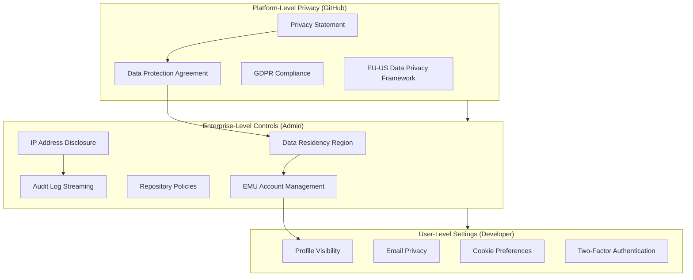

# User Privacy and Data Residency

**Level:** L300 (Advanced)  
**Objective:** Understand GitHub Enterprise Cloud privacy controls, data residency architecture, GDPR compliance, and enterprise-level settings for protecting user data and meeting regulatory requirements

## Overview

GitHub Enterprise Cloud provides a comprehensive set of privacy controls, data residency options, and compliance certifications designed for organizations with strict regulatory requirements. Since the launch of GitHub Enterprise Cloud with data residency, enterprises can now choose where their code and metadata are stored — with the EU, Australia, US, and Japan available as hosting regions.

GitHub's privacy architecture operates at three distinct tiers:

1. **Platform-level privacy commitments** — governed by GitHub's Privacy Statement and Data Protection Agreement (DPA)
2. **Enterprise-level controls** — configured by admins (data residency region, IP disclosure, audit streaming, repository policies)
3. **User-level settings** — managed by individual developers (profile visibility, cookie preferences, 2FA)

Understanding how these tiers interact — especially in Enterprise Managed Users (EMU) environments where the organization controls user accounts — is essential for architects designing compliant GitHub deployments.



## Data Residency

GitHub Enterprise Cloud with data residency allows enterprises to control the geographic location where their code and metadata are stored. This is a critical capability for organizations subject to data sovereignty regulations such as GDPR, the Australian Privacy Act, or Japan's APPI.

### Available Regions

GitHub Enterprise Cloud with data residency is currently available in four regions:

| Region | Location | Regulatory Drivers |
|--------|----------|-------------------|
| **EU** | European Union | GDPR, Schrems II, national data protection laws |
| **Australia** | Australia | Australian Privacy Act, IRAP, state-level requirements |
| **US** | United States | FedRAMP, HIPAA, state privacy laws (CCPA/CPRA) |
| **Japan** | Japan | APPI (Act on Protection of Personal Information) |

GitHub plans to offer data residency in additional regions in the future.

### GHE.com Subdomain Model

Enterprises with data residency are hosted on a dedicated subdomain of **GHE.com**, separate from the main GitHub.com platform. For example:

```
https://octocorp.ghe.com          # Web UI
https://api.octocorp.ghe.com      # REST/GraphQL API
```

This deployment model uses **Enterprise Managed Users** exclusively:

- User accounts are provisioned via SCIM from the organization's identity provider
- Authentication is handled via SAML or OIDC through the IdP
- All API requests must target the enterprise's dedicated GHE.com URL
- The enterprise namespace is completely isolated from GitHub.com

### Data Storage Boundaries

The following data categories are stored within the chosen region:

| Data Category | Examples | Stored In-Region |
|---------------|----------|:----------------:|
| **Customer content** | Repository names, source code, PRs, comments, file paths, raw URLs | ✅ |
| **Structured/blob storage** | Issues, wikis, project boards, releases | ✅ |
| **GitHub Actions data** | Workflow runs, logs, artifacts | ✅ |
| **BCDR data** | Business continuity and disaster recovery backups | ✅ |
| **Person-identifying data** | Email addresses, usernames, first/last names, IP addresses | ✅ |

### Data That May Leave the Region

Some data categories may be stored or processed outside the chosen region:

| Data Category | Examples | Reason |
|---------------|----------|--------|
| **Pseudonymized telemetry** | User IDs, GUIDs, unsalted hashes | Service improvement; cannot identify a person alone |
| **Billing/plan data** | Contact info, billing addresses, payment details | Global billing infrastructure |
| **Support data** | Support requests, case notes, chat sessions | Global support operations |
| **GitHub Copilot data** | Prompts, suggestions, telemetry | Copilot processing infrastructure |
| **Secret scanning metadata** | Validity checks, extended metadata (if enabled) | Partner notification and validation |
| **TLS certificates** | Certificate transparency logs for GHE.com subdomain | Sent to CAs and CT ecosystem globally |

> **⚠️ Important:** GitHub documents reasons for data transfers out of the enterprise's region but does not send notifications when transfers occur.

### Key Limitations

Enterprises using data residency on GHE.com should be aware of the following constraints:

- **No public repositories** — only internal and private repositories are supported in EMU enterprises
- **API endpoint changes** — all API requests must target `api.<enterprise>.ghe.com`, not `api.github.com`
- **Copilot feature gaps** — some GitHub Copilot features may be unavailable on GHE.com
- **Enterprise isolation** — managed user accounts cannot interact with resources outside their enterprise
- **No cross-enterprise collaboration** — users cannot contribute to public open-source projects on GitHub.com
- **Migration complexity** — moving from GitHub.com to GHE.com requires a full migration, not a simple toggle

## GDPR and Data Processing

GitHub processes personal data in compliance with the General Data Protection Regulation (GDPR), ensuring a lawful basis for each processing activity. Understanding the GDPR framework is critical for enterprise administrators responsible for their organization's compliance posture.

### GitHub's GDPR Stance

GitHub's data processing is grounded in four lawful bases under GDPR:

| Lawful Basis | Description | Example |
|-------------|-------------|---------|
| **Contractual Necessity** | Processing required to fulfill GitHub Terms of Service | Hosting repositories, running CI/CD |
| **Legal Obligation** | Processing necessary to comply with applicable laws | Tax records, law enforcement requests |
| **Legitimate Interests** | Processing for securing services, communication, improvement | Security scanning, service analytics |
| **Consent** | Processing when the user has explicitly consented | Marketing communications, optional telemetry |

GitHub only relies on legitimate interests when the processing is not overridden by the individual's data protection rights.

### Data Controller vs Data Processor

The GDPR defines two key roles in data processing. GitHub's role changes depending on context:

| Scenario | Data Controller | Data Processor |
|----------|----------------|----------------|
| **Enterprise-provided account** (employee/student) | The organization | GitHub |
| **Personal GitHub.com account** | GitHub | N/A (GitHub is sole controller) |
| **Specific DPA-defined activities** | GitHub | N/A |

When an organization provides a GitHub account to an employee or student:

- The **organization is the Data Controller** — it determines the purposes and means of processing personal data
- **GitHub is the Data Processor** — it processes data on behalf of the organization according to the DPA
- GitHub functions as Data Controller only for specific processing activities clearly defined in the DPA

### Data Protection Agreement

The standard Data Protection Agreement (DPA) governs how GitHub processes data on behalf of enterprise customers:

- Available at [github.com/customer-terms/github-data-protection-agreement](https://github.com/customer-terms/github-data-protection-agreement)
- Automatically incorporated into enterprise agreements
- Defines the scope of data processing, security measures, and breach notification procedures
- Specifies sub-processor requirements and audit rights

**GitHub Entities:**

| Entity | Address | Role |
|--------|---------|------|
| **GitHub, Inc.** | 88 Colin P. Kelly Jr. St., San Francisco, CA 94107, US | Primary service provider |
| **GitHub B.V.** | Prins Bernhardplein 200, Amsterdam 1097JB, Netherlands | Data Controller for EEA/UK users |

### International Data Transfers

For transfers to countries without an EU adequacy decision, GitHub relies on multiple legal mechanisms:

- **Standard Contractual Clauses (SCCs)** — published by the European Commission, incorporated into the DPA
- **EU-U.S. Data Privacy Framework (DPF)** — certified with the U.S. Department of Commerce
- **UK Extension to the EU-U.S. DPF** — covers transfers from the United Kingdom
- **Swiss-U.S. DPF** — covers transfers from Switzerland

GitHub is subject to FTC enforcement jurisdiction under the Data Privacy Framework. GitHub also maintains a public list of authorized subprocessors, publishing names of new subprocessors at least **30 days in advance** of authorization.

## Data Subject Requests

Under GDPR, individuals have specific rights regarding their personal data. Enterprise administrators must understand both the rights available to data subjects and the enterprise's responsibilities in fulfilling requests.

### User Rights Under GDPR

Data subjects (users) have the following rights:

| Right | GDPR Article | Description |
|-------|:------------:|-------------|
| **Right to Access** | Art. 15 | Obtain confirmation of processing and access to personal data |
| **Right to Rectification** | Art. 16 | Correct inaccurate or incomplete personal data |
| **Right to Erasure** | Art. 17 | Request deletion of personal data under specific conditions |
| **Right to Restrict Processing** | Art. 18 | Limit how personal data is processed |
| **Right to Object** | Art. 21 | Object to processing based on legitimate interests |
| **Right to Data Portability** | Art. 20 | Receive data in a structured, machine-readable format |
| **Right to Withdraw Consent** | Art. 7(3) | Withdraw previously given consent at any time |

### How to Exercise Rights

GitHub provides the following channels for exercising data subject rights:

- **Privacy contact:** [privacy@github.com](mailto:privacy@github.com) — for all privacy inquiries and data subject requests
- **Data Protection Officer:** [dpo@github.com](mailto:dpo@github.com) — for escalations and DPO-specific inquiries
- **Account settings:** Users can access, download, and modify much of their personal data directly through GitHub's account settings

### Enterprise Admin Responsibilities

When the enterprise is the Data Controller (for enterprise-provided accounts):

1. **Receive and triage DSRs** — the enterprise is the first point of contact for its managed users
2. **Coordinate with GitHub** — if fulfilling the request requires GitHub's assistance as Data Processor
3. **Document the process** — maintain records of DSRs received, actions taken, and response timelines
4. **Respond within deadlines** — GDPR requires responses within 30 days (extendable to 90 days for complex requests)
5. **Verify identity** — confirm the identity of the requester before disclosing personal data

### DSR Flow in EMU Environments

In Enterprise Managed User environments, the DSR process has a specific flow:

1. If GitHub receives a DSR from a managed user pertaining to a data residency enterprise, GitHub **redirects the data subject to the enterprise** (the Data Controller)
2. GitHub cooperates with the enterprise and provides necessary means to respond
3. The enterprise uses admin tools (People panel, SAML identity view, audit logs) to identify all data associated with the user
4. Deprovisioning is handled via SCIM through the organization's IdP

> **💡 Tip:** Export the membership CSV report and audit log entries for a user before deprovisioning to maintain compliance documentation.

## IP Address Controls

IP address visibility in audit logs is a sensitive privacy control that must be balanced against security monitoring needs. GitHub provides granular controls for enterprise administrators.

### Enabling IP Disclosure

By default, GitHub **does not display** source IP addresses in audit log events. Enterprise owners must explicitly opt in:

1. Navigate to **Enterprise** → **Settings** → **Audit log**
2. Select the **Settings** tab
3. Click **Enable source IP disclosure**
4. Confirm the action

Once enabled, IP addresses appear for **both new and existing events** in enterprise and organization audit logs.

### What Events Include IP Addresses

When IP disclosure is enabled, IP addresses are shown when a member interacts with **enterprise-owned resources**:

- Internal and private repositories
- Associated issues, pull requests, and discussions
- GitHub Actions workflow runs
- Projects and project boards
- Enterprise and organization settings changes

### EMU IP Address Behavior

In Enterprise Managed User environments, IP address disclosure is scoped to enterprise-owned resources only:

- IPs are recorded for interactions with internal and private repositories
- IPs are recorded for organization and enterprise administration events
- EMU accounts cannot access resources outside the enterprise, so all logged IPs relate to enterprise activity

### Limitations and Exclusions

IP addresses are **not** displayed for the following event types, even when disclosure is enabled:

| Excluded Event Type | Reason |
|--------------------|--------|
| Authentication to GitHub.com | Not enterprise-scoped (non-EMU) |
| Interactions with personal account resources | Outside enterprise boundary |
| Interactions with public repositories | Public activity not enterprise-controlled |
| `api.request` events without repository context | Insufficient enterprise association |
| Events where actor differs from action performer | Delegation/impersonation scenarios |
| Bot or automated system actions | Non-human actors |

> **⚠️ Legal Note:** Enterprise owners are responsible for meeting legal obligations related to viewing and storing IP addresses. Consult your legal team before enabling this feature.

## Audit Trail for Compliance

Audit logging is the foundation of compliance evidence for GitHub Enterprise Cloud. The audit log captures administrative and security events across the enterprise, providing the evidence trail required for regulatory frameworks.

### Compliance Certifications

GitHub maintains several compliance certifications that rely on audit trail capabilities:

| Certification | Scope | Relevance to Audit Logging |
|--------------|-------|----------------------------|
| **SOC 2 Type II** | Security, availability, processing integrity, confidentiality, privacy | Demonstrates continuous monitoring and access control |
| **ISO/IEC 27001** | Information security management systems | Requires security event logging and review |
| **FedRAMP (Tailored LI-SaaS)** | U.S. federal agency requirements | Mandates comprehensive audit logging and retention |
| **CSA STAR** | Cloud security assessment | Requires audit trail for cloud operations |
| **PCI DSS** | Payment processing | Requires logging of access to cardholder data environments |

Enterprise customers can request compliance reports through their GitHub account team or via the [GitHub Trust Center](https://github.com/security).

### Audit Log Streaming

For long-term retention beyond the 180-day web UI limit, enterprises can stream audit logs to external data management systems:

**Supported Destinations:**

| Destination | Authentication | Format |
|------------|----------------|--------|
| **Amazon S3** | Access keys or OIDC | Compressed JSON |
| **Azure Blob Storage** | SAS token | Compressed JSON |
| **Azure Event Hubs** | Connection string | Compressed JSON |
| **Datadog** | API key | Compressed JSON |
| **Google Cloud Storage** | Service account | Compressed JSON |
| **Splunk** | HEC token | Compressed JSON |

**Streaming Characteristics:**

- Streams export **both audit events and Git events** across the entire enterprise
- Delivered as compressed JSON files: `YYYY/MM/HH/MM/<uuid>.json.gz`
- Uses **at-least-once delivery** — some events may be duplicated
- Supports multiple endpoints simultaneously (public preview)
- Paused streams retain a buffer for **7 days**
- Streams paused for more than 3 weeks restart from the current timestamp
- Health checks run every 24 hours; misconfigured streams must be fixed within 6 days

### Event Correlation and SIEM Integration

Audit log data enables cross-event correlation for security analytics and compliance monitoring:

```json
{
  "action": "repo.change_visibility",
  "actor": "admin-user",
  "actor_location": {
    "country_code": "DE"
  },
  "org": "octocorp",
  "repo": "octocorp/internal-api",
  "created_at": "2025-03-15T14:32:00Z",
  "data": {
    "old_visibility": "private",
    "new_visibility": "internal"
  },
  "actor_ip": "203.0.113.42"
}
```

**Correlation Patterns for Compliance:**

- **Access anomalies** — flag events from unexpected geolocations or outside business hours
- **Privilege escalation** — detect role changes (member → admin) followed by sensitive operations
- **Data exposure** — alert on repository visibility changes (private → internal → public)
- **Account lifecycle** — correlate SCIM provisioning events with first authentication and resource access
- **Bulk operations** — detect mass repository deletion, transfer, or visibility changes

## Data Retention Policies

Understanding GitHub's data retention timelines is essential for compliance planning. Retention periods vary by data category and access method.

### Audit Log Retention

| Access Method | Retention Period | Event Types |
|--------------|:----------------:|-------------|
| **Web UI** | 180 days | Administrative, security, and organization events |
| **REST/GraphQL API** | 180 days | Same as web UI |
| **Git events (web/API)** | 7 days | Push, clone, fetch events |
| **Audit log streaming** | Unlimited (customer-managed) | All event types including Git events |
| **JSON/CSV export** | Snapshot at export time | Filtered by search qualifiers |

> **💡 Best Practice:** Configure audit log streaming to an external SIEM or storage system to ensure long-term retention beyond the 180-day platform limit. This is required for most compliance frameworks.

### Repository and Account Data

| Data Type | Retention Policy |
|-----------|-----------------|
| **Active repository data** | Retained as long as the repository exists |
| **Deleted repository data** | Recoverable for 90 days after deletion (enterprise policy) |
| **Account data (active)** | Retained as long as the account is active |
| **Account data (deleted)** | Removed per GitHub's data retention schedule; some data retained for legal obligations |
| **Git history** | Retained indefinitely while repository exists; follows repository lifecycle |
| **Actions workflow logs** | 90 days default; configurable per repository |
| **Actions artifacts** | 90 days default; configurable per repository |

### Backup and Export Options

Enterprise administrators have several options for data backup and export:

**Membership Data:**
- Export aggregated membership information as CSV (Enterprise → People → CSV Report)
- Enterprises with fewer than 1,000 members get an immediate download
- Enterprises with 1,000+ members receive an email with a download link
- Includes: username, display name, 2FA status, org role, pending invitations

**Audit Log Data:**
- Export in JSON or CSV format covering the last 180 days
- Git events can be exported separately as compressed JSON, filtered by date range
- Key fields: `action`, `actor`, `user`, `actor_location.country_code`, `org`, `repo`, `created_at`

**Repository Data:**
- Clone repositories for local backup using Git
- Use the GitHub API to export issues, PRs, wikis, and project data
- GitHub Archive Program provides long-term archival for significant open-source projects

**Dormant Users Report:**
- Available from the Compliance section of enterprise settings
- Identifies users inactive for 30+ days
- Useful for license management and access review

## Enterprise Managed User Privacy

Enterprise Managed Users (EMU) fundamentally changes the privacy model by placing full control of user accounts with the enterprise. This has significant implications for both administrators and end users.

### IdP-Controlled Profile Data

In EMU environments, user profile data is sourced from the organization's identity provider (IdP):

| Profile Field | Source | Modifiable by User |
|--------------|--------|:------------------:|
| **Username** | IdP (via SCIM) + enterprise shortcode | ❌ |
| **Display name** | IdP (via SCIM) | ❌ |
| **Email address** | IdP (via SCIM) | ❌ |
| **Organization membership** | IdP group mappings (via SCIM) | ❌ |
| **Profile photo** | User can set | ✅ |
| **Bio** | User can set | ✅ |

Profile data changes flow from the IdP to GitHub via SCIM synchronization. Enterprise administrators manage the canonical source of truth in the IdP.

### Namespace Isolation

EMU accounts operate within a strict namespace boundary:

- Managed user accounts can **only** interact with resources owned by their enterprise
- Users cannot contribute to repositories outside the enterprise (including public open-source projects on GitHub.com)
- Enterprise owners can optionally block user namespace repository creation
- Search results are scoped to the enterprise namespace
- The `_<shortcode>` suffix on usernames visually identifies managed accounts (e.g., `jdoe_octocorp`)

### No Personal Activity

Managed user accounts are fundamentally different from personal GitHub.com accounts:

- **No personal repositories** — unless the enterprise explicitly allows user namespace repos
- **No public contributions** — all activity is within the enterprise boundary
- **No marketplace access** — managed users cannot install GitHub Apps from the Marketplace
- **No personal notifications** — notification settings are enterprise-scoped
- **Account lifecycle tied to employment** — deprovisioning via SCIM removes the account from GitHub
- **No data portability** — users cannot transfer repositories or data out of the enterprise

> **⚠️ Important for HR/Legal:** When an employee leaves the organization, their EMU account is deprovisioned via SCIM. All contributions remain in the enterprise's repositories, but the user loses access. Ensure your offboarding process addresses GDPR Article 17 (Right to Erasure) obligations for the departing employee's personal data.

## User-Level Privacy Settings

While enterprise and platform controls provide the framework, individual users also have privacy settings they can configure. In EMU environments, some of these settings may be restricted or managed by the enterprise.

### Profile Visibility

Users can control what information is visible on their GitHub profile:

- **Public profile information** — name, bio, location, company, website, social accounts
- **Profile README** — optional repository-based profile content (public or internal)
- **Activity overview** — contribution graph and activity summary
- **Achievements** — badges earned through GitHub usage
- **Pinned repositories** — showcase specific repositories on the profile page

In EMU environments, profiles are only visible to other members of the same enterprise.

### Email Privacy

GitHub provides several email privacy controls:

| Setting | Description | Default |
|---------|-------------|:-------:|
| **Keep email addresses private** | Use a `noreply@github.com` address for web-based Git operations | Off |
| **Block command line pushes that expose email** | Reject pushes that would reveal a private email | Off |
| **Notification email routing** | Route notifications to different emails per organization | N/A |
| **Verified email addresses** | Only verified emails appear in commits and correspondence | Required |

> **💡 Tip:** Encourage developers to enable the `noreply` email address for Git operations to prevent personal email addresses from appearing in public commit history.

### Contribution and Activity Settings

Users can manage how their activity is displayed:

- **Private contributions** — optionally show private contribution counts on the public profile (without revealing repository names)
- **Activity status** — show or hide online/active status
- **Contribution graph** — cannot be hidden but only shows counts, not repository details
- **Starred repositories** — publicly visible list of starred repos (can be managed)

### Cookie Preferences

GitHub provides cookie consent mechanisms that comply with global privacy regulations:

| Cookie Category | Purpose | User Control |
|----------------|---------|:------------:|
| **Essential** | Authentication, security, site functionality | Required — cannot disable |
| **Analytics** | Usage metrics and service improvement | Opt-in (in applicable jurisdictions) |
| **Marketing** | Targeted advertising on non-GitHub sites | Opt-in (in applicable jurisdictions) |

Additional privacy signals respected by GitHub:

- **Do Not Track (DNT)** — GitHub respects browser DNT signals
- **Global Privacy Control (GPC)** — GitHub does not share or sell data when GPC is detected
- **Cookie settings** — accessible via the link in page footers on enterprise marketing pages

### Two-Factor Authentication

Two-factor authentication (2FA) is both a security and privacy control:

- Enterprise owners can **require 2FA** for all members across all organizations
- Supported methods: authenticator apps (TOTP), security keys (WebAuthn/FIDO2), SMS (fallback)
- Recovery codes should be stored securely by users
- Enterprise membership CSV export includes 2FA status and configuration security level
- GitHub is progressively requiring 2FA for all developers contributing to public repositories

**2FA Security Levels:**

| Level | Methods | Enterprise Recommendation |
|-------|---------|:-------------------------:|
| **Not configured** | None | ❌ Block access |
| **SMS only** | SMS-based codes | ⚠️ Discourage (SIM swap risk) |
| **Authenticator app** | TOTP codes | ✅ Minimum standard |
| **Security key** | WebAuthn/FIDO2 hardware keys | ✅ Recommended for admins |
| **Passkey** | Platform authenticator | ✅ Recommended |

## References

1. [About GitHub Enterprise Cloud with data residency](https://docs.github.com/en/enterprise-cloud@latest/admin/data-residency/about-github-enterprise-cloud-with-data-residency)
2. [GitHub General Privacy Statement](https://docs.github.com/en/site-policy/privacy-policies/github-general-privacy-statement)
3. [About storage of your data with data residency](https://docs.github.com/en/enterprise-cloud@latest/admin/data-residency/about-storage-of-your-data-with-data-residency)
4. [Exporting membership information for your enterprise](https://docs.github.com/en/enterprise-cloud@latest/admin/managing-accounts-and-repositories/managing-users-in-your-enterprise/exporting-membership-information-for-your-enterprise)
5. [Exporting audit log activity for your enterprise](https://docs.github.com/en/enterprise-cloud@latest/admin/monitoring-activity-in-your-enterprise/reviewing-audit-logs-for-your-enterprise/exporting-audit-log-activity-for-your-enterprise)
6. [About the audit log for your enterprise](https://docs.github.com/en/enterprise-cloud@latest/admin/monitoring-activity-in-your-enterprise/reviewing-audit-logs-for-your-enterprise/about-the-audit-log-for-your-enterprise)
7. [Streaming the audit log for your enterprise](https://docs.github.com/en/enterprise-cloud@latest/admin/monitoring-activity-in-your-enterprise/reviewing-audit-logs-for-your-enterprise/streaming-the-audit-log-for-your-enterprise)
8. [Managing dormant users](https://docs.github.com/en/enterprise-cloud@latest/admin/managing-accounts-and-repositories/managing-users-in-your-enterprise/managing-dormant-users)
9. [Displaying IP addresses in the audit log for your enterprise](https://docs.github.com/en/enterprise-cloud@latest/admin/monitoring-activity-in-your-enterprise/reviewing-audit-logs-for-your-enterprise/displaying-ip-addresses-in-the-audit-log-for-your-enterprise)
10. [Viewing and managing a user's SAML access to your enterprise](https://docs.github.com/en/enterprise-cloud@latest/admin/managing-accounts-and-repositories/managing-users-in-your-enterprise/viewing-and-managing-a-users-saml-access-to-your-enterprise)
11. [GitHub Trust Center](https://github.com/security)
12. [Enforcing repository management policies in your enterprise](https://docs.github.com/en/enterprise-cloud@latest/admin/enforcing-policies/enforcing-policies-for-your-enterprise/enforcing-repository-management-policies-in-your-enterprise)
13. [GitHub Data Protection Agreement](https://github.com/customer-terms/github-data-protection-agreement)
14. [GitHub Cookies](https://docs.github.com/en/site-policy/privacy-policies/github-cookies)
15. [GitHub Subprocessors](https://docs.github.com/en/site-policy/privacy-policies/github-subprocessors)
16. [EU-U.S. Data Privacy Framework](https://www.dataprivacyframework.gov/)
17. [GDPR Official Text — General Data Protection Regulation](https://gdpr.eu/)
