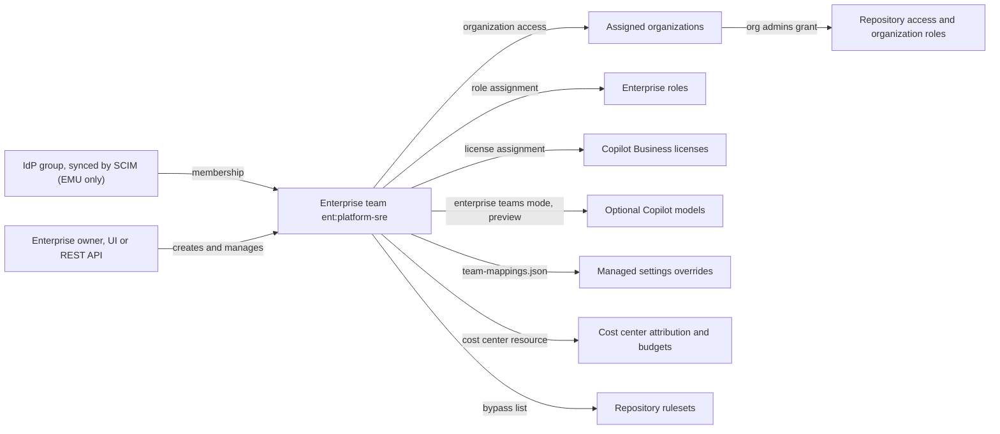

# Enterprise Teams

This document explains how enterprise administrators use enterprise teams to manage people across every organization in a GitHub Enterprise Cloud enterprise: membership and identity provider sync, organization access, enterprise roles, Copilot licenses and model access, cost centers, rulesets, automation and audit.

> **Last Updated:** October 2, 2026

---

## Table of Contents

1. [Overview](#overview)
2. [Enterprise Teams vs Organization Teams](#enterprise-teams-vs-organization-teams)
3. [Creating Enterprise Teams](#creating-enterprise-teams)
4. [Membership and Identity Provider Sync](#membership-and-identity-provider-sync)
5. [Assigning Teams to Organizations](#assigning-teams-to-organizations)
6. [Enterprise Roles](#enterprise-roles)
7. [Copilot Licenses and Model Access](#copilot-licenses-and-model-access)
8. [Team Specialization in Enterprise Managed Settings](#team-specialization-in-enterprise-managed-settings)
9. [Cost Centers](#cost-centers)
10. [Rulesets, Reviews and Mentions](#rulesets-reviews-and-mentions)
11. [Automating with the REST API](#automating-with-the-rest-api)
12. [Audit Log Events](#audit-log-events)
13. [Limits and Unsupported Features](#limits-and-unsupported-features)
14. [Design Guidance](#design-guidance)
15. [Troubleshooting](#troubleshooting)
16. [Related Documentation](#related-documentation)
17. [References](#references)

---

## Overview

An enterprise team is a group of users defined once at the enterprise account and then assigned to organizations, roles, licenses and policies across the enterprise. Before enterprise teams, an enterprise with 50 organizations that needed the same SRE group as pull request reviewers everywhere had to create and reconcile 50 organization teams.

Enterprise teams have been generally available on GitHub Enterprise Cloud since 2026-06-04, after a public preview that started in September 2025. GitHub Enterprise Server 3.22, generally available since 2026-09-08, made enterprise teams generally available on Server as well.

Since general availability, an enterprise team can:

- Receive **Copilot Business licenses** directly from the enterprise
- Be granted access to specific Copilot models (opt-in preview)
- Be assigned **predefined and custom enterprise roles**
- Be **added to organizations**, where organization administrators can grant it more access
- Be a **bypass actor** on repository rulesets
- Be @mentioned, assigned or requested for review in issues and pull requests in every organization it is assigned to
- Be a **cost center resource**, so its members' usage is attributed to that cost center (since 2026-06-25)
- Receive its own values for overridable Copilot enterprise managed settings (since 2026-08-03)

Every create, delete, rename, membership change, Copilot license assignment and role assignment is written to the enterprise audit log.



## Enterprise Teams vs Organization Teams

| Capability | Enterprise team | Organization team |
|------------|-----------------|-------------------|
| **Scope** | Enterprise account and every organization it is assigned to | One organization |
| **Who manages it** | Enterprise owners | Organization owners and team maintainers |
| **Members** | Organization members, unaffiliated users and outside collaborators | Members of that organization |
| **IdP sync** | Enterprise Managed Users only, from an IdP group through SCIM | EMU IdP groups, or team synchronization for personal accounts (Entra ID or Okta) |
| **Repository access** | Granted by organization administrators in each assigned organization | Granted in the organization |
| **Nested teams** | Not supported | Supported |
| **Secret visibility** | Not supported | Supported |
| **Team maintainers** | Not supported | Supported |
| **CODEOWNERS** | Not supported | Supported |
| **Project boards** | Can't be added | Can be added |
| **Slug** | `ent:` prefix, for example `ent:platform-sre` | Name-based, for example `platform-sre` |

GitHub's guidance is to use enterprise teams for anything that applies to the enterprise account or to more than one organization, and organization teams when the need is scoped to a single organization and an organization administrator should manage it. Keep organization teams where you need a capability enterprise teams don't support, such as CODEOWNERS or nested teams. See [05-teams-permissions.md](05-teams-permissions.md) for organization teams.

## Creating Enterprise Teams

Enterprise owners create and manage enterprise teams. The REST API also requires the caller to be an enterprise owner to create, edit or delete a team.

1. Navigate to your enterprise and click **People**.
2. In the left sidebar, click **Enterprise teams**.
3. Click **Create Enterprise team**.
4. Enter a name and description, and choose the team's organization access (see [Assigning Teams to Organizations](#assigning-teams-to-organizations)).
5. Click **Create Enterprise team**.

GitHub generates the slug from the name and adds the `ent:` prefix, so a team named `Platform SRE` has the slug `ent:platform-sre`. Through the REST API you can also set the team's notification setting: `notifications_enabled` (the default) notifies members when the team is @mentioned, and `notifications_disabled` notifies no one.

Deleting an enterprise team also deletes its IdP group mapping.

## Membership and Identity Provider Sync

There are three ways to add users to an enterprise team:

- **Manually:** open the team, click **Add members**, select users and click **Add**.
- **From an IdP group:** Enterprise Managed Users only, described below.
- **With the REST API:** the enterprise team membership endpoints, including bulk add and remove (see [Automating with the REST API](#automating-with-the-rest-api)).

Removing a user from an enterprise team removes the privileges the team granted. It doesn't remove the user from the enterprise.

### Syncing with an IdP group (EMU)

With Enterprise Managed Users, an enterprise team can take its membership from a group in your identity provider. Changes to the group, such as adding or removing a user, flow to the team through SCIM, and from the team to everything the team grants: organization membership, roles, Copilot licenses and cost center attribution.

1. Open the team and remove any manually added members. A team connected to an IdP group can't also have manual members.
2. Next to the team name, click **Edit**.
3. Under "Manage members", click **Identity provider group**.
4. Click **Select group**, choose the IdP group, then click **Update team**.

Before you connect a group:

- The group must be assigned to the GitHub Enterprise Managed User application in your IdP.
- With Microsoft Entra ID, you can only connect **security groups**. Nested group membership and Microsoft 365 groups are not supported.
- After the connection, membership changes are made in the IdP, not on GitHub.

GitHub stores group data at the enterprise level and runs a reconciliation job daily, whenever a Group SCIM API call changes membership, and whenever a team is linked to or unlinked from a group. Each Group SCIM API call writes an `external_group.scim_api_success` or `external_group.scim_api_failure` event to the enterprise audit log.

> **Important:** If an IdP group grows past 5,000 users, the team limit, the team stops syncing and keeps its last membership. Syncing resumes when the group is back at or under 5,000 users.

Enterprises with personal accounts can't sync enterprise teams with an IdP. They can keep using team synchronization for organization teams; see [05-teams-permissions.md](05-teams-permissions.md#team-synchronization-with-identity-provider).

## Assigning Teams to Organizations

The REST API's `organization_selection_type` field shows the three states a team's organization access can have:

| Value | Effect |
|-------|--------|
| `disabled` (default) | The team isn't assigned to any organization |
| `selected` | The team is assigned to the organizations you choose |
| `all` | The team is assigned to all current and future organizations in the enterprise |

When a team is assigned to an organization:

- Team members are added to the organization directly, **without an invitation**, and get the same access as other members, including the organization's base repository permissions.
- Outside collaborators and unaffiliated users in the team become standard enterprise members. They gain access to the enterprise's internal repositories and **consume a GitHub Enterprise license**.
- Organization administrators can give the team more repository access and organization roles. They **cannot** remove permissions granted by enterprise administrators, and the organization teams REST API returns `422` if you try to modify an enterprise team at the organization level.

A team can be assigned to at most 1,000 organizations.

> **Admin impact:** Assigning a large team to all organizations is a licensing decision as well as an access decision. Check the team for outside collaborators and unaffiliated users before you widen its organization access.

## Enterprise Roles

Enterprise owners can assign roles to enterprise teams under **People** → **Enterprise roles** → **Role assignments** → **Assign role**. Assigning a role to an IdP-synced team means your IdP decides who holds the role.

| Role | Can be assigned to an enterprise team? |
|------|----------------------------------------|
| App manager | Yes (public preview) |
| Security manager | Yes, and **only** to a team (public preview) |
| Custom enterprise roles | Yes (public preview) |
| Enterprise owner, billing manager, guest collaborator | No; assign these to individual users |

Enterprise owners can't assign organization roles from the enterprise settings. An organization administrator assigns organization roles to the team inside each organization.

`enterprise_role.assign` and `enterprise_role.revoke` audit events record role assignments to users and enterprise teams.

## Copilot Licenses and Model Access

### Licenses

Enterprise owners can assign **Copilot Business** licenses directly to enterprise teams. This direct assignment isn't available for Copilot Enterprise licenses, which are still granted by enabling Copilot Enterprise for organizations.

1. Set the **Policies for enterprise-assigned users** policy first. It decides how policies left to organizations apply to users who receive Copilot directly from the enterprise.
2. Go to **Billing and licensing** → **Licensing**, and next to "Copilot" click **Manage**.
3. Click the **Enterprise Teams** tab, then **Assign licenses**.
4. Search for the team and click **Add licenses**.

Users receive or lose Copilot when they join or leave the team. With an IdP-synced team, licensing follows your IdP groups. The `enterprise_team.copilot_assignment` and `enterprise_team.copilot_unassignment` events record these assignments. For Copilot billing and budgets, see [19-licenses-billing.md](19-licenses-billing.md#github-ai-credits).

### Model access (opt-in preview)

Since 2026-07-31, in public preview, Copilot Business and Copilot Enterprise enterprises can manage model access through enterprise teams instead of organizations. GitHub rolled the opt-in out gradually, with most enterprises getting it on 2026-08-03.

1. Set a baseline in **AI controls** → **Copilot** → **Configure models**: **Enabled** or **Disabled** for everyone. Models labeled **Delegate to Default Policy** follow the enterprise's default availability policy.
2. For models only some people should get, select **Delegate to Enterprise Teams/Apps**.
3. On each team's **Default models** tab, set those models to **Enabled**. You can prepare these assignments before you opt in; they take effect when you switch.
4. Turn on the **Enterprise teams mode** toggle on the enterprise's Copilot page.

How it evaluates:

- Team model access is **additive** to the enterprise baseline. A model disabled for the enterprise can't be enabled for a team, and a model enabled for the enterprise is enabled for every team.
- Access is **least restrictive**: a user gets every model enabled by any of their enterprise teams.
- In enterprise teams mode, **organization-level model settings no longer apply**. Models that were delegated to organizations are unavailable until you enable them for teams, so prepare team assignments first.
- During the preview you can roll back. Rolling back restores the policy state from before you opted in and drops enterprise-level model changes made after the switch.

## Team Specialization in Enterprise Managed Settings

Since 2026-08-03, server-managed Copilot enterprise managed settings can give enterprise teams their own values for keys the enterprise marks overridable. The enterprise file `copilot/managed-settings.json` in the `.github-private` repository wraps those keys as `{ "overridable": VALUE }`, `copilot/team-mappings.json` maps team settings files to enterprise team slugs, and the team files live in `copilot/teams/`. Keys that aren't overridable stay enterprise decisions. A user in several mapped teams gets the least restrictive value for each key. Overridable keys include the MCP server allowlist and denylist (`allowedMcpServers`, `deniedMcpServers`; generally available since 2026-08-06) and the agent permission rules (`permissions.deny`, `permissions.ask`, `permissions.allow`; generally available since 2026-09-09), so a platform team can get a wider MCP allowlist or different approval rules than the rest of the enterprise.

For the supported keys, an example and rollout guidance, see [Enterprise Team Specialization](29-enterprise-managed-settings.md#enterprise-team-specialization) in [29-enterprise-managed-settings.md](29-enterprise-managed-settings.md).

## Cost Centers

Since 2026-06-25, enterprise owners can add enterprise teams to cost centers, in **Billing and licensing** → **Cost centers** → **New cost center** (or edit a cost center) → **Resources**, or through the cost centers REST API (`enterprise_teams` in the add-resources request).

- All usage incurred by team members is attributed to the cost center. Attribution follows membership changes, including IdP changes synced through SCIM, with no reassignment.
- A resource, including an enterprise team, belongs to one cost center at a time. Adding it to another cost center moves it.
- If a user is also assigned to a cost center directly, the direct assignment wins. If a user is in several enterprise teams assigned to different cost centers, the team **created first** decides.
- Budgets attach to the cost center, not the team. Adding a team is how you keep membership current; a budget on the cost center then applies to every member, including a cost center user-level budget (REST API since 2026-06-30, billing UI since 2026-07-07) that caps each member's GitHub AI Credits, whether the member was added directly or through an enterprise team.
- A cost center that contains only users and enterprise teams can also turn on an AI credit pool (since 2026-07-02), which caps its share of the enterprise's included AI Credits at what its own Copilot licenses fund. The 2026-07-02 post asks for at least one user or enterprise team; the REST reference allows the pool only when the cost center contains nothing but users and enterprise teams.
- An enterprise can create up to 1,000 cost centers (since 2026-06-26).

See [19-licenses-billing.md](19-licenses-billing.md#cost-centers) for cost center budgets, AI credit pools and allocation rules.

## Rulesets, Reviews and Mentions

- **Ruleset bypass:** enterprise teams can be added to a repository ruleset's bypass list, for example to grant break-glass bypass to a platform team once instead of per organization. The rulesets documentation lists "enterprise teams, enterprise apps, and enterprise roles" as bypass actors, marked public preview, while the 2026-06-04 post includes ruleset bypass in the generally available release. Bypass events are written to the enterprise audit log.
- **Pull request reviews:** request an enterprise team as a reviewer in any organization the team is assigned to.
- **Mentions:** in an organization the team is assigned to, mention it as `@ORGANIZATION/ent:TEAM-SLUG`, for example `@octo-org/ent:platform-sre`. Members are notified as with organization teams, unless the team's notification setting is disabled.
- **CODEOWNERS:** enterprise teams can't be code owners. Keep an organization team in CODEOWNERS files and use the enterprise team for review requests and bypass.

## Automating with the REST API

| Endpoint | Method | Purpose |
|----------|--------|---------|
| `/enterprises/{enterprise}/teams` | GET, POST | List or create enterprise teams |
| `/enterprises/{enterprise}/teams/{team_slug}` | GET, PATCH, DELETE | Get, update or delete a team |
| `/enterprises/{enterprise}/teams/{enterprise-team}/memberships` | GET | List members |
| `/enterprises/{enterprise}/teams/{enterprise-team}/memberships/add` | POST | Bulk add members (`usernames`) |
| `/enterprises/{enterprise}/teams/{enterprise-team}/memberships/remove` | POST | Bulk remove members (`usernames`) |
| `/enterprises/{enterprise}/teams/{enterprise-team}/memberships/{username}` | GET, PUT, DELETE | Get, add or remove one member |
| `/enterprises/{enterprise}/teams/{enterprise-team}/organizations` | GET | List organization assignments |
| `/enterprises/{enterprise}/teams/{enterprise-team}/organizations/add` | POST | Assign to organizations (`organization_slugs`) |
| `/enterprises/{enterprise}/teams/{enterprise-team}/organizations/remove` | POST | Remove organization assignments (`organization_slugs`) |
| `/enterprises/{enterprise}/members/{username}/teams` | GET | List a user's enterprise teams |
| `/orgs/{org}/teams?team_type=enterprise` | GET | List the enterprise teams assigned to an organization |

**Authentication.** The REST reference accepts personal access tokens (classic) with `read:enterprise` for `GET` requests and `admin:enterprise` for the others. The GitHub App permissions reference lists an **Enterprise teams** enterprise permission for these endpoints, with user and installation access tokens, which matches the 2026-06-04 post's "manage enterprise teams programmatically with GitHub Apps". The enterprise teams REST page still says the endpoints aren't compatible with GitHub App or fine-grained tokens, and the fine-grained token permissions reference lists no enterprise teams permission, so test an app or fine-grained token before you depend on it.

```bash
# Create an enterprise team that will be assigned to selected organizations
gh api \
  --method POST \
  -H "Accept: application/vnd.github+json" \
  -H "X-GitHub-Api-Version: 2026-03-10" \
  /enterprises/{enterprise}/teams \
  -f name='Platform SRE' \
  -f description='On-call SREs who review infrastructure changes in every product organization' \
  -f organization_selection_type='selected'

# Add members in bulk (EMU teams synced from an IdP group are managed in the IdP instead)
gh api \
  --method POST \
  -H "Accept: application/vnd.github+json" \
  -H "X-GitHub-Api-Version: 2026-03-10" \
  /enterprises/{enterprise}/teams/ent:platform-sre/memberships/add \
  -f 'usernames[]=monalisa' \
  -f 'usernames[]=octocat'

# Assign the team to two organizations
gh api \
  --method POST \
  -H "Accept: application/vnd.github+json" \
  -H "X-GitHub-Api-Version: 2026-03-10" \
  /enterprises/{enterprise}/teams/ent:platform-sre/organizations/add \
  -f 'organization_slugs[]=octo-payments' \
  -f 'organization_slugs[]=octo-web'

# From the organization side: list only the enterprise teams assigned to it
gh api \
  -H "Accept: application/vnd.github+json" \
  -H "X-GitHub-Api-Version: 2026-03-10" \
  "/orgs/octo-web/teams?team_type=enterprise" \
  --jq '.[] | {name, slug}'
```

## Audit Log Events

| Event | Recorded when |
|-------|---------------|
| `enterprise_team.create` | An enterprise team is created |
| `enterprise_team.destroy` | An enterprise team is deleted |
| `enterprise_team.rename` | An enterprise team is renamed |
| `enterprise_team.add_member` | A member is added to the team or to its linked IdP group, or an IdP group is linked to the team |
| `enterprise_team.remove_member` | A member is removed from the team or its linked IdP group, or an IdP group is unlinked |
| `enterprise_team.copilot_assignment` | A Copilot license is assigned to the team |
| `enterprise_team.copilot_unassignment` | A Copilot license is unassigned from the team |
| `enterprise_role.assign`, `enterprise_role.revoke` | An enterprise role is assigned to or removed from a user or enterprise team |
| `business.enterprise_teams_limit_warning` | The enterprise is approaching its enterprise teams limit |
| `business.enterprise_teams_limit_reached` | The enterprise has reached its enterprise teams limit |

Enterprise team events carry the `enterprise_team` and `enterprise_team_id` fields, and the create and membership events also include `oauth_application_id`. To review all team activity, filter the enterprise audit log with `action:enterprise_team`. See [22-audit-log-deep-dive.md](22-audit-log-deep-dive.md) for searching and streaming.

## Limits and Unsupported Features

| Limit | Value |
|-------|-------|
| Enterprise teams per enterprise | 2,500 |
| Users per enterprise team | 5,000 |
| Organizations per enterprise team | 1,000 |

GitHub validates the team limits across the enterprise's organizations.

As documented on 2026-10-02, enterprise teams don't support:

- Adding the team to a project board
- Team synchronization for enterprises with personal accounts
- CODEOWNERS status
- Secret teams
- Nested teams
- Team maintainers

## Design Guidance

| Use case | Enterprise team pattern |
|----------|-------------------------|
| Same reviewers across many organizations | One `ent:` team requested as reviewer in every assigned organization |
| Break-glass access | A small, IdP-synced platform team on ruleset bypass lists |
| Copilot rollout cohorts | IdP-synced teams that receive Copilot Business licenses directly |
| Model access tiers (preview) | Teams that receive Optional models, for example after training |
| Chargeback | Teams added to cost centers so attribution follows the org chart |
| Delegated administration | Teams that hold app manager, security manager or custom enterprise roles |
| Code ownership, nested hierarchies | Stay on organization teams |

- **Drive membership from the IdP where you can.** With EMU, an IdP-synced team turns joiner, mover and leaver events into access, licensing and cost center changes without manual steps.
- **Keep privileged teams small.** Model access and managed settings combine to the least restrictive value across a user's teams, so one permissive team widens access for everyone in it.
- **Name teams for their purpose.** The name becomes the `ent:` slug that users type in mentions and that `team-mappings.json` references.
- **Plan organization access with licensing in mind.** Organization access adds members without an invitation and can turn outside collaborators into licensed enterprise members.
- **Retire duplicate organization teams gradually.** Move reviewer routing and bypass lists to the enterprise team first, then remove the duplicated organization teams that no longer hold CODEOWNERS or nested-team roles.

## Troubleshooting

| Symptom | Likely cause | What to do |
|---------|--------------|------------|
| You can't connect an IdP group to the team | The enterprise uses personal accounts, or the team still has manually added members | IdP sync for enterprise teams needs EMU; remove manual members first |
| An Entra ID group can't be connected | It is a Microsoft 365 group, or it isn't assigned to the EMU application | Use a security group assigned to the GitHub EMU application |
| Team membership stopped changing | The IdP group has more than 5,000 users | Reduce the group to 5,000 users or fewer; syncing resumes |
| An organization admin can't remove a team permission | The permission was granted by an enterprise administrator | Change it at the enterprise level |
| License count rose after assigning a team | Outside collaborators or unaffiliated users in the team became enterprise members | Review team membership before widening organization access |
| A user lost Copilot | They left the team that holds the license assignment | Check `enterprise_team.remove_member` events and the IdP group |
| A team can't be added to CODEOWNERS | Enterprise teams don't support CODEOWNERS | Use an organization team for code ownership |

## Related Documentation

- [Teams and Permissions](05-teams-permissions.md) - Organization teams, nesting and team synchronization
- [Organization Design Patterns and Strategies](02-organization-strategies.md) - Multi-organization patterns that enterprise teams span
- [Enterprise Managed Users](04-enterprise-managed-users.md) - SCIM provisioning and IdP group management
- [Licenses and Billing](19-licenses-billing.md) - Copilot licensing, budgets and cost centers
- [Enterprise Managed Settings](29-enterprise-managed-settings.md) - Team specialization of Copilot managed settings
- [Lab 16: Enterprise Teams](../labs/lab16.md) - Hands-on exercise for this document

## References

### Official GitHub Documentation

- [Teams in an enterprise](https://docs.github.com/en/enterprise-cloud@latest/admin/concepts/enterprise-fundamentals/teams-in-an-enterprise)
- [Creating enterprise teams](https://docs.github.com/en/enterprise-cloud@latest/admin/managing-accounts-and-repositories/managing-users-in-your-enterprise/create-enterprise-teams)
- [Managing team memberships with identity provider groups](https://docs.github.com/en/enterprise-cloud@latest/admin/managing-iam/provisioning-user-accounts-with-scim/managing-team-memberships-with-identity-provider-groups)
- [Assigning roles to people in an enterprise](https://docs.github.com/en/enterprise-cloud@latest/admin/managing-accounts-and-repositories/managing-roles-in-your-enterprise/assign-roles)
- [Granting users access to GitHub Copilot in your enterprise](https://docs.github.com/en/enterprise-cloud@latest/copilot/how-tos/administer-copilot/manage-for-enterprise/manage-access/grant-access)
- [Managing availability of models in your enterprise](https://docs.github.com/en/enterprise-cloud@latest/copilot/how-tos/administer-copilot/manage-for-enterprise/manage-availability-of-default-models)
- [Using cost centers to allocate costs to business units](https://docs.github.com/en/enterprise-cloud@latest/billing/how-tos/products/use-cost-centers)
- [Cost center allocation for different products](https://docs.github.com/en/enterprise-cloud@latest/billing/reference/cost-center-allocation)
- [Creating rulesets for a repository](https://docs.github.com/en/enterprise-cloud@latest/repositories/configuring-branches-and-merges-in-your-repository/managing-rulesets/creating-rulesets-for-a-repository)
- [REST API endpoints for enterprise teams](https://docs.github.com/en/enterprise-cloud@latest/rest/enterprise-teams/enterprise-teams)
- [REST API endpoints for enterprise team memberships](https://docs.github.com/en/enterprise-cloud@latest/rest/enterprise-teams/enterprise-team-members)
- [REST API endpoints for enterprise team organizations](https://docs.github.com/en/enterprise-cloud@latest/rest/enterprise-teams/enterprise-team-organizations)
- [Permissions required for GitHub Apps](https://docs.github.com/en/enterprise-cloud@latest/rest/authentication/permissions-required-for-github-apps)
- [Audit log events for your enterprise](https://docs.github.com/en/enterprise-cloud@latest/admin/monitoring-activity-in-your-enterprise/reviewing-audit-logs-for-your-enterprise/audit-log-events-for-your-enterprise)

### GitHub Changelog

- [Enterprise Teams is now generally available](https://github.blog/changelog/2026-06-04-enterprise-teams-is-now-generally-available) (2026-06-04)
- [Cost centers now support enterprise teams](https://github.blog/changelog/2026-06-25-assign-enterprise-teams-to-cost-centers) (2026-06-25)
- [Enterprise teams model policy targeting in public preview](https://github.blog/changelog/2026-07-31-enterprise-teams-model-policy-targeting-in-public-preview) (2026-07-31)
- [Enterprise team specialization for managed settings](https://github.blog/changelog/2026-08-03-enterprise-team-specialization-for-managed-settings) (2026-08-03)
- [GitHub Enterprise Server 3.22 is now generally available](https://github.blog/changelog/2026-09-08-github-enterprise-server-3-22-is-now-generally-available) (2026-09-08)
