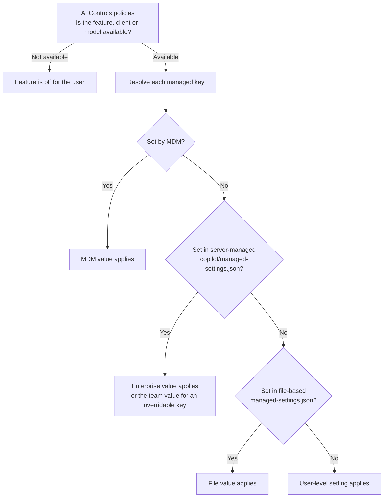
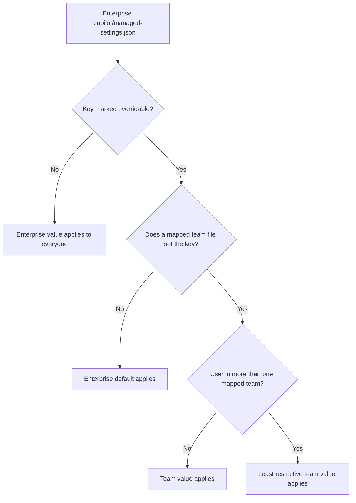

# Enterprise Managed Settings for GitHub Copilot

This document explains how enterprise owners use enterprise managed settings, a `managed-settings.json` file, to control how GitHub Copilot clients behave for everyone licensed through the enterprise: which plugins, marketplaces and MCP servers agents can use, whether users can bypass approval prompts, which operations need approval, the default model and where telemetry goes. It covers where the file lives, which clients enforce it, how it relates to AI Controls policies, how to give enterprise teams their own values, and how to roll changes out under change control.

> **Last Updated:** October 2, 2026

---

## Table of Contents

1. [Overview](#overview)
2. [Policies and Managed Settings](#policies-and-managed-settings)
3. [Where the File Lives](#where-the-file-lives)
4. [Who and Which Clients It Applies To](#who-and-which-clients-it-applies-to)
5. [Supported Keys](#supported-keys)
6. [Deployment Channels and Precedence](#deployment-channels-and-precedence)
7. [Enterprise Team Specialization](#enterprise-team-specialization)
8. [Rollout and Change Control](#rollout-and-change-control)
9. [Troubleshooting](#troubleshooting)
10. [Rollout Checklist](#rollout-checklist)
11. [Related Documentation](#related-documentation)
12. [References](#references)

---

## Overview

Enterprise managed settings have been generally available for GitHub Enterprise Cloud since 2026-07-01. The enterprise defines Copilot client configuration once, in `copilot/managed-settings.json`, and supported clients fetch and enforce it. For each supported key, the managed value takes precedence over the file-based settings users configure in their own clients.

| Item | Detail |
|---|---|
| File | `copilot/managed-settings.json` in the `.github-private` repository of the organization the enterprise selects as its configuration source |
| Applies to | Users with a Copilot Business or Copilot Enterprise license from the enterprise or one of its organizations, whether or not they can see the repository |
| Clients | Copilot CLI, VS Code, the GitHub Copilot app, Copilot cloud agent and JetBrains IDEs. Not every client supports every key |
| Refresh | Fetched when a user signs in and refreshed about every hour; restarting the client or signing in again refreshes it immediately |
| Team values | Keys marked `overridable` can take different values for enterprise teams (server-managed deployments only) |
| Validation | An in-product validator on the **Agents** tab of the AI Controls page (since 2026-09-25) |

How the capability grew:

| Date | Change | Status in the post |
|---|---|---|
| 2026-05-06 | Enterprise-managed plugins for Copilot CLI: plugin marketplaces and auto-installed plugins | Public preview |
| 2026-06-05 | The same plugin standards in VS Code 1.122 | Public preview |
| 2026-06-17 | First governance key: block bypass ("yolo") mode | Not stated |
| 2026-06-25 | `strictKnownMarketplaces` | Public preview |
| 2026-07-01 | `managed-settings.json` generally available; `model: "auto"` as the default | GA |
| 2026-07-08 | MDM and file-based delivery (GA); managed OpenTelemetry export (`telemetry`) | GA (delivery channels) |
| 2026-07-27 | The GitHub Copilot app and Copilot cloud agent enforce managed settings | Not stated |
| 2026-07-30 | `remoteControl` | Not stated |
| 2026-08-03 | Enterprise team specialization (`overridable`, `team-mappings.json`) | Not stated |
| 2026-08-06 | `allowedMcpServers` and `deniedMcpServers` | GA |
| 2026-08-11, 2026-08-18 | JetBrains IDEs enforce the plugin, MCP, telemetry and bypass keys | Not stated |
| 2026-08-26 | `autoUpdate` on marketplace entries | GA |
| 2026-09-02 | `model` accepts any model, with per-team defaults | GA |
| 2026-09-09 | `permissions.deny`, `permissions.ask` and `permissions.allow` | GA |
| 2026-09-22 | OpenTelemetry export from the GitHub Copilot app | Not stated |
| 2026-09-25 | In-product validator | Not stated |
| 2026-10-01 | Computer use, which managed settings can disable | Public preview |

The 2026-07-01 GA post lists `extraKnownMarketplaces`, `enabledPlugins`, `strictKnownMarketplaces`, `disableBypassPermissionsMode` and `model` as the supported keys at GA.

> **Why it matters:** AI Controls policies decide whether users get a Copilot feature. Managed settings are where the enterprise decides what agents on developer machines may install, connect to and run without asking.

## Policies and Managed Settings

The two layers work together:

| Layer | Where it lives | What it decides | Examples |
|---|---|---|---|
| AI Controls policies | Enterprise **AI Controls** page and organization Copilot settings | Which Copilot features, clients, agents and models users can access | Copilot CLI policy, Copilot app policy, **MCP servers in Copilot**, **Store local sessions in the Cloud** |
| Enterprise managed settings | `copilot/managed-settings.json`, or MDM and file-based delivery on the device | How the supported clients behave | Allowed plugins, marketplaces and MCP servers; bypass mode; deny, ask and allow rules; default model; telemetry |

- The 2026-07-01 GA post describes the file as "in addition to the policies available in the AI Controls tab".
- Remote control shows the split. The **Store local sessions in the Cloud** policy must be set to **View and control** before remote control is available at all; the `remoteControl` key then restricts which devices' sessions can be remotely controlled.
- Since 2026-07-27, the GitHub Copilot app has its own policy, separate from the Copilot CLI policy. It is **Enabled everywhere** by default.
- From 2026-10-22, the **Default policy for new features** (Enabled by default) decides eligible generally available features left Unconfigured, including the **MCP servers in Copilot** policy. Where that makes MCP available, the MCP allow and deny lists in managed settings decide which servers can run in the supported clients.
- Policy changes are recorded in the enterprise audit log. Changes to managed settings are Git commits in the `.github-private` repository.

For the policies themselves, see [GitHub Copilot Governance](12-github-copilot-governance.md).

## Where the File Lives

### The configuration source

Managed settings are read from one place: the `.github-private` repository of the organization the enterprise selects as its configuration source. It is the same source that holds enterprise custom agents, so an enterprise that already set a custom agents source organization reuses that `.github-private` repository.

1. Choose an organization in the enterprise to own the repository.
2. Create a repository named `.github-private` in that organization, from scratch or from the [governance template repository](https://github.com/docs/custom-agents-template), which includes an empty `copilot/managed-settings.json`.
3. Choose the visibility. **Internal** lets every enterprise member read the settings and propose changes through pull requests; **Private** limits access to people you grant. GitHub recommends internal visibility. The settings apply to licensed users either way.
4. Select the source: enterprise → **AI Controls** → **Agents** tab → **Configuration source** → **Select organization**, then choose the organization. The **Configuration summary** on the same tab shows the settings read from the repository.

### Repository layout

```text
.github-private/
└── copilot/
    ├── managed-settings.json   # enterprise baseline
    ├── team-mappings.json      # optional: team settings file -> enterprise team slugs
    └── teams/
        └── TEAM-FILE.json      # optional: values for overridable keys
```

- Commit changes to the **default branch**; the configuration takes effect from there.
- The supported path is `copilot/managed-settings.json`. The pre-GA path used by the May and June 2026 preview posts, `.github/copilot/settings.json`, is still read for backward compatibility, as a fallback. Move to the supported path rather than maintaining both.
- The 2026-07-01 auto model post shows `.github-private/.github/copilot/managed-settings.json`. The GA post and the docs use `copilot/managed-settings.json`; follow them.

### Managing the source with the REST API

The source organization can also be managed with the REST API (API version `2026-03-10`). The caller must be an enterprise owner with read access to AI Controls for `GET`, or write access for `PUT` and `DELETE`. Classic tokens need the `admin:enterprise` scope; fine-grained tokens need the **Enterprise AI controls** enterprise permission.

| Endpoint | Purpose |
|---|---|
| `GET /enterprises/{enterprise}/copilot/custom-agents/source` | Shows the source organization and its `.github-private` repository |
| `PUT /enterprises/{enterprise}/copilot/custom-agents/source` | Sets the source (`organization_id`). By default it also creates an enterprise ruleset that protects agent definition files (`create_ruleset`, default `true`) |
| `DELETE /enterprises/{enterprise}/copilot/custom-agents/source` | Removes the source reference, which disables custom agents and Copilot CLI client settings for the enterprise. The repository is not deleted |

The ruleset that the `PUT` endpoint creates covers agent definition files, not the `copilot/` folder. Protect the settings files yourself (see [Rollout and Change Control](#rollout-and-change-control)).

### Enterprises without organizations

An enterprise that exists only to assign Copilot Business licenses has no organization to host `.github-private`. Either give one user a GitHub Enterprise license so they can create an organization and the repository, or deliver the same settings through MDM or file-based deployment, which need neither.

## Who and Which Clients It Applies To

- **Server-managed settings** apply to users who receive a Copilot Business or Copilot Enterprise license from the enterprise or any of its organizations, whether or not they can access the `.github-private` repository or its organization.
- A user licensed by more than one billing entity receives your settings only after selecting your enterprise under **Usage billed to** on their personal Copilot settings page (`https://github.com/settings/copilot/features`).
- **MDM and file-based settings** apply to everyone who uses Copilot on the device, wherever their license comes from.

| Client | Enforces managed settings since | Notes |
|---|---|---|
| Copilot CLI | 2026-05-06 (plugin preview); GA 2026-07-01 | See the fail-open note below |
| VS Code | 2026-06-05 (VS Code 1.122); GA 2026-07-01 | The `model` key needs VS Code 1.126 or later |
| GitHub Copilot app | 2026-07-27 | Picks up settings at the next sign-in or restart |
| Copilot cloud agent | 2026-07-27 | Reads the `model`, plugin and marketplace keys on the next task assignment; bypass controls don't apply |
| JetBrains IDEs | 2026-08-11 and 2026-08-18 posts | Plugin, MCP, telemetry and bypass keys |

The server-managed configuration is fetched each time a user authenticates, held in memory and refreshed hourly. Users see changes within about an hour; restarting the client or signing in again applies them immediately. Users must run a supported client version for the settings to apply.

> **⚠️ Fail-open risk in Copilot CLI:** if Copilot CLI can't fetch the server-managed settings and has no cached response, the server-managed policy is unavailable for that session. Deliver restrictions that must hold without a server response through MDM or file-based deployment.

## Supported Keys

The [enterprise managed settings reference](https://docs.github.com/en/enterprise-cloud@latest/copilot/reference/enterprise-administrators/enterprise-managed-settings) lists these keys and clients (read 2026-10-02). Client coverage changes often; check the reference before you rely on a key for a given client.

| Key | Controls | CLI | VS Code | Copilot app | Cloud agent | JetBrains |
|---|---|---|---|---|---|---|
| `permissions.disableBypassPermissionsMode` | Blocks bypass ("yolo", allow-all) mode | ✅ | ✅ | ✅ | ❌ | ✅ |
| `permissions.deny`, `.ask`, `.allow` | Blocks, gates or allows specific shell, file and network operations | ✅ | ✅ | ✅ | ❌ | ❌ |
| `enabledPlugins` | Plugins installed (`true`) or blocked (`false`) for everyone | ✅ | ✅ | ✅ | ✅ | ✅ |
| `extraKnownMarketplaces` | Plugin marketplaces users can install from, with optional `autoUpdate` | ✅ | ✅ | ✅ | ✅ | ✅ |
| `strictKnownMarketplaces` | Restricts plugin installs to the listed marketplaces | ✅ | ✅ | ✅ | ✅ | ✅ |
| `allowedMcpServers`, `deniedMcpServers` | MCP server allowlist and denylist | ✅ | ✅ | ✅ | ❌ | ✅ |
| `model` | Default model for new conversations | ✅ | ✅ | ✅ | ✅ | ❌ |
| `autoTier` | Default Auto routing tier for new conversations | ✅ | ✅ | ❌ | ❌ | ❌ |
| `telemetry` | OpenTelemetry export to your collector | ✅ | ✅ | ❌ | ❌ | ✅ |
| `remoteControl` | Whether sessions hosted on a device can be remotely controlled | ✅ | ✅ | ✅ | ❌ | ❌ |
| `features.computerUse` | Whether users can turn on computer use | ✅ | ❌ | ✅ | ❌ | ❌ |
| `sandbox` | Minimum local sandbox restrictions | ✅ | ❌ | ✅ | ❌ | ❌ |

### Agent permissions

Setting `permissions.disableBypassPermissionsMode` to `"disable"` stops users from turning on bypass mode, which lets an agent run commands, access files and fetch URLs without asking:

- **Copilot CLI:** `--yolo`, `--allow-all`, `--allow-all-tools`, `--allow-all-paths` and `--allow-all-urls` can't grant elevated permissions, and the `/yolo` and `/allow-all` commands are blocked.
- **VS Code:** the global auto-approve setting, `chat.tools.global.autoApprove`, is turned off and can't be turned back on.
- **GitHub Copilot app:** the **Allow all** option for **Tool Permissions** is blocked.
- **JetBrains IDEs:** the agent can't use **Bypass Approvals** or **Autopilot** (2026-08-18 post).
- **Copilot cloud agent:** not applicable. The 2026-07-27 post says bypass-prompt controls apply only to the interactive clients.

The reference nests this key under `permissions`; the June and July 2026 posts show `disableBypassPermissionsMode` at the top level. Use the nested form.

Since 2026-09-09 (GA), `permissions.deny`, `permissions.ask` and `permissions.allow` set rules for shell commands, file reads and edits, and network domains:

- Precedence is deny, then ask, then allow. A deny rule from any managed source blocks the operation for everyone.
- A managed `ask` rule needs a fresh approval every time. Bypass mode, auto-approval, hooks and approvals saved earlier can't satisfy it.
- The effective `allow` list is the intersection of every source that declares one, not the union.
- When any managed source defines a permission rule, an operation that matches no rule needs approval.
- Selectors are `Shell(...)`, `Read(...)`, `Edit(...)` and `Domain(...)`.
- In VS Code, these rules apply only to sessions that use Agent Host. The bypass key has broader VS Code support.

```json
{
  "permissions": {
    "disableBypassPermissionsMode": "disable",
    "deny": ["Shell(rm -rf *)", "Read(~/.ssh/**)", "Domain(*.unapproved.example)"],
    "ask": ["Shell(git push *)"],
    "allow": ["Shell(npm test *)", "Domain(registry.npmjs.org)"]
  }
}
```

### Plugins and marketplaces

- **`enabledPlugins`** maps `PLUGIN-NAME@MARKETPLACE-NAME` to `true` (install for everyone) or `false` (block).
- **`extraKnownMarketplaces`** adds named marketplaces. Source types are `github` (`repo` in `OWNER/REPO` form), `git` (`url`) and `directory` (`path`). Since 2026-08-26 (GA), `autoUpdate: true` makes clients refresh that marketplace and update the plugins installed from it. Users can't override an `autoUpdate` value you set.
- **`strictKnownMarketplaces`** allows plugin installs only from the listed marketplaces. An empty array, `[]`, locks installation down completely. Marketplaces with `autoUpdate` must still pass this list.
- **Agent Plugins 1.0** (GA 2026-08-12, all Copilot plans) is governed by the same keys; the post says "No separate Agent Plugins policy is required." The Awesome Copilot marketplace is available by default in VS Code, Copilot CLI and the Copilot app, so set `strictKnownMarketplaces` if you need to control where plugins come from.
- Plugins can carry MCP server configurations. Pair the plugin keys with the MCP allow and deny lists.
- Users need access to where plugin files are hosted. A plugin in a private repository needs repository access, which may require a license.

```json
{
  "enabledPlugins": {
    "security-review@platform-plugins": true
  },
  "extraKnownMarketplaces": {
    "platform-plugins": {
      "source": { "source": "github", "repo": "OCTO-ORG/copilot-plugins" },
      "autoUpdate": true
    }
  },
  "strictKnownMarketplaces": [
    { "source": "github", "repo": "OCTO-ORG/copilot-plugins" }
  ]
}
```

### MCP servers

- **`allowedMcpServers`** (GA 2026-08-06): only matching servers can run. Omit the key to allow all servers (subject to the denylist); an empty array blocks every server except the built-in default servers. Across sources, the effective allowlist is the intersection.
- **`deniedMcpServers`**: matching servers are always blocked, even when they are also allowed. Across sources, the denylist is the union. First-party Copilot servers, such as the built-in GitHub MCP server, can't be blocked.
- Each entry has exactly one matcher: `serverUrl` for remote servers (supports `*` wildcards; URLs are canonicalized before matching), `serverCommand` for local stdio servers (exact command and arguments), or `serverName`, which matches the user's own label and is a convenience, not a security control.
- The 2026-08-06 post says these lists fail closed: a malformed or unverifiable configuration is blocked rather than allowed.
- The 2026-06-17 agent finder post says enterprises use managed settings to define which resources agents can discover. The reference documents no separate key for agent finder.

```json
{
  "allowedMcpServers": [
    { "serverUrl": "https://api.githubcopilot.com/*" },
    { "serverCommand": ["npx", "@playwright/mcp@latest"] }
  ],
  "deniedMcpServers": [
    { "serverCommand": ["npx", "-y", "@modelcontextprotocol/server-filesystem", "/"] }
  ]
}
```

### Default model

- Since 2026-07-01, `"model": "auto"` makes auto model selection the default for new conversations. Since 2026-09-02 (GA), `model` can name a specific model and version instead. Users can still pick another model per conversation, and the AI Controls model policies still decide which models are available.
- `model` was first documented as `permissions.model`. Clients still read the nested value when the top-level key is absent; use the top-level key.
- The reference also documents `autoTier`, the default Auto routing tier (`efficiency`, `balance`, `intelligence` or `unmanaged`). It needs Copilot CLI 1.0.87-0 or VS Code 1.140.0 or later. No changelog post from April to October 2026 announced it.

### Telemetry

- Since 2026-07-08, `telemetry` routes Copilot OpenTelemetry data to your collector: `enabled`, `endpoint`, `protocol` (`http/json` or `http/protobuf`), `serviceName`, `resourceAttributes`, `headers` (for example a collector `Authorization` header), `captureContent` and `lockCaptureContent`.
- Prompts, responses and tool arguments are excluded unless you set `captureContent: true`; treat that as a privacy decision. `lockCaptureContent: true` stops users changing it. Users can't override managed telemetry values.
- The reference table lists Copilot CLI, VS Code and JetBrains IDEs. The 2026-09-22 post adds the GitHub Copilot app, which the reference table (read 2026-10-02) does not list; confirm in the reference before you rely on it for the app.
- The 2026-07-08 post names the protocols `otlp-http` and `otlp-grpc`. Use the reference values.

### Remote control

- Since 2026-07-30, `remoteControl` decides whether sessions hosted on a device can be remotely controlled. Set `mode` to `"disabled"`, to `"requireSSO"` (only clients that are SSO-authorized for the organizations in `githubDotComOrganizations`, which is then required) or to `"enabled"`. It doesn't affect the same user controlling sessions hosted on other devices.
- It applies on top of the **Store local sessions in the Cloud** policy, which must be **View and control** for remote control to be available.

### Computer use and local sandboxing

- **`features.computerUse`** set to `false` stops users turning on computer use, which has been in public preview in Copilot CLI and the GitHub Copilot app on macOS and Windows since 2026-10-01 and is off by default. A local setting can't override it.
- **`sandbox`** enforces minimum local sandbox restrictions in Copilot CLI and the Copilot app, such as `enabled: true`, `failIfUnavailable: true` and `allowBypass: false`, plus filesystem, network and credential limits. Managed sandbox settings impose restrictions, not defaults. With `enabled` and `failIfUnavailable` both `true`, Copilot blocks model and tool execution when it can't enforce the sandbox. Local sandboxing is in public preview (in the Copilot app since 2026-09-23).

## Deployment Channels and Precedence

| Channel | Where the settings live | Who it covers | Team overrides | When changes apply |
|---|---|---|---|---|
| Server-managed | `copilot/managed-settings.json` in the `.github-private` repository | Users licensed by the enterprise, on every supported client including Copilot cloud agent | Yes | Within about an hour, or at restart or sign-in |
| MDM-managed | Windows: `REG_SZ` values under `HKEY_LOCAL_MACHINE\SOFTWARE\Policies\GitHubCopilot`; macOS: forced managed preferences for the `com.github.copilot` domain | Everyone on the device, local clients only | No | Clients check every hour |
| File-based | `/Library/Application Support/GitHubCopilot/managed-settings.json` (macOS), `%ProgramFiles%\GitHubCopilot\managed-settings.json` (Windows), `/etc/github-copilot/managed-settings.json` (Linux) | Everyone on the device, local clients only | No | At client restart |

- **MDM values are strings.** Nested keys use dots, such as `permissions.disableBypassPermissionsMode` with the value `disable`. Booleans, arrays and objects are stored as JSON text. Linux has no native MDM delivery; use file-based settings. In VS Code, the `Developer: Sync Account Policy` command forces a policy check for testing.
- **File-based settings** need a regular file. For Copilot CLI on macOS and Linux, it must be owned by `root`, must not be group-writable or world-writable, and must not be a symbolic link; the CLI rejects anything else. Machines that don't receive the file aren't restricted.
- **MDM and file-based settings load from the device**, so they can apply before sign-in and stay active when users switch accounts. File-based delivery is available on every platform, including developer environments such as containers and Codespaces.

When more than one source sets a key, precedence runs: MDM-managed, then server-managed, then file-based, then user-level settings. Some keys are composed rather than taken from one source:

- `sandbox`, `permissions.deny`, `permissions.ask` and `permissions.allow` are composed in the most restrictive direction across delivery methods.
- `allowedMcpServers` is the intersection of every source that sets it; `deniedMcpServers` is the union.



The diagram shows the general order. The composed keys listed above combine every source instead of taking the first value.

You can combine channels, for example MDM for non-negotiable IT security settings and server-managed settings for plugins, which change more often. Combining makes it harder to see which value applies, so record which keys each channel owns.

## Enterprise Team Specialization

Since 2026-08-03, server-managed deployments can give enterprise teams their own values for chosen keys. MDM and file-based deployments don't support team overrides. Create the enterprise teams first; see [Enterprise Teams](28-enterprise-teams.md).

1. In `copilot/managed-settings.json`, wrap each key that teams may change as `{ "overridable": VALUE }`. `VALUE` is the default for everyone whose team doesn't set the key.
2. In `copilot/team-mappings.json`, map each team settings file to one or more enterprise team slugs.
3. In `copilot/teams/`, create the team settings files. They can set the overridable keys and add plugins through `enabledPlugins`; every other key stays governed by the enterprise file.
4. Commit to the default branch.

`copilot/managed-settings.json`:

```json
{
  "model": { "overridable": "auto" },
  "permissions": {
    "disableBypassPermissionsMode": { "overridable": "disable" }
  },
  "allowedMcpServers": {
    "overridable": [
      { "serverUrl": "https://mcp.company.example/*" }
    ]
  }
}
```

`copilot/team-mappings.json`:

```json
{
  "devs.json": ["developers-all", "finops-dev"],
  "frontier.json": ["ai-pioneers"]
}
```

`copilot/teams/frontier.json`:

```json
{
  "model": "unmanaged",
  "permissions": {
    "disableBypassPermissionsMode": "unmanaged"
  },
  "allowedMcpServers": [
    { "serverUrl": "https://team-mcp.company.example/*" }
  ]
}
```

How values resolve:

- **Overridable keys:** `model`, `autoTier`, `permissions.disableBypassPermissionsMode`, `permissions.deny`, `permissions.ask`, `permissions.allow`, `allowedMcpServers`, `deniedMcpServers`, `extraKnownMarketplaces`, `strictKnownMarketplaces` and `sandbox`. Every other key, including `telemetry`, `remoteControl` and `features.computerUse`, stays an enterprise-wide decision.
- **Keys not marked overridable are a ceiling.** The 2026-08-03 post puts it as "enterprise decisions always win".
- **An overridable key** uses the team's value when the team file sets it, and the enterprise default otherwise. `"unmanaged"` in a team file removes the managed value for that team.
- **Users in several teams** get the team files combined using the least restrictive value for each key, applied beneath the enterprise settings.
- **`enabledPlugins` is additive.** A team file adds plugins on top of the enterprise baseline.
- **Marketplace keys replace the default.** A team value for `extraKnownMarketplaces` or `strictKnownMarketplaces` replaces the enterprise default, so list every default marketplace the team should keep. For `strictKnownMarketplaces`, `[]` means complete lockdown, not unmanaged. The 2026-08-03 and 2026-08-12 posts describe plugin and marketplace settings as additive; the reference and the team override guide (read 2026-10-02) say a team marketplace value replaces the default. Plan on replacement.
- **`sandbox` replaces as a whole.** Wrap the entire `sandbox` object in `overridable`; a team's object replaces the whole default, so it must include every restriction that should remain.



> **Admin impact:** because team files combine to the least restrictive value, a user who belongs to both a strict team and a permissive team gets the permissive value. Keep exception teams small and review their membership, especially for teams synced from an identity provider.

## Rollout and Change Control

### Protect the governance repository

The repository is the control plane, so treat it like production configuration:

- Give the repository internal visibility so members can read it and propose changes, and restrict who can change the settings files to administrators and AI managers.
- Add a `CODEOWNERS` entry for `/copilot/` that names the team that owns Copilot governance.
- Add a branch ruleset that targets the default branch: **Require a pull request before merging** with at least one required approval and **Require review from Code Owners**, plus **Block force pushes**. In the repository, go to **Settings** → **Rulesets** (under **Code, planning, and automation**) → **New ruleset** → **New branch ruleset**, and set the enforcement status to **Active**.
- Remember that the ruleset created by the source `PUT` endpoint protects agent definition files only.

### Stage the change

- Start with a low-impact key. GitHub's getting-started guide uses `"model": "auto"` because it doesn't disrupt users.
- Before you add restrictive keys such as the bypass block or an MCP allowlist, tell developers what will change. Both change daily workflows.
- Use team overrides for the teams that need exceptions instead of loosening the enterprise baseline.
- Add a JSON syntax check to pull requests. The in-product validator reports on settings after they are committed, so a pull request check catches malformed files before they reach the default branch.

```yaml
name: Check Copilot managed settings
on:
  pull_request:
    paths:
      - "copilot/**"
permissions:
  contents: read
jobs:
  json-syntax:
    runs-on: ubuntu-latest
    steps:
      - uses: actions/checkout@v6
      - name: Parse every settings file
        run: |
          find copilot -name '*.json' -print0 | while IFS= read -r -d '' f; do
            python3 -m json.tool "$f" > /dev/null || { echo "Invalid JSON: $f"; exit 1; }
          done
```

### Validate

Since 2026-09-25, GitHub validates the server-managed settings in the selected `.github-private` repository:

1. Go to the enterprise → **AI Controls** → **Agents** tab.
2. Find the **Copilot settings validation** section. It checks `copilot/managed-settings.json`, `copilot/team-mappings.json` and every file in `copilot/teams/` that the mappings reference, and it reports malformed JSON, unsupported configurations and invalid team mappings.
3. Each issue names the affected file and JSON path. Fix the file, commit to the default branch, then reload the **Agents** tab.

If the validator finds no issues, the section isn't displayed. If validation is temporarily unavailable, existing settings continue to apply. Use the **Configuration summary** on the same tab to confirm what is active, then check one supported client.

### Audit

- The `.github-private` history (commits, pull requests and reviews) is the change record for server-managed settings. GitHub's deployment guide describes server-managed delivery as "best for review workflows and audit history".
- The enterprise audit log records Copilot policy changes (search `action:copilot`), but it doesn't include client session data such as the prompts users send locally.
- For evidence of what agents do on developer machines, export OpenTelemetry data with the `telemetry` key.
- For MDM and file-based delivery, the change record lives in your device management or configuration management tooling.

### Roll back

- Revert the commit on the default branch. Clients pick up the change within about an hour, or at restart or sign-in.
- `DELETE /enterprises/{enterprise}/copilot/custom-agents/source` removes the configuration source entirely. It also disables enterprise custom agents, so keep it for emergencies.

## Troubleshooting

| Symptom | Check |
|---|---|
| A user doesn't get the settings | Does the license come from your enterprise or one of its organizations? Is your enterprise selected under **Usage billed to**? Is the client a supported version? Ask the user to restart the client or sign in again |
| Settings work in one client but not another | Check the client columns in [Supported Keys](#supported-keys). For example, `features.computerUse` isn't supported in VS Code, and Copilot cloud agent reads only the `model`, plugin and marketplace keys |
| A team override doesn't apply | Check the slugs in `copilot/team-mappings.json`. The override example in the docs uses bare team slugs (`ai-pioneers`), while the enterprise teams REST API reports slugs with an `ent:` prefix (`ent:ai-pioneers`), and the docs don't say which form the file needs. Check the **Copilot settings validation** section on the **Agents** tab, then try the other form |
| Nothing applies after a change | Check the **Copilot settings validation** section and the **Configuration summary** on the **Agents** tab. Confirm the change is on the default branch |
| Copilot CLI ignores server-managed settings for a session | The fetch failed and no cached response existed. Use MDM or file-based delivery for restrictions that must always hold |
| File-based settings are ignored by Copilot CLI on macOS or Linux | The file must be a regular file owned by `root`, not group-writable or world-writable, and not a symbolic link |
| A team override doesn't apply | Is the key marked `overridable`? Is the team slug in `team-mappings.json`? Is the team file under `copilot/teams/`? A user in several teams gets the least restrictive value |
| A required plugin doesn't install | Can the user access the repository that hosts the plugin? Is its marketplace allowed by `strictKnownMarketplaces`? |
| An MCP server is blocked unexpectedly | The allowlist is the intersection of all sources and deny always wins. Match on `serverUrl` or `serverCommand`, not `serverName` |

## Rollout Checklist

- [ ] Choose the source organization and create `.github-private` with internal visibility
- [ ] Select the organization under **AI Controls** → **Agents** → **Configuration source**
- [ ] Protect the default branch with a ruleset and `CODEOWNERS` for `/copilot/`
- [ ] Add a JSON syntax check to pull requests
- [ ] Commit a low-impact first setting and confirm it in the **Configuration summary**
- [ ] Decide the restrictive keys: bypass mode, MCP allow and deny lists, marketplaces, `features.computerUse`
- [ ] Decide which keys enterprise teams may override, and keep exception teams small
- [ ] Decide which keys, if any, IT delivers through MDM or files, and document channel ownership
- [ ] Agree telemetry content capture with privacy and security stakeholders before enabling it
- [ ] Check the **Copilot settings validation** section after every merge

## Related Documentation

- [GitHub Copilot Governance](12-github-copilot-governance.md) - AI Controls policies, content exclusions and cloud agent governance
- [Enterprise Teams](28-enterprise-teams.md) - The enterprise teams that team mappings target
- [Policy Inheritance](06-policy-inheritance.md) - Enterprise → Org → Repo policy enforcement
- [Lab 17: Enterprise Managed Settings for Copilot](../labs/lab17.md) - Hands-on setup, validation and team override

## References

### Official GitHub Documentation

- [Getting started with enterprise-managed settings](https://docs.github.com/en/enterprise-cloud@latest/copilot/how-tos/administer-copilot/manage-for-enterprise/use-managed-settings/get-started)
- [Enterprise managed settings (reference)](https://docs.github.com/en/enterprise-cloud@latest/copilot/reference/enterprise-administrators/enterprise-managed-settings)
- [Choosing how to deploy enterprise-managed settings to users](https://docs.github.com/en/enterprise-cloud@latest/copilot/how-tos/administer-copilot/manage-for-enterprise/use-managed-settings/deploy-managed-settings)
- [Overriding enterprise-managed settings for teams](https://docs.github.com/en/enterprise-cloud@latest/copilot/how-tos/administer-copilot/manage-for-enterprise/use-managed-settings/override-settings-for-teams)
- [Using enterprise-managed settings without organizations](https://docs.github.com/en/enterprise-cloud@latest/copilot/how-tos/administer-copilot/manage-for-enterprise/use-managed-settings/copilot-business-only)
- [Creating a `.github-private` repository](https://docs.github.com/en/enterprise-cloud@latest/copilot/how-tos/administer-copilot/manage-for-enterprise/manage-agents/create-github-private-repo)
- [REST API endpoints for Copilot custom agents](https://docs.github.com/en/enterprise-cloud@latest/rest/copilot/copilot-custom-agents)
- [About enterprise-managed plugin standards](https://docs.github.com/en/enterprise-cloud@latest/copilot/concepts/enterprise/plugin-standards)
- [GitHub Copilot policies for enterprises and organizations](https://docs.github.com/en/enterprise-cloud@latest/copilot/concepts/enterprise/policies)
- [Agent management for enterprises](https://docs.github.com/en/enterprise-cloud@latest/copilot/concepts/enterprise/agent-management)
- [About remote control of GitHub Copilot CLI sessions](https://docs.github.com/en/enterprise-cloud@latest/copilot/concepts/agents/copilot-cli/about-remote-control)
- [About computer use in GitHub Copilot](https://docs.github.com/en/enterprise-cloud@latest/copilot/concepts/agents/computer-use)
- [OpenTelemetry for agent monitoring](https://docs.github.com/en/enterprise-cloud@latest/copilot/concepts/enterprise/opentelemetry)
- [Reviewing audit logs for GitHub Copilot](https://docs.github.com/en/enterprise-cloud@latest/copilot/how-tos/administer-copilot/manage-for-enterprise/review-audit-logs)
- [Creating rulesets for a repository](https://docs.github.com/en/enterprise-cloud@latest/repositories/configuring-branches-and-merges-in-your-repository/managing-rulesets/creating-rulesets-for-a-repository)

### GitHub Changelog

- [Enterprise-managed plugins in GitHub Copilot CLI are now in public preview (2026-05-06)](https://github.blog/changelog/2026-05-06-enterprise-managed-plugins-in-github-copilot-cli-are-now-in-public-preview)
- [Enterprise-managed plugins in VS Code in public preview (2026-06-05)](https://github.blog/changelog/2026-06-05-enterprise-managed-plugins-in-vs-code-in-public-preview)
- [Enterprise-managed settings now support bypass permission controls (2026-06-17)](https://github.blog/changelog/2026-06-17-enterprise-managed-settings-now-support-bypass-permission-controls)
- [Agent finder for GitHub Copilot now available (2026-06-17)](https://github.blog/changelog/2026-06-17-agent-finder-for-github-copilot-now-available)
- [Enterprise-managed settings now support strictKnownMarketplaces (2026-06-25)](https://github.blog/changelog/2026-06-25-enterprise-managed-settings-now-support-strictknownmarketplaces-in-vs-code-and-the-cli)
- [Enterprise managed-settings.json is generally available (2026-07-01)](https://github.blog/changelog/2026-07-01-enterprise-managed-settings-json-is-generally-available)
- [Enterprises can default to auto model selection (2026-07-01)](https://github.blog/changelog/2026-07-01-enterprises-can-default-to-auto-model-selection)
- [Deploy managed Copilot settings via MDM in VS Code and CLI (2026-07-08)](https://github.blog/changelog/2026-07-08-deploy-managed-copilot-settings-via-mdm-in-vs-code-and-cli)
- [Enterprise-managed OpenTelemetry export for VS Code and CLI (2026-07-08)](https://github.blog/changelog/2026-07-08-enterprise-managed-opentelemetry-export-for-vs-code-and-cli)
- [Enterprise managed settings in the GitHub Copilot app and Copilot cloud agent (2026-07-27)](https://github.blog/changelog/2026-07-27-enterprise-managed-settings-now-apply-to-the-github-copilot-app)
- [Manage GitHub Copilot app access with a dedicated policy (2026-07-27)](https://github.blog/changelog/2026-07-27-manage-github-copilot-app-access-with-a-dedicated-policy)
- [Limit remote control to managed devices (2026-07-30)](https://github.blog/changelog/2026-07-30-limit-remote-control-to-managed-devices)
- [Enterprise team specialization for managed settings (2026-08-03)](https://github.blog/changelog/2026-08-03-enterprise-team-specialization-for-managed-settings)
- [MCP allowlists in enterprise managed settings (2026-08-06)](https://github.blog/changelog/2026-08-06-mcp-allowlists-in-enterprise-managed-settings)
- [Copilot memory and Ollama in GitHub Copilot for JetBrains (2026-08-11)](https://github.blog/changelog/2026-08-11-copilot-memory-and-ollama-in-github-copilot-for-jetbrains)
- [Agent Plugins 1.0 in VS Code, Copilot CLI, and the Copilot app (2026-08-12)](https://github.blog/changelog/2026-08-12-agent-plugins-1-0-in-vs-code-copilot-cli-and-the-copilot-app)
- [Enterprise managed settings in GitHub Copilot for JetBrains (2026-08-18)](https://github.blog/changelog/2026-08-18-enterprise-managed-settings-in-github-copilot-for-jetbrains)
- [Enterprise-managed settings now support autoUpdate for plugin marketplaces (2026-08-26)](https://github.blog/changelog/2026-08-26-enterprise-managed-settings-now-support-autoupdate-for-plugin-marketplaces)
- [Enterprise-managed settings support any default model (2026-09-02)](https://github.blog/changelog/2026-09-02-enterprise-managed-settings-support-any-default-model)
- [Enterprise managed permissions for GitHub Copilot agent operations (2026-09-09)](https://github.blog/changelog/2026-09-09-enterprise-managed-permissions-for-github-copilot-agent-operations)
- [OpenTelemetry in the GitHub Copilot app (2026-09-22)](https://github.blog/changelog/2026-09-22-opentelemetry-in-the-github-copilot-app)
- [Local sandboxing in the GitHub Copilot app (2026-09-23)](https://github.blog/changelog/2026-09-23-local-sandboxing-in-the-github-copilot-app)
- [Default Enablement of Copilot features for Copilot Business and Enterprise (2026-09-24)](https://github.blog/changelog/2026-09-24-default-enablement-of-copilot-features-for-copilot-business-and-enterprise)
- [Enterprise managed settings in-product validator (2026-09-25)](https://github.blog/changelog/2026-09-25-enterprise-managed-settings-in-product-validator)
- [GitHub Copilot can now interact with desktop apps with computer use (2026-10-01)](https://github.blog/changelog/2026-10-01-github-copilot-can-now-interact-with-desktop-apps)
