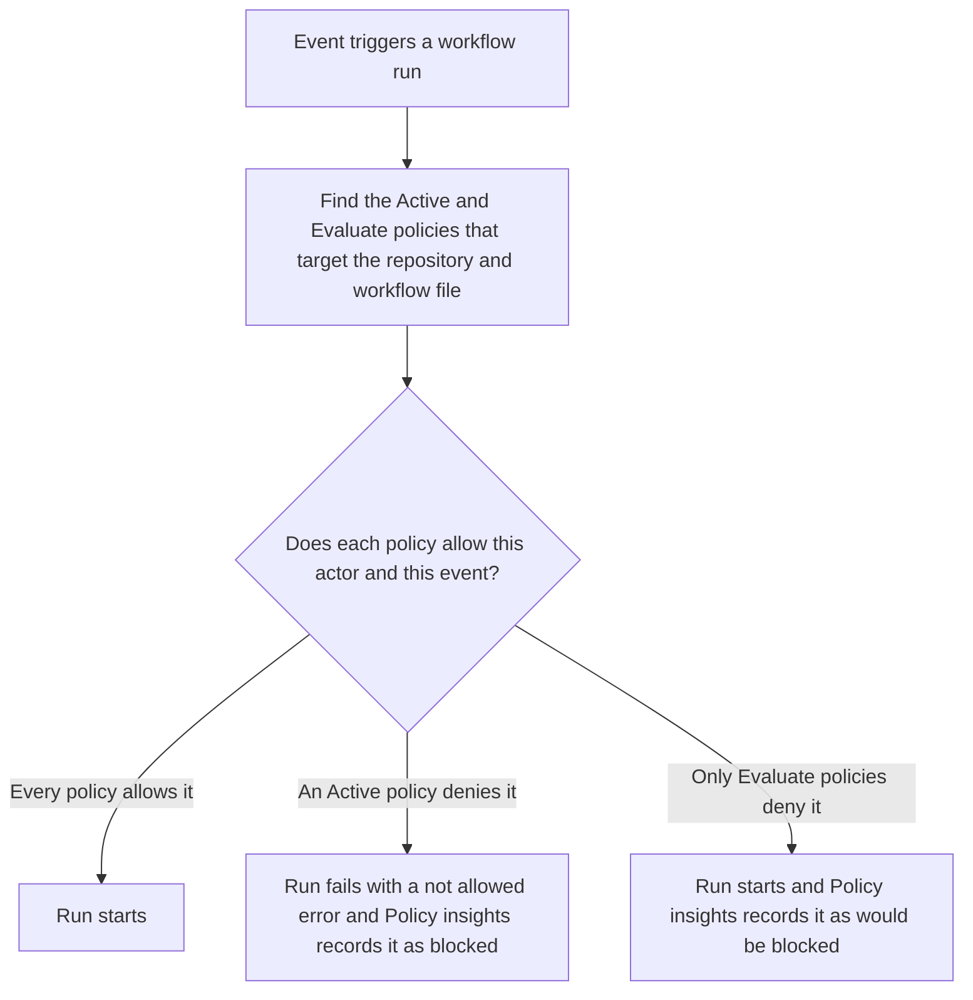
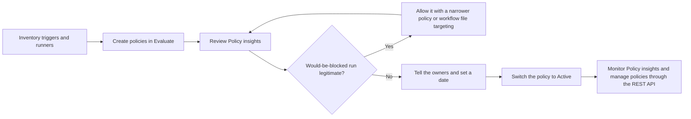

# GitHub Actions Workflow Execution Protections and Runner Governance

This document explains how enterprise and organization administrators control who and what can start GitHub Actions workflows, how GitHub's safer defaults for untrusted triggers change workflow reviews, and how to keep self-hosted runners inside the supported version window. It covers workflow execution protections (generally available since 2026-09-17), the default `pull_request_target` policy that GitHub enforces from 2026-11-02, workflow runs that wait for approval, and the self-hosted runner version enforcement that began on GitHub Enterprise Cloud on 2026-09-29.

> **Last Updated:** October 2, 2026

---

## Table of Contents

1. [Overview](#overview)
2. [Where Actions Policies Live](#where-actions-policies-live)
3. [Workflow Execution Protections](#workflow-execution-protections)
4. [The Default pull_request_target Policy](#the-default-pull_request_target-policy)
5. [Evaluate Mode and Policy Insights](#evaluate-mode-and-policy-insights)
6. [Managing Actions Policies as Code](#managing-actions-policies-as-code)
7. [How Execution Protections Fit with Other Actions Controls](#how-execution-protections-fit-with-other-actions-controls)
8. [Safer Defaults for Untrusted Triggers](#safer-defaults-for-untrusted-triggers)
9. [Workflow Runs That Wait for Approval](#workflow-runs-that-wait-for-approval)
10. [Runner Governance](#runner-governance)
11. [Retention Scope for Run Evidence](#retention-scope-for-run-evidence)
12. [Rollout Plan](#rollout-plan)
13. [Admin Checklist](#admin-checklist)
14. [Related Documentation](#related-documentation)
15. [References](#references)

---

## Overview

Before workflow execution protections, write access to a repository was effectively permission to run its workflows: by default, every user with write access can trigger them, and a run uses the workflow file from the commit that triggered it. Someone with write access — or a stolen token — could change that file and run code with the workflow's secrets. The existing Actions settings (allowed actions, `GITHUB_TOKEN` permissions, fork pull request approvals) govern what a run can use, not who or what may start it.

Workflow execution protections close that gap. Administrators define allowlists of actors and events, and GitHub Actions evaluates them before a run starts. The feature entered public preview on 2026-06-18 and became generally available for enterprises, organizations and repositories on 2026-09-17. GA added workflow file targeting, Insights and a REST API.

The same months brought related changes that an Actions administrator has to plan for:

| Date | Change | Admin impact |
|------|--------|--------------|
| 2026-06-11 | Pull requests created by `github-actions[bot]` can run workflows once a user with write access approves them | Bot pull requests can satisfy required checks after approval |
| 2026-06-18 | Workflow execution protections in public preview; `actions/checkout` v7 refuses common "pwn request" checkouts | A **Policies** section appears in Actions settings |
| 2026-06-25 | Standard GitHub-hosted runner labels can be disabled; macOS runners can join runner groups | Hosted-runner use can be forced through runner groups |
| 2026-06-26 | Read-only Actions cache for untrusted triggers | Cache saves from `pull_request_target` and similar triggers are skipped with a warning |
| 2026-07-20 | Checkout hardening backported to supported major versions except v1 (moved from 2026-07-16) | Floating major tags pick it up; SHA-pinned workflows must upgrade |
| 2026-07-28 | Potentially malicious workflow runs held for approval in public repositories on github.com | Write-access approval in an authenticated web session |
| 2026-07-31 | Self-hosted runner version enforcement on GitHub Enterprise Cloud with data residency | Outdated runners stop registering and taking jobs |
| 2026-09-10 | `cache-mode` workflow key generally available | Least-privilege cache access declared in workflow YAML |
| 2026-09-17 | Workflow execution protections GA; default `pull_request_target` policy for public repositories starts in evaluate mode | Review Policy insights before 2026-11-02 |
| 2026-09-29 | Full self-hosted runner version enforcement on GitHub Enterprise Cloud | Runners below `2.329.0` can't register; runners that miss a release by more than 30 days stop receiving jobs |
| 2026-10-01 | Checks, workflow runs and statuses follow the Actions retention setting | Run evidence expires with the retention period |
| 2026-11-02 | Default policy blocking `pull_request_target` enforced for affected public repositories | Allow the event explicitly or move workflows to `pull_request` |

## Where Actions Policies Live

Actions policies live in the **Policies** section of the GitHub Actions settings, separate from the **General** section that holds the allowed-actions, runner, fork and `GITHUB_TOKEN` settings. As of 2026-10-02, workflow execution protections are the only policy type in that section; GitHub plans to add more.

| Level | Path | Configured by | Typical use |
|-------|------|---------------|-------------|
| Enterprise | **Policies** tab → sidebar **Actions** → **Policies** | Enterprise owners | Broad, non-negotiable rules across organizations |
| Organization | **Settings** → sidebar **Actions** → **Policies** | Organization owners | Organization-wide rules targeted by repository |
| Repository | **Settings** → sidebar **Actions** → **Policies** | Repository administrators | Rules for specific workflow files in one repository |

The **Policy insights** page sits directly under **Policies** in the same sidebar at each level.

Like rulesets, policies layer. GitHub recommends several clearly defined policies rather than one large policy per account: enterprise owners create the broad, non-negotiable protections, and organization owners and repository administrators add restrictions on top. Workflow execution protections are built on the rulesets framework, so the targeting model — organization-wide scope, custom properties, evaluate mode — will be familiar to anyone who runs rulesets (see [Repository Governance](07-repository-governance.md)).

## Workflow Execution Protections

A workflow execution policy is an allowlist. It has a name, an enforcement status, targeting conditions and one or both rule types. When a run matches an active policy and its actor or event isn't allowed, the run fails with an error such as:

```text
Event 'workflow_dispatch' is not allowed to trigger Actions workflows. Workflow file: '.github/workflows/0-welcome.yml'.
```



### Actor Rules

Actor rules decide **who** can trigger workflows. Allowed actors can be individual users, repository roles (for example `Read`, `Maintain` and `Admin`), teams and enterprise teams, GitHub Apps, Copilot and Dependabot.

- By default, every user with write access to a repository can trigger its workflows. Actor rules separate who contributes code from who runs CI, so a contributor can have write access without being able to execute workflows.
- Only allowed actors can run the targeted workflows. If the policy also restricts events, allowed actors can trigger the workflows only with the allowed events.
- GitHub features are exempt for the built-in processes they run on GitHub Actions. If you wrote workflows that run as a feature's identity, such as `dependabot[bot]`, add that identity as an allowed actor.
- Put the people who may run sensitive workflows in an organization team or an enterprise team so that several policies can reference the same group (see [Enterprise Teams](28-enterprise-teams.md)).

### Event Rules

Event rules decide **which events** may start a workflow, such as `push`, `pull_request`, `pull_request_target` and `workflow_dispatch`. The REST API lists every supported event, from `branch_protection_rule` to `workflow_run`. Events that aren't on the allowlist can't start the targeted workflows.

### Targeting

| Level | Can target | Workflow targeting |
|-------|-----------|--------------------|
| Enterprise | Organizations by name, ID or organization property (`~ALL` for every organization, `~EMUS` for managed user accounts), combined with repositories by name or property | Optional workflow path condition |
| Organization | Repositories by name, ID or property — for example visibility, deployment status or a custom property | Optional workflow path condition, or required workflows |
| Repository | The repository itself | Workflow path condition |

Workflow file targeting arrived with GA on 2026-09-17. One repository can apply different policies to different workflows — for example, only a release team may run `deploy.yml` while CI workflows stay open to every contributor. Path conditions accept file paths and glob patterns; `~ALL` includes every workflow.

Deployment status comes from the organization's linked artifacts page, so it is only a useful target if your pipelines upload deployment records when an artifact is deployed.

### Enforcement Statuses

| Status | Behavior |
|--------|----------|
| **Active** | Disallowed runs fail with an error |
| **Evaluate** | Runs continue; runs that would have been blocked appear in Policy insights. GitHub Enterprise Cloud only |
| **Disabled** | The policy is switched off |

### Attack Patterns and Matching Protections

| Attack pattern | Protection |
|----------------|------------|
| Poisoned pipeline execution from pull requests | Event rule that leaves `pull_request_target` off the allowlist, or allows it only for named workflow files |
| Manual-trigger abuse | Limit `workflow_dispatch` so that untrusted identities can't start workflows |
| Untrusted-actor execution | Actor rule that keeps low-trust identities from triggering workflows at all |
| Misconfigured workflow file | A central policy applies regardless of what a single workflow file declares |

## The Default pull_request_target Policy

`pull_request_target` runs with the base repository's `GITHUB_TOKEN` and access to secrets. That is safe while the workflow only runs code from the default branch, and dangerous when it checks out and executes code from a fork's pull request — the "pwn request" pattern behind several supply-chain incidents. Fork pull request approval settings don't help: `pull_request_target` runs in the context of the base branch and always runs, regardless of approval settings.

From 2026-09-17, GitHub adds a default event policy that blocks `pull_request_target`:

- It applies to **public** repositories that don't already have an applicable Actions event policy. It doesn't apply to private or internal repositories.
- It doesn't replace an event policy you have already configured.
- It starts in **evaluate** mode: runs continue, and Policy insights shows the runs that would be blocked.
- **From 2026-11-02, GitHub enforces it** for affected repositories that were using the default `pull_request_target` policy before GA.

For each workflow that Policy insights flags, choose one path:

1. **Move to `pull_request`** if the workflow doesn't need secrets or a write token.
2. **Allow `pull_request_target` explicitly** in an applicable event policy if the workflow needs it, and limit the allowance to those workflow files with workflow file targeting.
3. **Leave the default in place** if you don't want the event. After enforcement, those runs are blocked.

Only allow `pull_request_target` for workflows that never check out, build or run pull request code with access to secrets or a privileged `GITHUB_TOKEN`. Opting out of the default policy, or of the `actions/checkout` protection described below, is a deliberate security exception: record who approved it and why.

## Evaluate Mode and Policy Insights

Evaluate mode runs a policy in shadow. Workflow runs proceed, and **Policy insights** records the runs that would have been blocked; for an active policy, the same page shows the runs that were blocked. Insights covers the enterprise, organization and repository levels, so you can audit a policy's impact and tune it both before and after enforcement.

Before you switch a policy to **Active**, use Policy insights to answer three questions:

- Which repositories and workflow files would fail, and who owns them?
- Is each would-be-blocked run legitimate (allow it with a narrower policy or workflow file targeting) or unwanted (keep it blocked)?
- Did a bot or GitHub App identity trip an actor rule (add it as an allowed actor)?

Evaluate mode is available on GitHub Enterprise Cloud only. Ruleset evaluations have their own page, **Rule Insights** (repository **Settings** → **Rules** → **Insights**); see [Repository Governance](07-repository-governance.md).

## Managing Actions Policies as Code

Since GA, the REST API supports create, read, update and delete at all three levels, including workflow path conditions:

| Level | Endpoints |
|-------|-----------|
| Enterprise | `GET` and `POST /enterprises/{enterprise}/actions/policies`; `GET`, `PUT` and `DELETE /enterprises/{enterprise}/actions/policies/{policy_id}` |
| Organization | `GET` and `POST /orgs/{org}/actions/policies`; `GET`, `PUT` and `DELETE /orgs/{org}/actions/policies/{policy_id}` |
| Repository | `GET` and `POST /repos/{owner}/{repo}/actions/policies`; `GET`, `PUT` and `DELETE /repos/{owner}/{repo}/actions/policies/{policy_id}` |

- Rule types are `restrict_actions_actors` (parameter `allowed_actors`) and `restrict_action_events` (parameter `allowed_events`).
- `enforcement` is `active`, `evaluate` or `disabled`.
- Actor types are `User`, `Bot`, `Team`, `BusinessTeam`, `EnterpriseTeam`, `IntegrationInstallation`, `App` and `RepositoryRole`.
- Listing organization policies includes policies configured at higher levels; pass `has_parents=false` to see only the organization's own.
- Omitting `workflow_path` on create targets every workflow; omitting it on update keeps the existing workflow targeting.

The following organization policy, in evaluate mode, allows only one team to run `deploy.yml` in every repository:

```json
{
  "name": "deploy-workflow-release-team-only",
  "enforcement": "evaluate",
  "conditions": {
    "repository_name": {
      "include": ["~ALL"],
      "exclude": []
    },
    "workflow_path": {
      "include": [".github/workflows/deploy.yml"],
      "exclude": []
    }
  },
  "rules": [
    {
      "type": "restrict_actions_actors",
      "parameters": {
        "allowed_actors": [
          { "id": 1234, "type": "Team" }
        ]
      }
    }
  ]
}
```

```bash
# Create the policy (replace 1234 with the team ID), then list the policies that apply to the organization
gh api --method POST /orgs/ORG/actions/policies \
  -H "X-GitHub-Api-Version: 2026-03-10" \
  --input deploy-policy.json

gh api /orgs/ORG/actions/policies -H "X-GitHub-Api-Version: 2026-03-10"
```

Keep policy JSON in a repository and change it through reviewed pull requests, the same way you manage ruleset JSON. That keeps rules consistent across hundreds of repositories and gives you a history of who changed what.

## How Execution Protections Fit with Other Actions Controls

Execution protections add a question that no other Actions control answers. Use the table to place each control in the run lifecycle.

| Control | Question it answers | When it applies | More detail |
|---------|---------------------|-----------------|-------------|
| Workflow execution protections | Who or what may start this workflow? | Before the run starts | This document |
| Fork pull request approval | Must a maintainer approve a run from an outside contributor? | Before the run starts; never for `pull_request_target` | [Policy Enforcement and Inheritance](06-policy-inheritance.md#github-actions-policies) |
| Allowed actions and reusable workflows | Which actions and reusable workflows may the run use? | When the run resolves its actions | [Policy Enforcement and Inheritance](06-policy-inheritance.md#github-actions-policies) |
| `GITHUB_TOKEN` permissions and `cache-mode` | What can the run's token and cache access do? | During the run | [Deployment Strategies](23-deployment-strategies.md#github_token-default-permissions) |
| Runner groups and standard hosted runners | Which runners may the job use? | When the job is queued | [Runner Governance](#runner-governance) |
| Environments and deployment protection rules | May this job deploy? | Before a deployment job runs | [Deployment Strategies](23-deployment-strategies.md) |
| Rulesets (required status checks and workflows) | What must pass before a merge? | Before merge | [Repository Governance](07-repository-governance.md) |

Two interactions matter most:

- **Required checks need runs.** If an execution protection blocks the workflow that produces a required status check, the pull request can't merge. Review Policy insights together with your ruleset's required checks before enforcing.
- **Environments are a second gate.** Restrict who can start `deploy.yml` with an actor rule, and keep required reviewers on the production environment; the two controls fail independently.

## Safer Defaults for Untrusted Triggers

These protections apply automatically or are declared in workflow YAML. Administrators don't switch them on, but they change what reviewers should look for.

### actions/checkout Refuses Pwn Request Checkouts

Since 2026-06-18, `actions/checkout` v7 refuses to fetch a fork pull request's code in `pull_request_target` workflows, and in `workflow_run` workflows triggered by a `pull_request*` event. It refuses when `repository:` resolves to the fork, or when `ref:` matches `refs/pull/number/head` or `refs/pull/number/merge` or resolves to the pull request's head or merge commit SHA.

- **Backport:** on 2026-07-20 the enforcement was backported to every supported major version except v1. The original post gave 2026-07-16; an editor's note dated 2026-07-15 moved the date to 2026-07-20.
- **Pinning matters:** floating major tags (for example `actions/checkout@v4`) pick up the backport. Workflows pinned to a commit SHA, minor or patch version don't, and must upgrade to get the protection. Enterprises that enforce full-length SHA pinning should move to v7, for example through Dependabot.
- **Opt-out:** the `allow-unsafe-pr-checkout` input turns the check off. Treat it as a security exception and search for it in code review and static analysis.
- **Not covered:** `run` steps that fetch untrusted refs with `git` or `gh`, other privileged events such as `issue_comment`, and checkouts of unrelated third-party repositories.

### Read-Only Cache for Untrusted Triggers

Since 2026-06-26, only `push`, `schedule`, `workflow_dispatch`, `repository_dispatch`, `delete`, `registry_package` and `page_build` runs can create or overwrite caches in the default branch's scope, unless a workflow explicitly declares a write-capable `cache-mode` (see below). Runs from other events that resolve to the default branch — including `pull_request_target`, `issue_comment` and `workflow_run` — get read-only access: restores work, saves fail with a warning, and the job continues. `pull_request` is unaffected because its caches are scoped to the merge ref. To keep the benefit of caching, populate the cache from a trusted workflow, for example one triggered by `push`.

### cache-mode

`cache-mode` (generally available on all plans since 2026-09-10) is a workflow syntax key, not an admin setting. Set it at the top level of a workflow, or per job with `jobs.<job_id>.cache-mode`; a job value overrides the workflow value.

| Value | Restore caches | Save caches |
|-------|----------------|-------------|
| `read` | Yes | No |
| `write` | Yes | Yes |
| `write-only` | No | Yes |
| `none` | No | No |

- Without `cache-mode`, trusted triggers get `write` and low-trust triggers such as `pull_request_target` get `read`.
- An explicit `write` or `write-only` overrides the read-only default for a low-trust trigger, adds a warning annotation and reintroduces cache-poisoning risk. Flag it in workflow reviews.
- The mode carries into reusable workflows: a called workflow can't get more cache access than its caller explicitly granted.

```yaml
on:
  pull_request_target:
    types: [opened, synchronize]

cache-mode: read

jobs:
  triage:
    runs-on: ubuntu-latest
    permissions:
      pull-requests: write
    steps:
      - run: echo "Triage the pull request without running its code"
```

## Workflow Runs That Wait for Approval

Three kinds of runs can wait for a person with write access before they start. None of them is configured in the **Policies** section.

| Trigger | Since | Scope | Approval |
|---------|-------|-------|----------|
| Run that GitHub identifies as potentially malicious | 2026-07-28 | Public repositories on github.com. GitHub applies it automatically, with no configuration; GitHub Enterprise Server doesn't add it | A collaborator with write access, through an authenticated web session |
| Pull request created or updated by a workflow using `GITHUB_TOKEN` (`github-actions[bot]`) | 2026-06-11 | `pull_request` runs for the `opened`, `synchronize` and `reopened` activity types | A user with write access selects **Approve workflows to run** |
| Pull request from a fork | Fork approval setting | Depends on the enterprise, organization or repository fork pull request policy | A maintainer with write access selects **Approve workflows to run** |

- Before 2026-06-11, pull requests created by `github-actions[bot]` couldn't run workflows at all, so they could be merged without CI. Since then, approved runs on those pull requests can satisfy required status checks; review rulesets in repositories where workflows open pull requests.
- To let workflow-created pull requests run without approval, the workflow must create them with a GitHub App installation token or a personal access token instead of `GITHUB_TOKEN`. Prefer a GitHub App.
- Fork approvals that wait more than 30 days expire, and the run is marked failed with an annotation.
- The hold for potentially malicious runs complements fork approval policies; it doesn't replace them and doesn't cover private or internal repositories.

## Runner Governance

### Self-Hosted Runner Minimum Versions

Self-hosted runners on github.com must meet two requirements:

- **Registration:** version `2.329.0` or later is required to configure, register or re-register a runner.
- **Job execution:** each runner release must be installed within 30 days of publication. A runner that misses that window stops receiving jobs, and when GitHub publishes a critical security update, it pauses job queuing to the runner until the update is installed. `2.329.0` isn't a permanent floor: the minimum for running jobs moves forward with every release.

| Platform | Full enforcement |
|----------|------------------|
| GitHub Enterprise Cloud with data residency (GHE.com) | 2026-07-31 |
| GitHub Enterprise Cloud (github.com) | 2026-09-29. The change shipped on 2026-09-28. The 2026-06-12 announcement gave 2026-09-25; the 2026-09-28 post superseded that date |
| GitHub Enterprise Server | Not affected |

Runners with auto-update enabled meet the 30-day rule if they can reach the update service. Runners with auto-update disabled, such as ephemeral runners built into container images, need an image rebuild cadence of 30 days or less.

**Find outdated runners:**

- Query the audit log for `org.register_self_hosted_runner`, `repo.register_self_hosted_runner` and `enterprise.register_self_hosted_runner`. Each event records the runner version at registration time only, so it isn't a complete inventory; use the audit log REST API for large fleets.
- The self-hosted runners REST API returns each runner's version, and jobs on outdated runners get annotations.
- Since 2026-09-03, the runner version end-of-life schedule endpoints return `registration_deprecates_at` and `runtime_deprecates_at` for a runner version, so you can alert before a fleet falls out of support:

```bash
# Registration and runtime deprecation dates for one runner version
gh api /enterprises/ENTERPRISE/actions/runners/deprecations/2.329.0
gh api /orgs/ORG/actions/runners/deprecations/2.329.0
gh api /repos/OWNER/REPO/actions/runners/deprecations/2.329.0
```

**Fix them:** upgrade every runner; update installation scripts, VM and container images and deployment automation; and recreate runners built from old cached images or templates.

### GitHub-Hosted Runner Controls

Since 2026-06-25 (GitHub Team and GitHub Enterprise plans), administrators can disable the standard GitHub-hosted runner labels, such as `ubuntu-latest`, so that jobs must target runners through runner groups:

- **Organization:** **Settings** → **Actions** → **General** → "Standard hosted runners" → **Disable for all repositories** → **Save**.
- **Enterprise:** **Policies** → **Actions** → "Standard hosted runners" → **Disable for all organizations** → **Save**.

macOS runners can also join runner groups, which restricts them to selected organizations, repositories or workflows, enforces concurrency limits and lets workflows route jobs by group name. Network configurations aren't supported for macOS runners. Before you disable standard runners, find the workflows that use standard labels and check the concurrency implications in the runner groups documentation.

Standard labels also change underneath you: from 2026-10-19 to 2026-11-19, `ubuntu-latest` moves gradually from Ubuntu 24.04 to Ubuntu 26.04. Pin critical workflows to `ubuntu-24.04` to defer the move.

## Retention Scope for Run Evidence

From 2026-10-01, checks, workflow runs and commit statuses — including those created by third-party apps — follow the **Check, workflow run, status, artifact and log retention** setting (90 days by default; at most 90 days for public repositories). Run history and check results that audits rely on expire with that setting, so raise retention within the enterprise and organization caps or export what you must keep, and keep your Policy insights reviews in your change records. For details, see [Third-Party Integrations and Status API](27-integrations-status-api.md#permissions-and-retention) and [Deployment Strategies](23-deployment-strategies.md#artifact-and-log-retention).

## Rollout Plan

Roll execution protections out the way you roll out rulesets: observe first, then enforce.



| Phase | Actions | Exit criteria |
|-------|---------|---------------|
| 1. Inventory | Search workflows for `pull_request_target`, `workflow_run`, `issue_comment` and `workflow_dispatch`; search for `allow-unsafe-pr-checkout` and write-capable `cache-mode`; list self-hosted runner versions | An owner is known for every privileged trigger |
| 2. Evaluate | Create enterprise policies for non-negotiable rules (for example, no `pull_request_target` in public repositories) and organization policies for team-specific rules, all in **Evaluate** | Policies cover the target repositories and workflow files |
| 3. Review Policy insights | Classify each would-be-blocked run; adjust actor lists, allowed events and workflow targeting | No unexplained would-be-blocked runs for an agreed period |
| 4. Communicate | Tell repository owners what will be blocked and when; for public repositories, the default policy is enforced from 2026-11-02 | Owners have acknowledged the date |
| 5. Enforce | Switch policies to **Active** one at a time; keep a support channel open | Failed-run volume back to its baseline |
| 6. Operate | Keep policy JSON in version control and apply it with the REST API; review Policy insights on a schedule | Every policy change goes through review |

## Admin Checklist

- [ ] Before 2026-11-02, review Policy insights for public repositories and decide, per workflow, to keep the `pull_request_target` block, allow the event explicitly, or move to `pull_request`.
- [ ] Create at least one organization or enterprise policy in **Evaluate** that restricts who can start deployment workflows.
- [ ] Confirm every self-hosted runner is auto-updated, or its image rebuilt, within 30 days of each runner release.
- [ ] Check that workflows pinned to a commit SHA use `actions/checkout` v7.
- [ ] Search workflows for `allow-unsafe-pr-checkout` and for write-capable `cache-mode` on low-trust triggers.
- [ ] Decide whether to disable standard hosted runners and route jobs through runner groups.
- [ ] Set the Actions retention period to match how long you must keep run and check evidence.

## Related Documentation

- [Policy Enforcement and Inheritance](06-policy-inheritance.md) — enterprise and organization Actions policies, runner policies and how settings cascade
- [Repository Governance](07-repository-governance.md) — rulesets, evaluate mode and Rule Insights, which share the targeting model
- [Deployment Strategies](23-deployment-strategies.md) — environments, OIDC and enterprise deployment policies
- [Third-Party Integrations and Status API](27-integrations-status-api.md) — checks, statuses and their retention
- [Lab 18: Workflow Execution Protections](../labs/lab18.md) — create a policy in evaluate mode and review Policy insights

## References

### Official GitHub Documentation

- [About Actions policies](https://docs.github.com/en/enterprise-cloud@latest/actions/concepts/about-actions-policies)
- [Controlling who can execute GitHub Actions workflows](https://docs.github.com/en/enterprise-cloud@latest/actions/how-tos/administer/control-workflow-execution)
- [REST API endpoints for GitHub Actions policies](https://docs.github.com/en/enterprise-cloud@latest/rest/actions/policies)
- [Securely using pull_request_target](https://docs.github.com/en/enterprise-cloud@latest/actions/reference/security/securely-using-pull_request_target)
- [Dependency caching reference](https://docs.github.com/en/enterprise-cloud@latest/actions/reference/workflows-and-actions/dependency-caching)
- [Workflow syntax: cache-mode](https://docs.github.com/en/enterprise-cloud@latest/actions/reference/workflows-and-actions/workflow-syntax#cache-mode)
- [Approving workflow runs from forks](https://docs.github.com/en/enterprise-cloud@latest/actions/how-tos/manage-workflow-runs/approve-runs-from-forks)
- [GITHUB_TOKEN](https://docs.github.com/en/enterprise-cloud@latest/actions/concepts/security/github_token)
- [Self-hosted runners reference](https://docs.github.com/en/enterprise-cloud@latest/actions/reference/runners/self-hosted-runners)
- [REST API endpoints for self-hosted runners](https://docs.github.com/en/enterprise-cloud@latest/rest/actions/self-hosted-runners)
- [Runner groups](https://docs.github.com/en/enterprise-cloud@latest/actions/concepts/runners/runner-groups)
- [Disabling or limiting GitHub Actions for your organization](https://docs.github.com/en/enterprise-cloud@latest/organizations/managing-organization-settings/disabling-or-limiting-github-actions-for-your-organization)
- [Enforcing policies for GitHub Actions in your enterprise](https://docs.github.com/en/enterprise-cloud@latest/admin/enforcing-policies/enforcing-policies-for-your-enterprise/enforcing-policies-for-github-actions-in-your-enterprise)

### GitHub Changelog

- [Bot-created pull requests can run workflows if approved (2026-06-11)](https://github.blog/changelog/2026-06-11-bot-created-pull-requests-can-run-workflows-if-approved)
- [GitHub Actions: Minimum version enforcement timeline for self-hosted runners (2026-06-12)](https://github.blog/changelog/2026-06-12-github-actions-minimum-version-enforcement-timeline-for-self-hosted-runners)
- [Control who and what triggers GitHub Actions workflows (2026-06-18)](https://github.blog/changelog/2026-06-18-control-who-and-what-triggers-github-actions-workflows)
- [Safer pull_request_target defaults for GitHub Actions checkout (2026-06-18)](https://github.blog/changelog/2026-06-18-safer-pull_request_target-defaults-for-github-actions-checkout)
- [More control over your GitHub-hosted runners (2026-06-25)](https://github.blog/changelog/2026-06-25-more-control-over-your-github-hosted-runners)
- [Read-only Actions cache for untrusted triggers (2026-06-26)](https://github.blog/changelog/2026-06-26-read-only-actions-cache-for-untrusted-triggers)
- [GitHub Actions holds potentially malicious workflows for approval (2026-07-28)](https://github.blog/changelog/2026-07-28-github-actions-holds-potentially-malicious-workflows-for-approval)
- [GitHub Actions: Early September 2026 updates (2026-09-03)](https://github.blog/changelog/2026-09-03-github-actions-early-september-2026-updates)
- [Control GitHub Actions cache access with cache-mode (2026-09-10)](https://github.blog/changelog/2026-09-10-control-github-actions-cache-access-with-cache-mode)
- [Workflow execution protections in GitHub Actions generally available (2026-09-17)](https://github.blog/changelog/2026-09-17-workflow-execution-protections-in-github-actions-generally-available)
- [Ubuntu 26 generally available and latest migration (2026-09-17)](https://github.blog/changelog/2026-09-17-ubuntu-26-generally-available-and-latest-migration)
- [Self-hosted runner version enforcement date has moved (2026-09-28)](https://github.blog/changelog/2026-09-28-self-hosted-runner-version-enforcement-date-has-moved)
- [Actions retention now covers checks, runs, and statuses (2026-10-01)](https://github.blog/changelog/2026-10-01-actions-retention-now-covers-checks-runs-and-statuses)

---

## Version History

| Version | Date | Changes |
|---------|------|---------|
| 1.0 | October 2026 | Initial document: workflow execution protections, default `pull_request_target` policy, safer defaults for untrusted triggers, approvals, runner governance |
